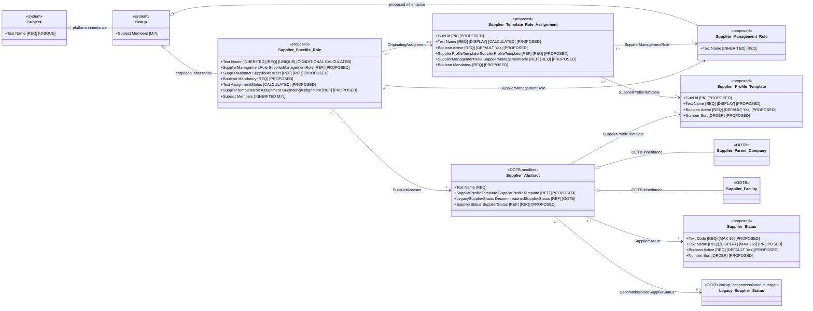

# Supplier Profile Template logical object model

> **Lifecycle overlay, 2026-10-06:** [Supplier Status Updates](supplier-status-updates-logical-model.md) governs status changes and supersedes direct status editing with the controlled transition action. Following the user-directed scope reduction, it does not change this document’s creation-only template generation, immutable original template selection, or status-independent assignment synchronization. Returning a supplier to Active uses the standard transition without template reapplication.

> **Status object clarification:** Rename the existing lookup object **[Decommissioned] Supplier Status** and retain it only for migration/history. Lookup objects cannot accept additional fields. The replacement **Supplier Status** below is an entirely new record/configuration object with its own identity, not an extension or conversion of the lookup. The governing status-update specification defines the single Draft workflow, Save Status Transition → Completed, with no email notifications.

| Property | Value |
|---|---|
| Mode | Target design; proposed configuration layered over the OOTB SRM baseline and Supplier Management Role target model |
| Scope | Supplier Profile Template, Supplier Template Role Assignment, creation-time role generation, assignment-level synchronization, copied role completeness, standalone supplier-created roles, and replacement Supplier Status configuration |
| Baseline authority | `../../ootb-srm-baseline-model/README.md` and its field and relationship registers |
| Related target model | [Supplier Management Role logical object model](supplier-management-role-logical-model.md) |
| Requirements source | User design direction recorded in the current design conversation; SRM ADR-002, ADR-003, ADR-004, ADR-005, ADR-077, and ADR-079 provide architectural context |
| As of | 2026-10-05 |

## Findings and architectural consequences

Supplier Profile Template is an optional, creation-time configuration choice on Supplier Abstract. It determines which standard Supplier Specific Role records are generated when a Supplier Parent Company or Supplier Facility is first created. It does not determine supplier eligibility, populate role members, create setup tasks, or execute on reactivation.

Each template contains Supplier Template Role Assignment children. Each assignment identifies one standard Supplier Management Role and whether that role is mandatory. Creation materializes every active assignment, including optional assignments, as a Supplier Specific Role related to the newly created Supplier Abstract.

The selected Supplier Profile Template is permanently retained on Supplier Abstract after first save. A null choice is also final: a supplier created without a template cannot apply one later. Template edits do not automatically alter existing suppliers. An administrator may explicitly push one Supplier Template Role Assignment to eligible existing suppliers that reference the same template.

Mandatory status and origin are copied onto Supplier Specific Role so current completeness and provenance do not depend on the mutable template. The push updates the copied Mandatory? value and standard calculated Name while preserving Members.

Every template assignment references a Supplier Management Role and creates a standard Supplier Specific Role whose Name follows `Supplier Management Role.Name + " for " + Supplier Abstract.Name`. A supplier user may also create a standalone Supplier Specific Role directly in an authorized supplier context without a Supplier Management Role; that role uses a manually entered unique Name and remains outside template generation and synchronization.

The OOTB Supplier Status field on Supplier Abstract is decommissioned in the target design and replaced by a new required M:1 field with the same `Supplier Status` caption. The replacement points to a new Supplier Status configuration object with Code, Name, Active?, and Sort. The previously proposed Supplier Profile Template Assignment Eligible field is removed; assignment synchronization no longer filters suppliers through status eligibility.

## ADR alignment and deliberate deviations

| ADR | Relevant direction | Design response | Alignment |
|---|---|---|---|
| ADR-002 | Supplier becomes active after award; setup completeness is not another approval gate | Template is optional and generated roles may remain empty without blocking Supplier Abstract creation | Aligned |
| ADR-003 | Use standardized supplier/depot roles; not every role is mandatory for every supplier | Template selects applicable library roles and distinguishes mandatory from optional | Aligned |
| ADR-004 | Maintain configurable internal roles without fixed employee fields | Templates create empty role groups and never copy or suggest internal members | Aligned |
| ADR-005 | Reusable setup templates generate role placeholders and allow new roles to be applied to existing suppliers | Creation generates all active assignment placeholders; assignment-level push applies additions or changed parameters to eligible existing suppliers | Aligned for role generation |
| ADR-005 | Generate documents, access activities, training, target dates, and completion work | Those capabilities are explicitly excluded; completeness is calculated directly on Supplier Specific Role with no task record | Partial; ADR scope is broader than this feature |
| ADR-077 | Apply template-driven setup after manual supplier creation | Automatic generation runs after initial Supplier Abstract creation | Aligned |
| ADR-079 | Apply the current template and reconfirm requirements on supplier reactivation | No template application or regeneration occurs on reactivation | Deliberate divergence; ADR-079 should be refined if this target design is adopted |

ADR-006 and ADR-080 may later use the resulting Supplier Specific Roles for profile confirmation, but they do not govern this template model.

## Requirements interpretation

| Requirement ID | Interpreted requirement |
|---|---|
| `SPT-001` | Create Supplier Profile Template as a configuration object with Name, Active?, and Sort. |
| `SPT-002` | Name is Text with a maximum of 255 characters and is the display field. |
| `SPT-003` | Active? is required, defaults to Yes, and controls availability for new Supplier Abstract selection. |
| `SPT-004` | Sort is a Number and the order property for template selection. |
| `SPT-005` | Add an optional M:1 Supplier Profile Template relationship to Supplier Abstract. |
| `SPT-006` | Supplier Profile Template is selectable only during initial Supplier Abstract creation and becomes permanently read only after first save, including when left null. |
| `SPT-007` | Selection is manual, not calculated or suggested, and uses no supplier-attribute applicability rules. |
| `SPT-008` | The same template behavior applies to Supplier Parent Company and Supplier Facility through Supplier Abstract. |
| `SPT-009` | Create Supplier Template Role Assignment with Name, Active?, Supplier Profile Template, Supplier Management Role, and Mandatory?. |
| `SPT-010` | Supplier Template Role Assignment Name is calculated as Supplier Management Role Name, literal ` for `, and Supplier Profile Template Name. |
| `SPT-011` | Supplier Profile Template and Supplier Management Role are required M:1 relationships. |
| `SPT-012` | Mandatory? is a required Yes/No field with no implicit default. |
| `SPT-013` | Active? is required, defaults to Yes, and permits retirement without deletion. |
| `SPT-014` | Supplier Profile Template plus Supplier Management Role is unique across Supplier Template Role Assignment records; a retired record is reactivated rather than duplicated. |
| `SPT-015` | Supplier Template Role Assignment always selects a Supplier Management Role. Standalone Supplier Specific Roles with no library relationship cannot be selected or generated by a template. |
| `SPT-016` | Initial creation generates Supplier Specific Roles for all active assignments, whether mandatory or optional. |
| `SPT-017` | Generated supplier and internal roles begin with empty Members and receive no suggested, copied, parent, or default membership. |
| `SPT-018` | A parent-company Supplier Specific Role never satisfies a facility/depot role requirement; generation and resolution use the exact Supplier Abstract. |
| `SPT-019` | Generated Supplier Specific Role copies Mandatory? and retains an optional read-only Originating Supplier Template Role Assignment reference. |
| `SPT-020` | Supplier Specific Role calculates a three-state completeness value directly from copied Mandatory? and eligible Members; no setup task or overall supplier completeness is created. |
| `SPT-021` | Template generation runs only after initial Supplier Abstract creation and never on reactivation or through a later supplier-level apply/retry action. |
| `SPT-022` | Partial creation failure does not roll back or flag Supplier Abstract and does not expose a supplier-level retry; exceptional failures require support. |
| `SPT-023` | Template changes do not automatically propagate to existing suppliers. |
| `SPT-024` | Provide a synchronization action only on Supplier Template Role Assignment. |
| `SPT-025` | Synchronization targets Supplier Abstract records that reference the assignment's template; no Supplier Status eligibility field or status-name condition narrows that population. |
| `SPT-026` | Decommission the OOTB Supplier Status field on Supplier Abstract by recaptioning it `[Decommisioned] Supplier Status`, removing it from target views and selection, and replacing it with a new required M:1 field captioned `Supplier Status`. |
| `SPT-027` | Synchronization creates a missing Supplier Specific Role or updates copied Mandatory?, calculated Name, and origin on an existing match while preserving Members. |
| `SPT-028` | Synchronization is idempotent, skips platform-level failures, and may be rerun over the same scope; no detailed completion report is required. |
| `SPT-029` | Removing or retiring an assignment does not alter existing Supplier Specific Roles. |
| `SPT-030` | No template versioning, effective dates, application-history record, approval workflow, training, access, documentation, target-date, escalation, or completion-task model is included. |
| `SPT-031` | SRM application administrators and system administrators maintain templates and assignments and execute synchronization. |
| `SPT-032` | Ordinary platform Modified By and Date Modified metadata are sufficient audit evidence. |
| `SPT-033` | Inactive referenced templates and retired referenced assignments remain historically reportable; hard-deleted records do not. |
| `SPT-034` | Create a new Supplier Status configuration object with required Code (Text, maximum 10), required Name (Text, maximum 255), required Active? (Yes/No, default Yes), and Sort (Number); Name is the display field and Sort is the order field. |
| `SPT-035` | Remove the previously proposed Supplier Profile Template Assignment Eligible field entirely. |
| `SPT-036` | A Supplier Specific Role related to a Supplier Management Role always uses the structured calculated Name; a supplier-created standalone role has no Supplier Management Role and uses a manually entered unique inherited Name. |

## Target logical object model

All identifiers and fields marked `PROPOSED` are logical design names, not confirmed Intelex internal names or stable metadata identifiers.



## Object inventory

| Logical object | State | Responsibility | Creation and maintenance | Workflow/action behavior |
|---|---|---|---|---|
| Supplier Profile Template | New configuration object | Names and orders one administrator-defined collection of role assignments available during Supplier Abstract creation | SRM application administrators and system administrators | No workflow; Active? controls new selection |
| Supplier Template Role Assignment | New configuration child | Relates one template to one standard role and defines Mandatory? | SRM application administrators and system administrators | Exposes assignment-level synchronization action |
| Supplier Management Role | New object (Refer to Supplier Management Role Logical Model) | Provides the governed library role definition used by template assignments | Existing target governance | Every template assignment selects one library role |
| Supplier Specific Role | New object (Refer to Supplier Management Role Logical Model) | Materialized role group with copied Mandatory?, origin, Members, and calculated status; may instead be a supplier-created standalone role with no library relationship | Creation automation, assignment push, or direct standalone-role maintenance | No lifecycle workflow; completeness is calculated |
| Supplier Abstract | Modified OOTB abstract object | Stores the optional, immutable-after-create template selection inherited by parent and facility records | User selects during creation; system locks after first save | Post-create automation generates roles once |
| Legacy Supplier Status | Existing OOTB controlled lookup object | Former target of the OOTB Supplier Status field | Existing records remain available for migration/history | OOTB field is recaptioned `[Decommisioned] Supplier Status` and removed from target views and new selection |
| Supplier Status | New configuration object | Provides governed replacement supplier-status values | Authorized Supplier Status administrators | Active? filters new selections; Name displays values and Sort orders them |

## Supplier Profile Template fields

| Field | Type | Required | Default/source | Editability | Property behavior | Classification |
|---|---|---:|---|---|---|---|
| Name | Text, maximum 255 characters | Yes | Administrator entered | SRM application administrator or system administrator | Object display field | Required/Proposed |
| Active? | Yes/No | Yes | `Yes` | SRM application administrator or system administrator | Active records are available for new Supplier Abstract selection; inactive records remain visible on existing read-only references | Required/Proposed |
| Sort | Number | No | Blank | SRM application administrator or system administrator | Object order property used by template selection | Required/Proposed |

## Supplier Template Role Assignment fields

| Field | Type | Required | Default/source | Editability | Property behavior | Classification |
|---|---|---:|---|---|---|---|
| Name | Text, maximum 255 characters | Yes | System calculated | Read only | Object display field; formula is Supplier Management Role Name + ` for ` + Supplier Profile Template Name | Required/Proposed |
| Active? | Yes/No | Yes | `Yes` | SRM application administrator or system administrator | Retires assignment from future creation without deleting history | Required/Proposed |
| Supplier Profile Template | M:1 reference to Supplier Profile Template | Yes | Administrator selected | SRM application administrator or system administrator | Related template; inactive template remains referenceable historically | Required/Proposed |
| Supplier Management Role | M:1 reference to Supplier Management Role | Yes | Administrator selected | SRM application administrator or system administrator | Selects the governed library role to materialize; standalone Supplier Specific Roles are not selectable because they have no library relationship | Required/Proposed |
| Mandatory? | Yes/No | Yes | No implicit default | SRM application administrator or system administrator | Copied to generated or synchronized Supplier Specific Role | Required/Proposed |

### Calculated Name

Logical expression:

```text
SupplierManagementRole.Name + " for " + SupplierProfileTemplate.Name
```

Exact platform syntax is unresolved. Changes to either related Name must recalculate the assignment Name.

### Assignment uniqueness

The pair `(Supplier Profile Template, Supplier Management Role)` is unique across active and retired assignment records. If a retired assignment is needed again, administrators reactivate and modify that record rather than create a duplicate.

## Supplier Abstract modification

| Field | Type | Required | Default/source | Editability | Property behavior | Classification |
|---|---|---:|---|---|---|---|
| Supplier Profile Template | M:1 reference to Supplier Profile Template | No | User may select one active template during initial creation | Editable only before first save; permanently read only afterward | Null is permitted and final; existing inactive reference remains visible; active selections ordered by Sort | Required/Proposed modification |

The field is declared on Supplier Abstract so the same behavior is inherited by Supplier Parent Company and Supplier Facility. No parent-to-child template defaulting or copying occurs.

## Supplier Status replacement

| Field | Type | Required | Default/source | Editability | Property behavior | Classification |
|---|---|---:|---|---|---|---|
| `[Decommisioned] Supplier Status` | Existing OOTB reference to legacy Supplier Status lookup | No for target operation | Existing migrated value only | Read only; removed from target detail and edit views | Recaptioned from the OOTB `Supplier Status` field and retained only for migration/history until retirement is approved | Required/Proposed decommissioning |
| Supplier Status | M:1 reference to new Supplier Status | Yes | Migrated or administrator/user selected according to supplier lifecycle permissions | Existing authorized supplier maintainers | Replacement status field; available values filter to Active? = Yes and display/order by the target object's Name and Sort properties | Required/Proposed modification |

### Supplier Status fields

| Field | Type | Required | Default/source | Editability | Object/field property behavior | Classification |
|---|---|---:|---|---|---|---|
| Code | Text, maximum 10 characters | Yes | Administrator entered | Authorized Supplier Status administrator | Governed short code; no uniqueness rule was specified | Required/Proposed |
| Name | Text, maximum 255 characters | Yes | Administrator entered | Authorized Supplier Status administrator | Object display field | Required/Proposed |
| Active? | Yes/No | Yes | `Yes` | Authorized Supplier Status administrator | Controls availability for new Supplier Status selections; inactive records remain valid for historical references | Required/Proposed |
| Sort | Number | No | Blank | Authorized Supplier Status administrator | Object order field used for Supplier Status selections | Required/Proposed |

The previously proposed Supplier Profile Template Assignment Eligible field is removed. Synchronization does not use a supplier-status eligibility flag or hard-coded status name.

## Relationship register

| Source object | Declaring field | Target object | Cardinality | Required | Maintenance | Evidence/classification |
|---|---|---|---|---|---|---|
| Supplier Template Role Assignment | Supplier Profile Template | Supplier Profile Template | Many assignments to one template | Yes | Administrator | Required/Proposed |
| Supplier Template Role Assignment | Supplier Management Role | Supplier Management Role | Many assignments to one library role | Yes | Administrator; standalone unlinked Supplier Specific Roles are not selectable | Required/Proposed |
| Supplier Abstract | Supplier Profile Template | Supplier Profile Template | Many supplier entities to zero or one template | No | User at initial creation only | Required/Proposed modification |
| Supplier Abstract | `[Decommisioned] Supplier Status` | OOTB legacy Supplier Status | Many supplier entities to zero or one legacy status during migration | No for target operation | Read only and removed from target views | Extracted baseline relationship; proposed decommissioning |
| Supplier Abstract | Supplier Status | New Supplier Status | Many supplier entities to one status | Yes | Authorized supplier lifecycle maintenance; selections filtered to active records and ordered by Sort | Required/Proposed replacement relationship |
| Supplier Specific Role | Originating Supplier Template Role Assignment | Supplier Template Role Assignment | Many roles to zero or one origin assignment | No | System | Required/Proposed |
| Supplier Specific Role | Supplier Abstract | OOTB Supplier Abstract | Many roles to one exact supplier entity | Yes | Creation automation, synchronization, or direct custom creation | Required/Proposed |
| Supplier Specific Role | Supplier Management Role | Supplier Management Role | Many roles to one library role | Yes | Creation automation, synchronization, or direct custom creation | Required/Proposed |

## Uniqueness and standalone-role rules

### Standard roles

When Supplier Management Role is populated, Supplier Specific Role Name always calculates as `Supplier Management Role.Name + " for " + Supplier Abstract.Name`. Because inherited Subject Name is unique, a second record for the same library role and supplier produces the same Name and is rejected by the inherited unique rule. Templates and synchronization create only this standard related form.

### Standalone supplier-created roles

An authorized supplier user may manually create a Supplier Specific Role without relating it to a Supplier Management Role. For such a record:

- Supplier Management Role remains blank;
- Name is entered manually and must satisfy the inherited Subject Name unique rule;
- it cannot appear on Supplier Template Role Assignment and has no Originating Supplier Template Role Assignment; and
- it is never created, renamed, or otherwise changed by template generation or assignment synchronization.

This replaces the earlier Allow Supplier-Specific Name?/Supplier-Specific Name design. A role that is related to a library record can never be recaptioned for one supplier.

## Initial creation behavior

### User interaction

1. During creation of Supplier Parent Company or Supplier Facility, the user may select one active Supplier Profile Template ordered by Sort.
2. Selection is optional and is neither calculated nor suggested.
3. When the Supplier Abstract is first saved, the selected value or null becomes permanently read only.
4. The user cannot later apply, replace, or clear a template.

### Post-create generation

If Supplier Profile Template is populated after the first successful save:

1. Read every active Supplier Template Role Assignment related to the selected template.
2. Revalidate that the assignment has a related Supplier Management Role.
3. For each assignment, create one Supplier Specific Role for the exact new Supplier Abstract.
4. Relate it to the assignment's Supplier Management Role and the exact Supplier Abstract.
5. Copy Mandatory?.
6. Set Originating Supplier Template Role Assignment.
7. Calculate Name.
8. Leave Members empty, regardless of role classification or any parent-company membership.
9. Calculate Assignment Status from Mandatory? and empty eligible membership.

Both mandatory and optional assignments are generated. A parent-company role is not reused for or inherited by a facility, and a facility role is not reused for its parent.

### Generation failures

A partial or complete generation failure does not roll back Supplier Abstract creation, set a failure flag, or expose a supplier-level retry action. Resolution occurs through platform support. The Supplier Profile Template reference remains locked even when generation fails.

## Assignment-level synchronization action

### Availability

The synchronization action exists only on Supplier Template Role Assignment and is available to SRM application administrators and system administrators. It is not available at Supplier Profile Template or Supplier Abstract level.

The action applies only to an active assignment with a related Supplier Management Role. Supplier Profile Template Active? controls new supplier selection but does not exclude existing referenced suppliers from synchronization.

### Target population

Select Supplier Abstract records satisfying this condition:

```text
SupplierAbstract.SupplierProfileTemplate = CurrentAssignment.SupplierProfileTemplate
```

No Supplier Status eligibility field or status name is evaluated.

### Per-supplier operation

For each selected Supplier Abstract:

1. Locate the Supplier Specific Role with the exact Supplier Abstract and current assignment's Supplier Management Role.
2. If none exists, create it using the same rules as initial generation.
3. If one exists, update Mandatory?, refresh calculated Name from the current library-role and supplier names, and set or correct Originating Supplier Template Role Assignment.
4. Preserve Members without additions, removals, or replacement.
5. Recalculate Assignment Status.
6. If more than one standard match exists, skip that supplier as a configuration exception rather than selecting one arbitrarily.

The operation is idempotent. Rerunning it processes the same eligible population; already-correct records remain effectively unchanged, while previously skipped platform failures may succeed. No created/updated/unchanged/failed summary is required beyond simple confirmation that processing finished.

### Changes that do not propagate automatically

- Adding an assignment requires its administrator-triggered synchronization to reach existing suppliers.
- Changing Mandatory? requires synchronization to update existing Supplier Specific Roles.
- Renaming a standard Supplier Management Role requires synchronization to refresh related standard Supplier Specific Role Names for suppliers using that assignment.
- Removing, retiring, or deleting an assignment does not remove, retire, or modify existing Supplier Specific Roles.
- Template changes never run automatically on supplier reactivation.

## Permissions and audit

| Scope | Principal | Permission |
|---|---|---|
| Supplier Profile Template | SRM application administrators; system administrators | Create, edit, activate/inactivate, view |
| Supplier Template Role Assignment | SRM application administrators; system administrators | Create, edit, activate/inactivate, delete when deliberately permitted, synchronize, view |
| Supplier Abstract template field | Supplier creator | Select during initial creation only |
| Supplier Abstract template field | All users after first save | Read only subject to record visibility |
| New Supplier Status object | Authorized Supplier Status administrators | Create, edit, activate/inactivate, view |
| `[Decommisioned] Supplier Status` field | All target users | No edit; hidden from target detail/edit views |
| Replacement Supplier Status field | Authorized supplier lifecycle maintainers | Edit using active values ordered by Sort |
| Synchronization action | SRM application administrators; system administrators | Execute |

No approval workflow or dedicated change-history object is required. Standard platform Modified By and Date Modified metadata are sufficient. Inactive referenced templates and retired referenced assignments remain reportable. Hard deletion removes normal reporting availability and is therefore a deliberate administrative action.

## Change summary

| Change ID | Action | Element | Baseline/current target | Proposed | Requirement | Rationale | Confidence |
|---|---|---|---|---|---|---|---|
| `SPT-C01` | Add | Supplier Profile Template | None | Name, Active?, and Sort configuration object | SPT-001 through SPT-004 | Provides manual reusable role-set selection | High |
| `SPT-C02` | Add | Supplier Template Role Assignment | None | Template child relating one standard role and Mandatory? | SPT-009 through SPT-015 | Defines which standard roles are materialized | High |
| `SPT-C03` | Modify | Supplier Abstract | No profile-template reference | Optional creation-only, permanently read-only M:1 reference | SPT-005 through SPT-008 | Retains the one-time template choice without application-version records | High |
| `SPT-C04` | Replace | Supplier Status field and catalogue | Required OOTB Supplier Status relationship to legacy lookup | Recaption old field `[Decommisioned] Supplier Status`; add a required replacement Supplier Status M:1 relationship and new Code/Name/Active?/Sort catalogue | SPT-026, SPT-034 | Replaces the legacy lookup cleanly while retaining a migration reference | High; migration mapping required |
| `SPT-C05` | Remove/replace | Supplier-specific naming controls | Earlier target added Allow Supplier-Specific Name? and Supplier-Specific Name | Remove both fields; library-related roles always use structured calculated Name, while standalone supplier-created roles have no library relationship and use manual unique Name | SPT-015, SPT-036 | Corrects the earlier requirement interpretation | High |
| `SPT-C06` | Modify | Supplier Specific Role | Role, supplier, inherited Name and Members | Add Mandatory?, Originating Assignment, and Assignment Status; make Supplier Management Role optional only for standalone supplier-created roles | SPT-019, SPT-020, SPT-036 | Supports copied requirement, provenance, standalone roles, and direct completeness | High |
| `SPT-C07` | Add automation | Initial Supplier Abstract creation | No role generation | Generate all active standard assignments once after first save | SPT-016 through SPT-022 | Materializes the selected profile without membership copying | High |
| `SPT-C08` | Add action | Supplier Template Role Assignment synchronization | No propagation mechanism | Administrator-triggered idempotent create/update for all Supplier Abstract records referencing the assignment's template | SPT-023 through SPT-029 | Applies discrete changes to existing matching suppliers without automatic drift | High |
| `SPT-C10` | Remove | Supplier Profile Template Assignment Eligible | Earlier target proposed a required status-level flag | Field removed; synchronization uses template relationship only | SPT-025, SPT-035 | The additional status field is not required | High |
| `SPT-C09` | No change | Supplier reactivation | ADR-079 expected current-template application | No template generation or synchronization | SPT-021, SPT-030 | Avoids clearing or regenerating existing supplier role lists | High; ADR divergence documented |

## Requirement traceability

| Requirement | Affected elements | Design response | Status |
|---|---|---|---|
| SPT-001–SPT-004 | Supplier Profile Template | Object and three fields defined with display, default, and order behavior | Satisfied |
| SPT-005–SPT-008 | Supplier Abstract | Optional manual creation-only reference defined on shared base | Satisfied |
| SPT-009–SPT-015 | Supplier Template Role Assignment; Supplier Management Role | Object, fields, formula, uniqueness, retirement, and custom-role exclusion defined | Satisfied |
| SPT-016–SPT-018 | Initial generation | All active mandatory and optional assignments create exact-entity empty roles | Satisfied |
| SPT-019–SPT-020 | Supplier Specific Role | Copied Mandatory?, origin reference, and direct three-state completeness defined | Satisfied |
| SPT-021–SPT-022 | Creation and reactivation behavior | Initial post-create only; no reactivation, flag, or supplier retry | Satisfied; ADR-079 divergence |
| SPT-023–SPT-029 | Synchronization and non-propagation | Assignment-level eligibility-filtered idempotent action defined | Satisfied |
| SPT-030 | Exclusions | Versioning and broader setup capabilities explicitly excluded | Satisfied for requested scope; ADR-005 partially addressed |
| SPT-031–SPT-033 | Governance and history | Administrator permissions, platform audit, and retention behavior defined | Satisfied |
| SPT-034–SPT-035 | Supplier Status replacement; removed eligibility field | New catalogue and replacement M:1 defined; legacy field decommissioned; eligibility flag removed | Satisfied at design level; migration mapping required |
| SPT-036 | Supplier Specific Role naming and optional library relationship | Structured calculated naming enforced for related roles; standalone manual unique naming defined for unlinked supplier-created roles | Satisfied; member-classification behavior is detailed in the related role model |

## Validation findings and unresolved implementation details

1. **ADR-079 conflict:** The target explicitly does not apply the current template on reactivation. ADR-079 currently says that it should. Adopted design should trigger a narrow ADR refinement so future implementers do not reintroduce reactivation behavior.
2. **ADR-005 scope:** The feature implements role placeholders and administrator propagation only. It does not implement training, documents, access setup, target dates, escalation, or completion tasks described by ADR-005.
3. **Optional template is final:** Saving Supplier Abstract with a null template permanently prevents later template application. Confirm the UI clearly communicates this before first save.
4. **Post-save automation timing:** Exact event/configuration used to generate children after initial creation requires platform validation, particularly transaction and error behavior.
5. **No failure telemetry:** Per requirement, generation failures create no supplier flag or retry action. Support diagnostics must rely on platform logs.
6. **Assignment pair uniqueness:** Confirm the platform mechanism used to enforce uniqueness across active and retired Supplier Template Role Assignments.
7. **Standalone-role exclusion:** Enforce that template assignments and generated roles always have a Supplier Management Role; unlinked standalone roles cannot enter a template through import or API.
8. **Calculated Name implementation:** Confirm that related-record changes and synchronization can refresh inherited Subject Name without affecting other Group descendants.
9. **Status migration:** Map each legacy OOTB Supplier Status value to a record in the new Supplier Status object, populate the required replacement field, and validate dependent workflows/reports before removing the decommissioned field from operational use.
10. **Eligible member calculation:** Confirm the expression or automation can count only active Members backed by an Employee with a valid user profile and, for supplier roles, the required Supplier Contact association.
11. **Hard deletion:** Deleted templates or assignments will not be available through ordinary historical reporting. Use inactivation for normal retirement.
12. **Push performance:** Test assignment-level processing against representative supplier counts and platform batch limits. Platform retries must remain idempotent.
13. **Concurrent edits:** Synchronization preserves Members, but concurrent administrator membership edits and role updates require platform transaction testing.
14. **No parent fallback:** Exact Supplier Abstract matching is required for creation, completeness, and workflow routing.
15. **Physical metadata:** Final internal names, stable identifiers, relationship/map names, formulas, action configuration, and view behavior remain to be assigned during build.

## Acceptance criteria

1. Administrators can create Supplier Profile Templates with Name, default-active Active?, and Sort ordering.
2. New Supplier Abstract creation offers only active templates ordered by Sort and permits no selection.
3. First save permanently locks the selected template or null value.
4. The same behavior works on Supplier Parent Company and Supplier Facility.
5. Supplier Template Role Assignment requires template, standard role, Mandatory?, and a unique template/role pair.
6. Assignment Name calculates from role and template names and is the display value.
7. Template assignments require a Supplier Management Role; standalone unlinked roles are rejected from assignments.
8. Initial creation generates every active assignment, including optional roles, for the exact Supplier Abstract.
9. Generated roles copy Mandatory? and origin, calculate Name and Assignment Status, and leave Members empty.
10. Parent membership is never copied to a facility role.
11. Mandatory empty roles show Required - Incomplete; optional empty roles show Optional - Unpopulated; either shows Complete with an eligible member.
12. Removing the last eligible member immediately returns the role to the appropriate unpopulated state.
13. No overall Supplier Abstract completeness value or task record is created.
14. No template action occurs during reactivation.
15. No supplier-level later apply or retry action exists.
16. Assignment synchronization selects every Supplier Abstract that references the matching template without a status-eligibility filter.
17. Synchronization creates missing standard roles and updates Mandatory?, Name, origin, and status without changing Members.
18. Synchronization is safely rerunnable and provides only simple completion confirmation.
19. Removing or retiring an assignment does not alter existing Supplier Specific Roles.
20. Inactive referenced templates and retired referenced assignments remain visible for historical reporting.
21. The OOTB Supplier Status field is recaptioned `[Decommisioned] Supplier Status`, made non-operational, and removed from target detail/edit views.
22. The replacement required Supplier Status field relates M:1 to the new Supplier Status object.
23. Supplier Status provides required Code (10), required display Name (255), required default-Yes Active?, and Sort as the order field.
24. No Supplier Profile Template Assignment Eligible field exists.
25. A library-related Supplier Specific Role always uses the structured calculated Name; an authorized supplier user can create an unlinked standalone role with a manually entered unique Name.
