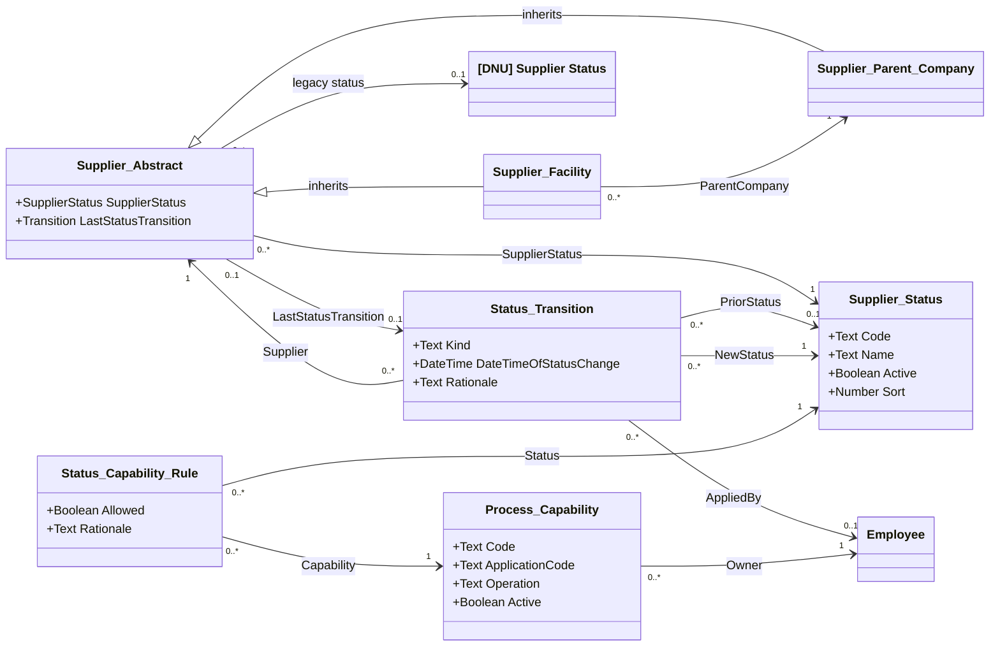

# Supplier Status Updates — solution specification and logical object model

| Property | Value |
|---|---|
| Mode | Proposed target configuration over the preserved OOTB SRM baseline and current target designs |
| As of | 2026-10-06 |
| Scope | Supplier lifecycle transitions, application eligibility, parent/facility effects, and history |
| Primary authority | ADR-079 and the user's agreement to the plain-English solution overview |
| Status | Design specification; no Intelex configuration has been implemented or runtime-tested |

## 1. Solution overview

An authorized SIA user creates a supplier status transition through an **Update Supplier Status** entry point. Its single workflow stage is **Draft**. The workflow action **Save Status Transition** captures Prior Status, New Status, actor, reason, and **Date/Time of Status change**, applies the change, and terminates the workflow as **Completed**. Date/Time of Status change is a DateTime field with TimeZone Capture. The transition object has no State field. There are no email notifications. New suppliers start Active after verified award; returning suppliers reuse their existing identity.

Connected applications use a shared status-capability matrix for supplier selection, new work, recurring work, participation, and historical visibility. Parent-company restrictions also constrain child facilities, without overwriting a child's stored status. Inactive suppliers retain historical records but cannot participate in operational workflows.

Returning an existing supplier to Active uses the same status-transition workflow and preserves supplier identity and history. Per user direction, this feature does not introduce a dedicated reactivation process, template reapplication, profile-confirmation automation, or an additional gate before new work. This deliberately leaves the template/confirmation portion of ADR-079 outside the current implementation scope; it does not change the ADR itself.

### Evidence and design boundaries

- **Extracted:** supported by the package-derived baseline registers and workflow documentation.
- **Inferred:** baseline relationship multiplicity interpreted from exported metadata.
- **Proposed:** every new field, object, constraint, state, seed value, rule, and operational behavior below unless explicitly identified otherwise.
- **Unresolved:** business policy or platform capability requiring verification before deployment.

The accepted overview authorizes this design direction. Detailed defaults below are proposals, not additional decisions attributed to the ADRs. New logical names are not confirmed internal names, physical tables, or metadata IDs. No primary-key claim is made for inherited platform identity. All new record objects use platform identity and audit properties where supported.

### Sources and related designs

- [ADR-079: lifecycle eligibility](../../adrs/ADR-079-govern-supplier-eligibility-through-auditable-lifecycle-statuses.md).
- [ADR directory](../../adrs/): ADR-002/077 (post-award creation), ADR-004 (internal responsibility), ADR-076 (hierarchy), ADR-007/078/081/084 (account/security boundaries), ADR-080 (campaigns).
- [Baseline logical model](../../ootb-srm-baseline-model/README.md), [object inventory](../../ootb-srm-baseline-model/object-inventory.csv), [field inventory](../../ootb-srm-baseline-model/field-inventory.csv), and [relationship register](../../ootb-srm-baseline-model/relationship-register.csv).
- [Parent-company baseline workflow](../../ootb-srm-baseline-workflows/supplier-parent-company.md) and [facility baseline workflow](../../ootb-srm-baseline-workflows/supplier-facility.md).
- [Profile Template target](supplier-profile-template-logical-model.md), [Role target](supplier-management-role-logical-model.md), [User Access Request target](user-access-request-logical-model.md), and [Survey target](supplier-surveys-technical-specification.md).

ADR-079 is accepted. ADR-080 remains proposed; status transitions do not depend on campaign implementation. Campaigns that use supplier status must respect the shared eligibility rules.

## 2. Baseline and compatibility findings

The existing baseline extraction identifies the source as UTF-8 JSON with BOM, package SIA OOTB SRM Export 1.0.0.0, package ID `3325fc66-fd29-47a8-9d93-70a10035aba2`, version ID `9d7880d0-54fd-4245-bce4-2f200a698f20`. It inventories 49 record objects, five lookup types, 325 fields, and six workflows. This specification reuses that established extraction; it is not a new inspection of a live tenant.

| Element | Evidence and current behavior | Target consequence |
|---|---|---|
| Supplier Abstract | Extracted `SupplierMgmt_SupAbstractObject`, ID `904aac63-aa3d-42d5-8a35-9c8426e7b96a` | Declare shared changes here once |
| Supplier Parent Company | Extracted `SupplierMgmt_ParentCompnyObject`, ID `ca226798-b56d-49bd-93bf-d8e81398150a`; directly inherits Supplier Abstract | Inherits lifecycle behavior |
| Supplier Facility | Extracted `SupplierMgmt_FacilityObject`, ID `df5c58cd-a62e-4a11-8ff3-a49936e53fbb`; directly inherits Supplier Abstract | Inherits lifecycle behavior; supports depot context |
| Facility.ParentCompany | Extracted required reference, ID `22a0255f-8f98-4f9f-abde-47fe70d9d0a7`; many facilities to one parent is Inferred | Reuse for eligibility restrictions; no new hierarchy |
| Legacy SupplierStatus | Extracted required reference on Supplier Abstract, ID `efe0a44e-d45f-4530-8cc3-9c3ab954890c` | Follow current target decommissioning; do not build a second operational status |
| DateClosed | Extracted optional Date on Supplier Abstract, ID `13b73117-8f6b-43f2-ad74-9c636bf49f86` | Retain as legacy evaluation-workflow history; do not interpret as the time of a lifecycle status change |
| Supplier evaluation workflows | Submit Evaluation validates Active/InActive; Deactivate Supplier requires already-Suspended status, cancels workflow, and sets DateClosed | Replace status checks and retire the old deactivation route |
| Controlled values and runtime semantics | Complete legacy lookup values, recurrence schedule, transaction behavior, and some permission semantics are unresolved | Validate in tenant; do not infer that Suspended means Inactive |

Rename the existing Supplier Status lookup object **[DNU] Supplier Status**. It is retained only for migration/history and is no longer used operationally. Lookup objects cannot have additional fields added to them. Create **Supplier Status as an entirely new record/configuration object**, with its own identity and Code, Name, Active?, and Sort fields, and a new required supplier reference. This implements the separate replacement object proposed in the October 5 Profile Template target; it does not extend or convert the OOTB lookup. Its `Active?` means **selectable configuration**, not supplier lifecycle Active.

### Explicit revisions to earlier target assumptions

This document takes precedence for lifecycle behavior only:

1. Replace direct editing of the replacement Supplier Status reference with the controlled transition action. Initial creation and governed migration remain special initialization operations.
2. Keep original Supplier Profile Template selection immutable. Status changes do not regenerate template assignments, alter role members, or initiate profile-confirmation work. The existing creation-only template behavior remains unchanged.
3. Do not restore the removed Supplier Profile Template Assignment Eligible flag. Ordinary template synchronization remains independent of lifecycle status.

## 3. Requirements and proposed defaults

| ID | Source | Requirement / interpretation |
|---|---|---|
| SSU-01 | ADR-079 | Active, Service Parts Only, and Inactive; Warranty Only deferred |
| SSU-02 | ADR-079; user feedback | Auditable manual transitions; one Draft workflow stage, Save Status Transition action, terminal Completed outcome, no State field and no email; no direct editing or initial approval |
| SSU-03 | ADR-002/077 | Verified award creates Active; setup is not another supplier approval |
| SSU-04 | ADR-079 | Govern application-specific selection, scheduling, participation, and historical visibility |
| SSU-05 | ADR-076; agreed overview | Exact-entity transitions; explicit parent effects; preserve facility identity |
| SSU-06 | Agreed overview | Assess and resolve incompatible open work before restricting eligibility |
| SSU-07 | ADR-079; latest user scope direction | Reuse the existing supplier for a return to Active through the normal transition; dedicated follow-up automation is outside scope |
| SSU-08 | ADR-004/007/078/081/084 | Authorized internal actors; preserve account and record-security boundaries |
| SSU-09 | Proposed reliability control | Prevent stale updates, duplicate application, and incomplete history/current-state updates |
| SSU-10 | User feedback | Capture Date/Time of Status change as DateTime with TimeZone Capture when Save Status Transition succeeds; no Effective Date field |
| SSU-11 | Proposed hierarchy policy | Facility operational permission requires both its own and parent's permission; no silent status propagation |

The date/time is generated by Save Status Transition, not entered as a scheduled or retrospective effective date. This user direction replaces the earlier effective-date proposal and narrows ADR-079's date requirement to the actual captured status-change timestamp.

## 4. Complete feature logical model

This is the complete model for the status-update feature, with unchanged SRM domains represented by their integration endpoints. The baseline diagrams remain the complete application model. Diagram aliases map to display names by replacing underscores with spaces; `Legacy_Status` represents the renamed [DNU] Supplier Status lookup; `Supplier_Status` represents the entirely new Supplier Status record object. New object internal IDs remain unassigned.



No new business inheritance or M:N map is introduced. Status Capability Rule is an explicit association record between status and capability.

## 5. Object inventory and field specification

| Object | Treatment | Responsibility / identity |
|---|---|---|
| Supplier Abstract | Modify OOTB | Current lifecycle projection shared by both concrete supplier types; baseline ID above |
| [DNU] Supplier Status | Rename existing lookup | No additional fields; retain only for migration/history; cease operational use |
| Supplier Status | New | Governed catalogue with new identity; no exported target metadata ID |
| Status Transition | New | One entity change or initialization event; platform identity and single-stage workflow |
| Process Capability | New | One application/business operation; unique stable Code |
| Status Capability Rule | New | One decision per Status + Capability pair |
| Employee | OOTB | Actor and configuration-owner references; not a duplicated identity object |

Unless stated otherwise, business fields are required, users cannot hard-delete referenced configuration or applied history, and platform-generated identities are read only. Text lengths below are proposed limits. Audit CreatedBy/CreatedAt/ModifiedBy/ModifiedAt remain platform properties, subject to tenant verification.

### 5.1 Supplier Abstract — modify fields in OOTB object

| Action | Field | Type | Required? | Default, ownership, and behavior |
|---|---|---|---|---|
| Add new field | Supplier Status | M:1 reference to the entirely new Supplier Status record object | Y | Active on verified-award creation; subsequent writes only through Save Status Transition |
| Re-caption | [DNU] Supplier Status | Ref to the OOTB lookup | N | Read only and hidden operationally; never used for eligibility |
| Add new field | Last Status Transition | M:1 reference to Status Transition | Y | System sets after successful apply; must reference this supplier's latest applied event |

No additional supplier-completeness field or new-work gate is introduced. Existing application-specific validation remains in place.

### 5.2 Supplier Status — new object

| Field | Type | Required? | Additional Config |
|---|---|---|---|
| Code | Text | Y | Max 10 char<br />Business rule: code should be unique<br />Should be read-only after Create |
| Name | Text | Y | Max 255 char<br />Display field |
| Active? | Boolean | N | Default: Yes<br />Change view settings to checkbox |
| Sort | Number | N | Order/sort field |

Add initial Supplier Status records:

-  `ACTIVE` / Active
- `SERVICE` / Service Parts Only
- `INACTIVE` / Inactive

All three catalogue records have Active? = Yes.

Do not add Warranty Only until permitted operations are decided. Renaming a label must not change rules or historical meaning.

### 5.3 Status Transition — new object

| Field | Type | Required? | Additional Config |
|---|---|---|---|
| Supplier | M:1 Supplier Abstract | Y | Selected at creation and then read-only |
| Kind | Lookup | Y | Create a new lookup "SRM - Supplier Status Transition Kind" with values: Change, Initialization, Migration |
| Prior Status | M:1 Supplier Status | N | Read-only always<br />Displaymode=View,Edit<br />Show only when Kind=Change, hide and clear value when <> Change (view action)<br />Add AH, on create, set this field to Supplier's Supplier Status |
| New Status | M:1 Supplier Status | Y |  |
| Date and Time of Status change | Date and Time | N | Ensure timezone is checked<br />read only |
| Applied By | M:1 Employee | N | read only |
| Rationale | Text | N | For user to provide business reason; migration identifies mapping/source batch |
| Impact Summary | Text | N | System snapshot of policy outcome and affected open-work counts/references |
| Impact Resolution | Text | N | User to provide explanation; cannot override unresolved blockers |
| [Helper] Updated Supplier Status | Yes/No | N | read only<br />default: no |

This object has a workflow. View section 7.

### 5.4 Process Capability — new object

| Field            | Type         | Required? | Additional Config                                            |
| ---------------- | ------------ | --------- | ------------------------------------------------------------ |
| Code             | Text         | Y         | max 100 char<br />business rule: must be unique              |
| Name             | Text         | Y         | max 255 char<br />display field                              |
| Application Code | Text         | Y         | max 50 char                                                  |
| Operation        | Lookup       | Y         | New lookup with values: SelectNew, CreateNew, Schedule, Participate, History |
| Active?          | Yes/No       | N         | set view settings to checkbox<br />default: yes              |
| Owner            | M:1 Employee | Y         |                                                              |

### 5.5 Status Capability Rule — new object

| Field      | Type                   | Required? | Additional Config                                        |
| ---------- | ---------------------- | --------- | -------------------------------------------------------- |
| Status     | M:1 Supplier Status    | Y         | Business rule: Status and Capability pair must be unique |
| Capability | M:1 Process Capability | Y         |                                                          |
| Allowed?   | Yes/No                 | Y         | Default: No                                              |
| Rationale  | Text                   | Y         |                                                          |

Matrix editing is restricted to designated configuration administrators; it is not a supplier status transition. Rule changes take immediate prospective effect and require an impact review. Never reinterpret historical scorecard populations or issuance snapshots under today's matrix. Apply the same incompatible-open-work check to a restrictive matrix edit before publishing it; otherwise editing configuration would bypass the protection on status transitions. Policy publication and work creation require the same concurrency protection as status application.

## 6. Relationship register

All new multiplicities are Proposed logical constraints, not proven physical database constraints. Reverse collections are navigation, not additional foreign keys.

| Source | Declaring field | Target | Cardinality per source | Required | Evidence / classification |
|---|---|---|---|---|---|
| Facility | ParentCompany | Parent Company | Many:1 | Yes | Baseline field ID in §2; Extracted reference, Inferred multiplicity |
| Supplier Abstract | Legacy Supplier Status | Legacy lookup | Many:0..1 | No after migration | Baseline field in §2; target relaxation Proposed |
| Supplier Abstract | Supplier Status | Replacement Supplier Status | Many:1 | Yes | Profile Template target, controlled writes modified here |
| Supplier Abstract | Last Status Transition | Status Transition | 0..1:0..1 | Conditional | Proposed; target must point back to this supplier |
| Status Transition | Supplier | Supplier Abstract | Many:1 | Yes | Proposed SSU-02 |
| Status Transition | Prior Status / New Status | Supplier Status | Many:0..1 / Many:1 | Conditional / Yes | Proposed SSU-02 |
| Status Transition | Applied By | Employee | Many:0..1 | On completion | Proposed SSU-02 |
| Process Capability | Owner | Employee | Many:1 | Yes | Proposed configuration ownership |
| Status Capability Rule | Status / Capability | Supplier Status / Process Capability | Many:1 each | Yes | Proposed explicit association; pair unique |

Direct inheritance remains Supplier Abstract → Parent Company and Supplier Abstract → Facility. Employee's existing Subject inheritance and Group-derived role inheritance are unchanged and omitted from the feature diagram. No new object inherits Supplier Abstract.

## 7. Status application and eligibility contract

### Supplier Status Transition Workflow: Single-stage workflow

**SIA-Defined Requirement:** exactly one stage, **Draft**; exactly one workflow action, **Save Status Transition**; successful execution terminates the workflow as **Completed**. Completed is a terminal workflow outcome, not another stage or a custom object field. No email notifications are configured, including start, completion, failure, or reminder emails. There is no approval, cancellation, or email path.

Ownership and validations below are Proposed implementation details. No due-date rule is configured for this workflow.

-------------

(below diagram is AI-generated. Whenever tables and diagram clash, the tables are source of truth)

```mermaid
swimlane-beta LR
  accTitle: Supplier Status Transition workflow
  accDescr: An authorized SIA user saves a Draft transition. Intelex validates and saves the change, then terminates as Completed. Invalid submissions remain Draft. No emails are sent.
  subgraph sia[Authorized SIA user]
    draft["Draft"]
  end
  subgraph intelex[Intelex]
    valid{"Validation passes?"}
    save["Save status and capture date/time"]
    completed([Completed])
  end
  draft -->|Save Status Transition| valid
  valid -->|No: display error| draft
  valid -->|Yes| save
  save -->|Success: terminate workflow| completed
  save -->|Failure: roll back and display error| draft
```

The diagram requires a renderer supporting native Mermaid swimlanes. Validation and save nodes represent action operations, not additional stages.

-----------------------

**Workflow Stage**

| Stage | Workflow status | Responsible person | Due date |
|---|---|---|---|
| Draft | Draft | Created By | None |

**Workflow Stage Action**

| Stage | Action Name              | Permissions                  | OrderResult                                                  | ActionEmail                                |
| ----- | ------------------------ | ---------------------------- | ------------------------------------------------------------ | ------------------------------------------ |
| Draft | Submit Status Transition | Default security permissions | Validate; refresh impact; verify Prior Status; write supplier status/history; terminate workflowCompleted on success; Draft on failure | Completed on success; Draft on failureNone |

Ordered operations for **Submit Status Transition**:

1. Verify that Prior Status and New Status have different values. Throw error if same value.
2. Verify that Prior Status still matches Supplier's Status. If not, someone else has submitted a transition while this one was in Draft. Set [Helper] Updated Supplier Status = TRUE. Transition to Draft (keeps workflow in same spot and stops system from continuing below steps). If statuses do match, set helper to FALSE (i.e. reset to default).
3. Verify Rationale <> null. Throw error if it is null.
4. *ignore this step for now, Dave to comment*. Recalculate current impact, including child facilities for a parent change. Block incompatible open work and missing impact adapters. A note cannot override a blocker.
5. Set Applied By = current user, set Date and Time of Status change = current timestamp with timezone capture.
6. Set Supplier.Supplier Status = New Status and Supplier.Last Status Transition = this record.
7. Close workflow as Completed.


Set up detail view for this object:

- show all non-helper fields
- at the top, add a warning banner with "Supplier status has changed. Please review before re-submission." Add C# show/hide logic, show if [Helper] Updated Supplier Status = TRUE.
- everything should be read-only when workflow is complete.


Draft permissions permit authorized SIA lifecycle administrators to edit New Status, rationale, and permitted supporting inputs and execute the action. Prior Status and system-captured values are read only. These are proposed exceptions relative to inherited application permissions; exact tenant ACL configuration remains to be validated. Supplier users receive no transition edit/action permission.

No status transition automatically deletes, closes, or cancels domain work. The proposed default is to block a restrictive transition while any open work would lose a permission required for completion. Future exception policies need explicit domain-specific rules. A parent transition evaluates the work of affected facilities too.

### Eligibility calculation

For a parent supplier, look up the current Status + Capability pair. For a facility, require Allow for both its own current status and its parent's current status. Missing rules deny. Use current catalogue references and stable capability codes, not display names. Invalid/missing operational status is an owned configuration exception and blocks new work.

After lifecycle permission, apply ordinary user permissions, supplier entity scope, record classification, and domain rules. Status changes do not introduce an additional confirmation gate before new work.

History permission does not use parent lifecycle intersection and is seeded Allow for all three statuses. Existing entity and classification security still applies. It never grants portal authentication or broader record access. Account dormancy remains ADR-007; lifecycle reactivation does not reactivate accounts.

### Initial matrix proposal

Each business-specific operation becomes a separate capability when rules differ; “audit” or “survey” alone is too broad. Rows marked Confirm are unresolved and must receive explicit Allow/Deny decisions before their application goes live.

| Capability family | Active | Service Parts Only | Inactive |
|---|---|---|---|
| Mass-production new work | Allow, subject to domain rules | Deny | Deny |
| Monthly mass-production scorecard generation | Allow | Deny | Deny |
| Routine shutdown survey issuance | Allow | Deny | Deny |
| Service-related new work | Allow | Confirm by process | Deny |
| Operational participation / audits / NCRs | Confirm by process | Confirm by process | Deny |
| Authorized historical visibility | Allow | Allow | Allow |

Survey campaign filters can narrow eligible suppliers, but cannot override a denial from the central matrix. Existing Survey Status Eligibility configuration is an additional campaign restriction, not a competing lifecycle authority. Scheduled issuance rechecks eligibility at launch and before creating each supplier work item; already issued records follow the open-work policy.

### Parent and facility behavior

A parent can restrict child activity without changing child stored statuses. The UI must show both local status and the parent restriction. An Active child under an Inactive parent is therefore historically Active locally but operationally blocked. Changing one child does not affect its siblings. Reactivating a parent does not reactivate an Inactive child. A company-wide bulk transition is deferred; it would require separate auditable events for each changed entity.

Before returning a parent to Active, preview capabilities that will reopen for children. New facility work remains subject to its ordinary exact-facility validation and permissions.

## 8. Permissions, UI, and notifications

| Surface / action | Permission and behavior |
|---|---|
| Current supplier status | Read only for ordinary maintainers and supplier users; show current status, Date/Time of Status change and inherited parent restrictions |
| Create transition / Save Status Transition | Designated SIA lifecycle administrators within authorized scope; supplier role membership alone grants no authority |
| Applied history | Authorized internal read access; no ordinary edit/delete; supplier-facing status visibility may exclude internal rationale |
| Configuration | Designated SRM configuration administrators; audit status/capability changes |
| Transition emails | None: no start, completion, failure, or reminder email notifications |
| Missing owner/routing or processing error | SIA SRM administration exception queue; does not silently assign a supplier contact |

Resolve standard operational roles for the exact supplier, consistent with the Role target. Status Transition sends no email notifications. Validation errors are displayed in the UI; administrative exceptions are visible in reporting. This specification adds no email reminder configuration.

## 9. Change summary and traceability

| Change | Action | Element | Baseline / earlier target | Proposed | Requirement | Rationale / confidence |
|---|---|---|---|---|---|---|
| SSU-C01 | Modify | Supplier Abstract | Legacy lookup; newer replacement reference | Controlled replacement writes plus last-event pointer | SSU-01/02/09 | One current authority; High |
| SSU-C02 | Rename / Add | Legacy lookup / new Supplier Status record object | OOTB lookup cannot accept additional fields | Rename lookup [DNU] Supplier Status; create separate record object with Code/Name/Active?/Sort | SSU-01; user feedback | Separate new configuration from retired lookup; High |
| SSU-C03 | Add | Status Transition | No lifecycle event model | Immutable history; Draft workflow, Save Status Transition → Completed; no email or State field | SSU-02/03/09/10; user feedback | Auditable manual application; High |
| SSU-C04 | Add | Capability + Rule | Workflow-specific string conditions | Shared operation-level matrix | SSU-04/11 | Consistent eligibility; Medium until policy approved |
| SSU-C06 | Modify | Evaluation workflows | Suspended prerequisite; Active/InActive checks | Retire deactivation action; use relevant capabilities | SSU-04/06 | Avoid duplicate lifecycle control; Medium pending runtime checks |
| SSU-C07 | No structural change | Supplier hierarchy/account security | Existing parent reference and separate user lifecycle | Restriction calculation and exact-entity routing | SSU-05/08/11 | Preserve identity/security; Medium |

| Requirement | Affected elements | Design response | Status |
|---|---|---|---|
| SSU-01 | Supplier Status | Three seed states; Warranty Only deferred | Satisfied at design level |
| SSU-02 | Transition, workflow, supplier projection | Draft → Save Status Transition → Completed, immutable history, no State field or email; future approval would require explicit workflow revision | Satisfied at design level |
| SSU-03 | Initialization event | Verified award creates Active without supplier approval | Satisfied at design level |
| SSU-04 | Capability/Rule, consuming applications | Shared matrix and validation contract | Partially satisfied: complete application matrix/adapters required |
| SSU-05 | Hierarchy, transition impact | Exact entity and explicit parent restriction | Satisfied at design level |
| SSU-06 | Impact validation | Block incompatible open work; no bulk auto-closure | Requires confirmation of domain work inventory and disposition rules |
| SSU-07 | Supplier identity and Status Transition | Return to Active uses the existing supplier and standard save action; template reapplication and contact confirmation are excluded by user direction | Partially satisfied against ADR-079; current narrowed scope satisfied |
| SSU-08 | Permissions, actor references | Internal lifecycle authority; separate security/account state | Partially satisfied: business role owner must be named |
| SSU-09 | Transition record, Prior Status validation, platform locking | Prevent duplicate workflow execution and inconsistent saves without custom concurrency fields | Requires confirmation of platform transaction/locking support |
| SSU-10 | Date/Time of Status change | Actual DateTime with TimeZone Capture; no Effective Date field | Satisfied at design level per user feedback |
| SSU-11 | Eligibility resolver | Parent-and-facility operational intersection | Satisfied as proposed policy; business ratification required |

## 10. Migration, implementation impact, and validation

### Migration and deployment

1. Inventory live statuses and every form, workflow condition, report, automation, import, and integration reading/writing the legacy or replacement field. Do not assume baseline expressions enumerate live values.
2. Rename the OOTB lookup object [DNU] Supplier Status and create the entirely separate Supplier Status record object. If this new record object has already been implemented from the target, use that implementation; never extend or convert the lookup. Resolve duplicate codes and map each legacy value to a reviewed target value. Suspended and InActive require explicit business interpretation; never normalize solely by spelling.
3. Populate the replacement status for all companies/facilities before making it mandatory. Create one Migration event per supplier with unknown Prior Status left null and source status/mapping in rationale. Complete its workflow through the governed save operation, capturing actual Date/Time of Status change with TimeZone Capture, not an invented historical change date. Set the last-event pointer consistently.
4. Configure and validate capability rows and adapters for every enabled application before switching writers/readers. Preserve issued scorecard/survey snapshots and historical record permissions.
5. Remove direct-edit access and replace the old deactivation action. Adapt evaluation completion checks without treating workflow Closed as supplier Inactive. Decide recurrence eligibility explicitly; baseline schedule timing is unresolved.
6. Verify returns to Active use the existing supplier and standard transition. No regeneration of templates, contacts, users, or supplier records is authorized by this migration.
7. Validate reconciliation reports before retiring operational legacy usage. Retain rollback evidence; after real transitions exist, rollback requires preserving/reconciling those events rather than simply restoring an old status column.

### Validation findings and acceptance scenarios

| Check | Design result / required execution |
|---|---|
| Stable IDs and baseline references | Reused metadata IDs trace to existing inventories; target logical aliases are explicitly nonphysical |
| Inheritance | Two existing supplier subtype edges retained; no new parent or cycle introduced |
| Relationship targets | All feature references are declared in field/register tables; no template, role-assignment, or survey-request object dependency is added |
| Uniqueness | Enforce unique status/capability codes and Status + Capability matrix pairs |
| Required references | Supplier/status/employee/owner references can block operations; conditional timing specified above |
| Orphans and deletion | Required child parents; retain referenced configuration and applied events; no cascade deletion of history |
| Abstract-base effects | Both companies and facilities inherit projection fields, validation, permissions, and migration requirements |
| Competing writers | Verify UI, import, API, workflow, and automation routes cannot bypass transition rules after cutover |
| Concurrent changes | Concurrent saves are serialized by platform controls; mismatched Prior Status blocks a stale draft without completion or supplier change |
| Retry safety | Completed transition cannot execute Save Status Transition again |
| Atomicity | Inject failure between transition-history/supplier-status steps; no inconsistent operational state may be exposed |
| Hierarchy | Restrict parent, observe child blocks without stored child changes; changing one child leaves siblings unchanged |
| Open work | Incompatible record and missing impact adapter each block; text acknowledgement cannot bypass |
| Return to Active | Preserve supplier identity/history; use the normal save action; do not generate additional records, modify template assignments, or introduce a confirmation gate |
| Security | Inactive history remains authorized-only; account activation, entity scope, and confidentiality never expand through status change |
| Scheduling | Race between eligibility check and creation cannot issue prohibited work; historical audience snapshots remain unchanged |
| Timestamp and correction | Capture DateTime with TimeZone Capture; no editable Effective Date; corrections use another transition without rewriting completed history |
| Workflow and fields | One Draft stage, one Save Status Transition action, Completed termination; no State field on transition or removed concurrency/correction fields |
| Email | Verify absence of transition workflow email triggers and reminder configuration |
| Status objects | Lookup is named [DNU] Supplier Status; new fields exist only on the entirely new Supplier Status record object |

These are implementation acceptance scenarios, not claims of passing runtime tests. Document-level checks cover local links, diagram/reference consistency, and preservation of baseline files. Mermaid rendering and tenant-specific expression syntax must be verified in the implementation environment.

### Remaining decisions and release conditions

- Name the authorized lifecycle business owner and configuration owner.
- Approve the capability matrix, especially service activity and audits/NCR participation.
- Ratify parent intersection; time of change is now system-captured per user direction.
- Confirm open-work adapters and closure/reassignment procedures; full inactivation cannot proceed with incompatible unresolved obligations.
- Prove guarded application, uniqueness, security enforcement, cache invalidation, and retry behavior in the tenant.
- Decide Warranty Only separately if needed. No additional lifecycle status is assumed.

## 11. Revision record

2026-10-06 — Initial status-update solution specification following agreement on the overview. Incorporates the October 5 replacement Supplier Status target. Supersedes direct lifecycle editing. The later user-directed scope reduction retains the existing creation-only template behavior. OOTB baseline artifacts and ADR decision records remain unchanged.

User-feedback revision — Rename the legacy lookup [DNU] Supplier Status and create a separate Supplier Status record object. Replace the transition State field with Draft → Save Status Transition → Completed, without email. Rename status references to Prior Status/New Status, replace Applied At with Date/Time of Status change (DateTime with TimeZone Capture), and remove Effective Date, Expected Version, Operation Token, Corrects Transition, and the now-unused supplier Lifecycle Version. This revision supersedes the earlier custom-state, date, concurrency-field, correction-link, and notification proposals.

Scope revision — Remove the platform workflow reference and the separate document/certification object dependencies from this feature model. Workflow behavior remains Draft → Save Status Transition → Completed.

Scope reduction — Reactivation is uncommon for this client. Remove the dedicated reactivation object model and all related generation, verification, gating, permissions, and migration requirements. A return to Active remains a normal status transition on the existing supplier. ADR-079’s template/confirmation work is explicitly outside this feature’s scope. SSU-12 and SSU-C05 are retired identifiers and are not reused.
