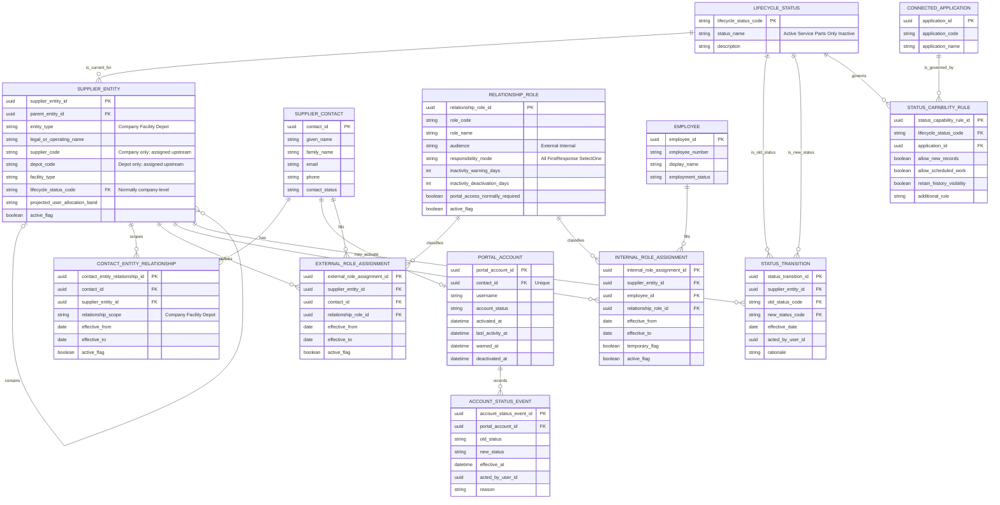
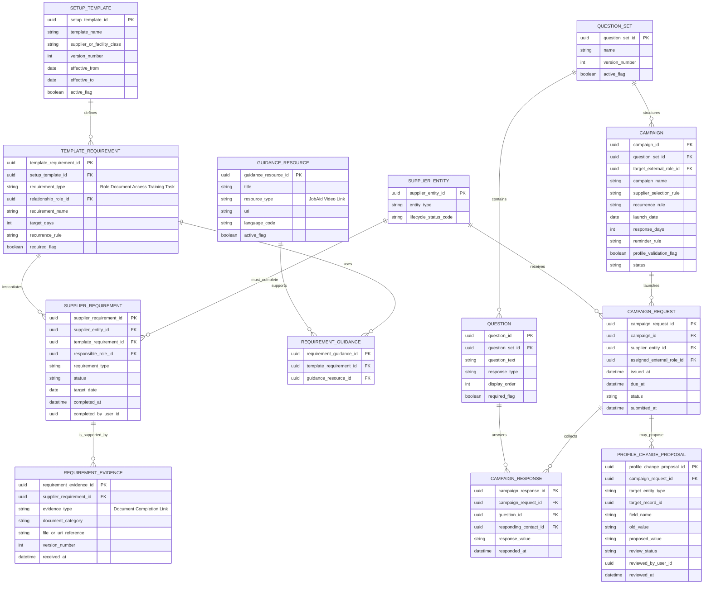
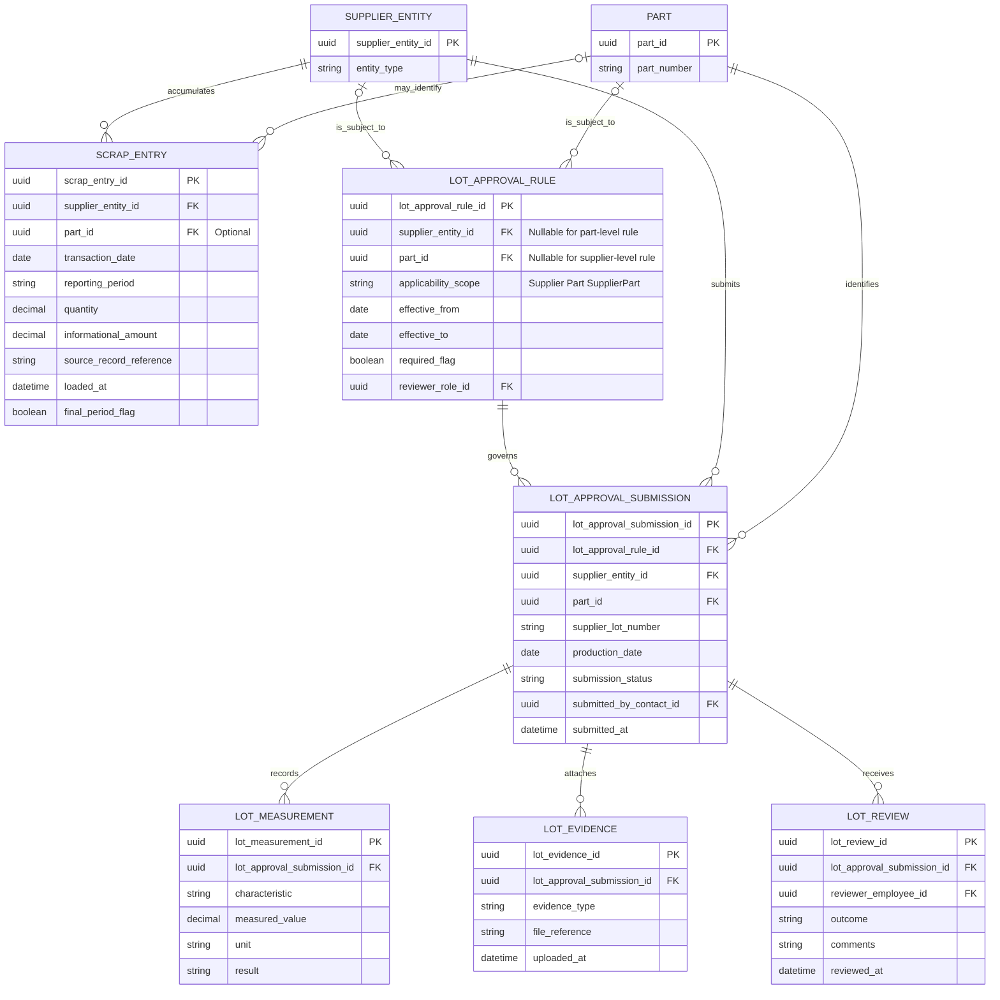
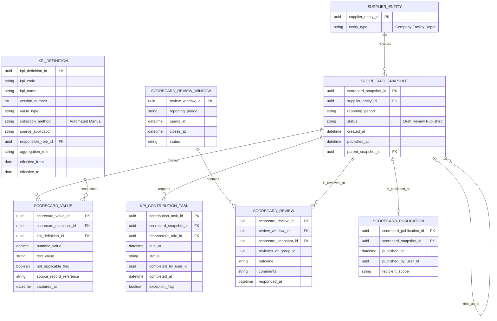

# Supplier Relationship Management Entity Relationship Diagram

## Purpose and scope

This document is a logical data model derived from the architectural decision records (ADRs). It is intended to guide application design; it is not a physical Intelex schema.

The model includes:

- the Supplier Relationship Management (SRM) system of record for supplier identity, hierarchy, contacts, roles, lifecycle, onboarding, campaigns, access, and record visibility;
- Supplier Portal account administration and the supplier-quality workspace boundary;
- the SRM-owned scrap-visibility and Supplier Lot Approval capabilities; and
- only the integration anchors required by directly adjacent applications named in the SRM ADRs, with additional detail for Supplier Scorecard.

It deliberately does not expand the internal data models of Procurement/RFQ, APQP, PPAP, PCR, Non-Conformance Management, Audit Management, Product Management, Warranty Analysis, or Shipping/Receiving/Inspection beyond the records and foreign-key relationships needed to connect them to SRM.

ADR-001 is superseded by ADR-083. Accordingly, the existing SIA Supplier Portal remains the upstream entry point, while Intelex provides the supplier-quality workspace and SRM remains the supplier master.

## Modeling conventions

- `SUPPLIER_ENTITY` is a logical supertype for a parent company, facility, or depot. A physical implementation may use separate application objects/forms while preserving the same hierarchy and relationships.
- `SUPPLIER_RECORD_CONTEXT` is a conceptual cross-application security contract. It may be implemented as shared fields on each adjacent record rather than as a literal table.
- `PART`, `DRAWING`, `EMPLOYEE`, and the adjacent workflow records are mastered outside SRM.
- Portal lists, assigned-task lists, status counts, scorecard summaries, notifications, and reports are projections over persisted records, not independent domain entities.
- Entities marked **proposed** below arise principally from ADR-006, ADR-080, or ADR-081 and should remain configurable until those ADRs are accepted.

## 1. Supplier master, relationships, lifecycle, and access

### Access semantics

- A contact relationship to one or more child entities grants access only to those facilities/depots. A relationship to the parent company grants inherited access to all children.
- A portal account is optional and one-to-zero-or-one from a contact. Contacts who only receive notifications do not require an account.
- External and internal role assignments are intentionally separate because their identity, authentication, and administration rules differ.
- Role assignments route work but do not broaden a user's supplier-entity scope.
- The shortest dormancy thresholds among a portal user's active external roles apply; the platform-level fallback applies when no standardized external role supplies thresholds.
- `projected_user_allocation_band` is **proposed** by ADR-081 and is a soft warning control, not a hard per-supplier license limit.

## 2. Onboarding, profile completeness, and supplier campaigns

The setup template generates auditable completeness work after an awarded supplier is created as active; incomplete requirements do not introduce another supplier approval gate. The campaign entities and campaign-driven profile confirmation are **proposed** by ADR-006 and ADR-080.

## 3. Cross-application security context and adjacent workflow anchors

```mermaid
erDiagram
    SUPPLIER_ENTITY {
        uuid supplier_entity_id PK
        string entity_type
        string supplier_or_depot_code
    }

    VISIBILITY_CLASSIFICATION {
        uuid visibility_classification_id PK
        string classification_code
        string classification_name
        string description
        boolean active_flag
    }

    SUPPLIER_RECORD_CONTEXT {
        uuid supplier_record_context_id PK
        uuid supplier_entity_id FK
        uuid visibility_classification_id FK
        string source_application
    }

    CLASSIFICATION_HISTORY {
        uuid classification_history_id PK
        uuid supplier_record_context_id FK
        uuid old_classification_id FK
        uuid new_classification_id FK
        datetime changed_at
        uuid changed_by_user_id
        string reason
    }

    PROCUREMENT_AWARD_REFERENCE {
        uuid award_reference_id PK
        uuid supplier_entity_id FK
        string upstream_reference
        date award_date
        string source_system
        boolean verified_flag
    }

    PART {
        uuid part_id PK
        string part_number
        string part_status
        uuid drawing_id FK
    }

    DRAWING {
        uuid drawing_id PK
        string drawing_number
        string current_revision
    }

    SUPPLIER_PART_RELATIONSHIP {
        uuid supplier_part_relationship_id PK
        uuid supplier_entity_id FK
        uuid part_id FK
        string relationship_purpose "Manufacturing Sequencing Service"
        date effective_from
        date effective_to
        boolean active_flag
    }

    APQP_PLAN {
        uuid apqp_plan_id PK
        uuid supplier_record_context_id FK
        uuid part_or_drawing_id FK
        uuid program_id FK
        string status
    }

    PPAP {
        uuid ppap_id PK
        uuid supplier_record_context_id FK
        uuid drawing_id FK
        string status
    }

    PPAP_PART_SCOPE {
        uuid ppap_part_scope_id PK
        uuid ppap_id FK
        uuid part_id FK
        boolean included_flag
    }

    SUPPLIER_NCR {
        uuid supplier_ncr_id PK
        uuid supplier_record_context_id FK
        uuid part_id FK
        string risk_tier
        string status
    }

    SUPPLIER_AUDIT {
        uuid supplier_audit_id PK
        uuid supplier_record_context_id FK
        string audit_type
        date audit_date
        string status
    }

    PCR {
        uuid pcr_id PK
        uuid supplier_record_context_id FK
        uuid part_id FK
        string change_type
        string concept_outcome
        string status
    }

    WARRANTY_ANALYSIS {
        uuid warranty_analysis_id PK
        uuid supplier_record_context_id FK
        string reporting_period
        datetime due_at
        datetime submitted_at
        string completion_status
    }

    INSPECTION_REQUEST {
        uuid inspection_request_id PK
        uuid supplier_record_context_id FK
        uuid part_id FK
        string inspection_purpose
        uuid specification_revision_id FK
        string status
    }

    SUPPLIER_ENTITY ||--o{ SUPPLIER_RECORD_CONTEXT : secures
    SUPPLIER_ENTITY ||--o{ PROCUREMENT_AWARD_REFERENCE : is_created_or_reactivated_from
    VISIBILITY_CLASSIFICATION ||--o{ SUPPLIER_RECORD_CONTEXT : classifies
    SUPPLIER_RECORD_CONTEXT ||--o{ CLASSIFICATION_HISTORY : preserves
    SUPPLIER_ENTITY ||--o{ SUPPLIER_PART_RELATIONSHIP : performs_role_for
    PART ||--o{ SUPPLIER_PART_RELATIONSHIP : is_supplied_through
    DRAWING ||--o{ PART : defines
    SUPPLIER_RECORD_CONTEXT ||--o| APQP_PLAN : secures
    SUPPLIER_RECORD_CONTEXT ||--o| PPAP : secures
    PPAP ||--o{ PPAP_PART_SCOPE : includes
    PART ||--o{ PPAP_PART_SCOPE : is_selected_in
    SUPPLIER_RECORD_CONTEXT ||--o| SUPPLIER_NCR : secures
    SUPPLIER_RECORD_CONTEXT ||--o| SUPPLIER_AUDIT : secures
    SUPPLIER_RECORD_CONTEXT ||--o| PCR : secures
    SUPPLIER_RECORD_CONTEXT ||--o| WARRANTY_ANALYSIS : secures
    SUPPLIER_RECORD_CONTEXT ||--o| INSPECTION_REQUEST : secures
```

Each adjacent business record has exactly one supplier security context; the context relates it to the responsible supplier company/facility and its current visibility classification. The classification history supports auditable transition from restricted new-model information to mass-production or general visibility without copying the business record.

Exactly one adjacent business-record type owns a given `SUPPLIER_RECORD_CONTEXT`; that exclusive-or constraint is not expressible directly in Mermaid ER syntax.

`PROCUREMENT_AWARD_REFERENCE` is deliberately shown as an upstream reference rather than a relationship to a sourcing model: SRM begins after verified award and does not own sourcing or award decisions.

## 4. SRM operational capabilities: scrap visibility and Supplier Lot Approval

Scrap entries provide secured operational visibility and scorecard input; Procurement's debit memo and settlement remain external. Supplier Lot Approval is event-driven: no submission is created until a supplier has an actual production lot. `LOT_MEASUREMENT` may later reuse the shared inspection framework rather than remain a distinct physical table.

## 5. Supplier Scorecard detail

Facility/depot snapshots roll up to the parent supplier under each KPI's aggregation rule. Values are period snapshots, so later changes to live NCR, PPAP, warranty, scrap, delivery, response, or parts-consumption data do not rewrite an approved historical scorecard.

## Portal and reporting read models

The Intelex supplier-quality workspace should query the entities above rather than maintain a duplicate supplier master. Its initial read models are expected to include:

- authorized supplier companies and facilities derived from `CONTACT_ENTITY_RELATIONSHIP`;
- actionable work derived from workflow tasks assigned through active relationship roles;
- selected current `SCORECARD_VALUE` records;
- filtered overdue counts for records such as `SUPPLIER_NCR` and `PPAP`; and
- navigation to authorized adjacent application records through `SUPPLIER_RECORD_CONTEXT`.

Summary counts must link to the filtered records that support them. Notifications and reporting consume domain events and read models; they are not modeled as independent SRM business entities here.

## ADR traceability

| Model area | Primary ADRs | Adjacent ADRs used to validate the relationship |
|---|---|---|
| Supplier hierarchy and identifiers | [ADR-076](ADR-076-model-suppliers-as-parent-companies-with-child-facilities-and-depots.md), [ADR-077](ADR-077-create-awarded-suppliers-through-reviewed-manual-intake.md) | [ADR-062](../product-management/ADR-062-integrate-partsmaster-and-service-part-data-with-governed-depot-assignment-and-update-precedence.md), [ADR-092](../product-management/ADR-092-support-role-qualified-multiple-supplier-relationships-per-part.md) |
| Post-award lifecycle and capability rules | [ADR-002](ADR-002-begin-the-intelex-supplier-lifecycle-after-supplier-award.md), [ADR-079](ADR-079-govern-supplier-eligibility-through-auditable-lifecycle-statuses.md) | APQP, PPAP, NCR, Audit, Scorecard, and Procurement/RFQ boundaries named by those ADRs |
| Contacts, roles, accounts, and entity access | [ADR-003](ADR-003-centralize-external-supplier-contacts-by-standardized-relationship-roles.md), [ADR-004](ADR-004-centralize-internal-sia-supplier-ownership-roles-with-flexible-reassignment.md), [ADR-006](ADR-006-allow-supplier-self-service-maintenance-of-external-roles-with-periodic-confirmation.md), [ADR-007](ADR-007-deactivate-dormant-supplier-accounts-using-role-based-thresholds.md), [ADR-078](ADR-078-scope-supplier-portal-access-through-supplier-entity-relationships.md), [ADR-081](ADR-081-delegate-supplier-user-administration-with-soft-license-controls.md) | [ADR-026](../ppap/ADR-026-route-ppap-work-through-stable-supplier-depot-and-internal-roles.md), [ADR-061](../intelex-platform/ADR-061-use-entra-id-sso-for-internal-users-and-a-separate-local-authentication-supplier-portal.md) |
| Onboarding and campaigns | [ADR-005](ADR-005-use-supplier-type-onboarding-templates-to-generate-required-roles-documents-training-and-tasks.md), [ADR-006](ADR-006-allow-supplier-self-service-maintenance-of-external-roles-with-periodic-confirmation.md), [ADR-080](ADR-080-use-reusable-campaigns-for-supplier-information-requests.md) | Supplier Portal, Supplier Surveys, Notifications, and Reporting are consumers |
| Supplier workspace and record security | [ADR-083](ADR-083-retain-the-existing-supplier-portal-as-the-upstream-entry-point-and-use-intelex-as-the-supplier-quality-workspace.md), [ADR-084](ADR-084-apply-mutable-visibility-classifications-to-supplier-related-records.md) | [ADR-008](../audit-management/ADR-008-manage-supplier-audits-in-audit-management-and-link-them-to-supplier-records.md), [ADR-009](../apqp/ADR-009-model-each-apqp-for-a-specific-supplier-and-item-or-drawing-combination.md), [ADR-021](../ppap/ADR-021-model-ppap-as-a-drawing-scoped-parent-with-selected-part-numbers-and-an-integrated-part-warrant.md), [ADR-032](../pcr/ADR-032-use-supplier-initiated-pcr-with-context-specific-concept-outcomes.md), [ADR-046](../non-conformance-management/ADR-046-model-supplier-ncr-as-one-end-to-end-record-with-integrated-investigation-and-corrective-action.md), [ADR-059](../warranty-analysis/ADR-059-model-warranty-analysis-reports-as-a-separate-recurring-supplier-obligation.md) |
| Scrap and lot approval | [ADR-063](ADR-063-provide-suppliers-current-period-scrap-visibility-while-keeping-financial-debit-processing-external.md), [ADR-085](ADR-085-manage-supplier-lot-approval-as-an-event-driven-supplier-submission.md) | [ADR-040](../pilot-part-data/ADR-040-capture-pilot-part-data-as-structured-sample-level-inspection-records.md), [ADR-041](../pilot-part-data/ADR-041-reuse-one-inspection-framework-across-pilot-part-ppap-sample-and-internal-safe-launch.md) |
| Scorecards | [ADR-076](ADR-076-model-suppliers-as-parent-companies-with-child-facilities-and-depots.md), [ADR-079](ADR-079-govern-supplier-eligibility-through-auditable-lifecycle-statuses.md), [ADR-083](ADR-083-retain-the-existing-supplier-portal-as-the-upstream-entry-point-and-use-intelex-as-the-supplier-quality-workspace.md) | [ADR-058](../supplier-scorecard/ADR-058-build-supplier-scorecards-as-scheduled-kpi-snapshots-from-integrated-source-data.md), [ADR-086](../supplier-scorecard/ADR-086-orchestrate-monthly-supplier-scorecard-data-entry-review-and-publication.md) |

## Open implementation decisions

The ADRs intentionally leave these physical-design choices open:

- whether company, facility, and depot are separate objects or subtypes of one hierarchical supplier entity;
- whether cross-application security context is a shared object or a required field set embedded in every supplier-related application;
- the final visibility-classification catalogue and role matrix;
- the physical representation of configurable selection, recurrence, reminder, and aggregation rules;
- the approval/review policy for campaign-driven profile changes;
- the exact Supplier Lot Approval applicability level and whether its measurements reuse the common inspection framework; and
- the final supplier-user allocation bands, warning thresholds, and business owner.
