# Supplier Management Role logical object model

| Property | Value |
|---|---|
| Mode | Target design; proposed configuration layered over the OOTB SRM baseline |
| Scope | Supplier Management Role Classification catalogue, Supplier Management Role library, Supplier Specific Role groups, inherited membership, supplier/depot scoping, standard and custom naming, completeness, validation, generation, and workflow-consumption contract |
| Baseline authority | `../../ootb-srm-baseline-model/README.md` and its field, inheritance, and relationship registers |
| Requirements source | User design direction recorded in the current design conversation; SRM ADR-003, ADR-004, ADR-005, ADR-006, ADR-007, ADR-076, ADR-078, and ADR-081; PPAP ADR-026 |
| Supersedes | The standalone `EXTERNAL_ROLE_ASSIGNMENT` and `INTERNAL_ROLE_ASSIGNMENT` concepts in `../../entity-relationship-diagram.md` for supplier/depot role membership |
| As of | 2026-09-03 |
| Related target model | [Supplier Profile Template logical object model](supplier-profile-template-logical-model.md) |

## Findings and architectural consequences

The target design introduces one configuration catalogue and reuses Intelex's native Subject and Group architecture instead of creating independent person-assignment records. Two of the three new record objects inherit directly from Group:

- **Supplier Management Role Classification** is the governed catalogue that distinguishes supplier-user roles from internal-user roles.
- **Supplier Management Role** is the governed library of supplier-related responsibilities.
- **Supplier Specific Role** is the operational group that instantiates one library role for one Supplier Abstract record.

Membership is stored through the Members relationship inherited from Group. A workflow assigns responsibility to a Supplier Specific Role group, not to the library role and not permanently to a named person. This allows the group to contain one or more eligible users and is intended to let membership changes affect open and future group-owned work without editing each business transaction.

Supplier Management Role relates to a governed Supplier Management Role Classification record, initially `Supplier Users` or `Internal Users`. That classification controls which user population may be added to the Members grid of a related Supplier Specific Role. It does not itself grant supplier-data access.

Supplier Specific Role relates to Supplier Abstract rather than separately to Supplier Parent Company or Supplier Facility. Because both concrete supplier types inherit from Supplier Abstract, the same role framework can be used at corporate, facility, and depot scope.

## Evidence classifications and limitations

Material statements in this document use the following classifications:

- **Extracted** — directly present in the OOTB SRM package or extracted baseline registers.
- **Required/Proposed** — explicitly required by the user's target-design direction but not present in the OOTB SRM package.
- **Inferred** — supported by the supplied description of standard Intelex role behavior but not independently exported in the SRM package.
- **Unresolved** — requires confirmation in the target Intelex environment.

The OOTB SRM package exports Subject and Employee metadata and references existing user and security groups, but it does not contain enough metadata to reconstruct the complete Group-to-Subject inheritance, Location Role object, or inherited Members relationship. The Group behavior used here is therefore based on the user-supplied platform architecture and must be verified against the target environment before build.

## Requirements interpretation

| Requirement ID | Interpreted requirement |
|---|---|
| `SMR-001` | Create Supplier Management Role as a direct descendant of the Intelex Group object. |
| `SMR-002` | Use Supplier Management Role as the administrator-maintained library of roles available for supplier-specific use. |
| `SMR-003` | Create Supplier Management Role Classification with Name, Active?, and Sort fields, and classify each Supplier Management Role through a required M:1 reference to that catalogue. Initial classification records are `Supplier Users` and `Internal Users`. |
| `SMR-004` | Supplier Management Role inherits Subject Name, including the inherited uniqueness rule; authorized administrators enter its Name. |
| `SMR-005` | Supplier Management Role inherits the Group Members M:N relationship, but library-level membership is not used for supplier-specific routing. |
| `SMR-006` | Create Supplier Specific Role as a separate direct descendant of Group. |
| `SMR-007` | Each Supplier Specific Role relates to exactly one Supplier Management Role. |
| `SMR-008` | Each Supplier Specific Role relates to exactly one Supplier Abstract, allowing the scope to be a parent company, facility, or depot. |
| `SMR-009` | Supplier Specific Role inherits the Group Members M:N relationship; its Members are the operational assignees for the role in that supplier context. |
| `SMR-010` | Supplier Specific Role Name is system-calculated from Supplier-Specific Name when populated; otherwise it uses Supplier Management Role Name. The selected role name is followed by the literal ` for ` and Supplier Abstract Name. |
| `SMR-011` | Permit no more than one Supplier Specific Role for the same standard Supplier Management Role and Supplier Abstract combination. Permit multiple records only when the library role allows supplier-specific naming and each record has a distinct supplier-specific name in that supplier context. |
| `SMR-012` | Validate Supplier Specific Role members against the related role classification and supplier scope. |
| `SMR-013` | At initial Supplier Abstract creation, an optionally selected Supplier Profile Template creates empty Supplier Specific Role placeholders for all active assignments, including optional assignments. Custom-name-enabled library roles cannot be included in templates. |
| `SMR-014` | Workflows resolve the Supplier Specific Role from transaction Supplier Abstract plus required Supplier Management Role and validate eligible membership before supplier-facing submission or assignment. |
| `SMR-015` | Preserve the acting individual's audit identity even when the workflow responsibility is assigned to a group. |
| `SMR-016` | Add Allow Supplier-Specific Name? to Supplier Management Role. When Yes, the role may be instantiated manually multiple times for one supplier and renamed in that supplier context. |
| `SMR-017` | Add Mandatory?, Supplier-Specific Name, Assignment Status, and Originating Supplier Template Role Assignment to Supplier Specific Role so generated requirements and their current population state are retained directly on the role. |
| `SMR-018` | Resolve roles against the exact Supplier Abstract only. A parent-company role never satisfies a facility/depot role requirement. |

## Target logical object model

All identifiers and directly declared fields marked `PROPOSED` are logical design names. They are not confirmed Intelex internal names or stable metadata identifiers.

```mermaid
classDiagram
direction LR

class Subject {
  <<system>>
  +Text Name [REQ] [UNIQUE]
}

class Group {
  <<system>>
  +Subject Members [M:N]
}

class Employee {
  <<system>>
}

class Supplier_Management_Role_Classification {
  <<proposed>>
  +Text Name [REQ] [DISPLAY] [PROPOSED]
  +Boolean Active [DEFAULT Yes] [PROPOSED]
  +Number Sort [ORDER] [PROPOSED]
}

class Supplier_Management_Role {
  <<proposed>>
  +Text Name [INHERITED] [REQ] [UNIQUE]
  +SupplierManagementRoleClassification RoleClassification [REF] [REQ] [PROPOSED]
  +Boolean AllowSupplierSpecificName [DEFAULT No] [PROPOSED]
  +Subject Members [INHERITED M:N]
}

class Supplier_Specific_Role {
  <<proposed>>
  +Text Name [INHERITED] [REQ] [UNIQUE] [CALCULATED]
  +SupplierManagementRole SupplierManagementRole [REF] [REQ] [PROPOSED]
  +SupplierAbstract SupplierAbstract [REF] [REQ] [PROPOSED]
  +Text SupplierSpecificName [PROPOSED]
  +Boolean Mandatory [REQ] [PROPOSED]
  +Text AssignmentStatus [CALCULATED] [PROPOSED]
  +SupplierTemplateRoleAssignment OriginatingAssignment [REF] [PROPOSED]
  +Subject Members [INHERITED M:N]
}

class Supplier_Template_Role_Assignment {
  <<proposed; detailed in related model>>
}

class Supplier_Abstract {
  <<OOTB abstract>>
  +Text Name [REQ]
}

class Supplier_Parent_Company {
  <<OOTB>>
}

class Supplier_Facility {
  <<OOTB>>
}

class Supplier_Contact {
  <<OOTB>>
  +Employee Employee [REF]
}

Subject <|-- Group : user-specified platform inheritance
Subject <|-- Employee : OOTB inheritance
Group <|-- Supplier_Management_Role : proposed inheritance
Group <|-- Supplier_Specific_Role : proposed inheritance

Supplier_Abstract <|-- Supplier_Parent_Company : OOTB inheritance
Supplier_Abstract <|-- Supplier_Facility : OOTB inheritance

Supplier_Management_Role "0..*" --> "1" Supplier_Management_Role_Classification : RoleClassification
Supplier_Specific_Role "0..*" --> "1" Supplier_Management_Role : SupplierManagementRole
Supplier_Specific_Role "0..*" --> "1" Supplier_Abstract : SupplierAbstract
Supplier_Specific_Role "0..*" --> "0..1" Supplier_Template_Role_Assignment : OriginatingAssignment
Group "0..*" --> "0..*" Subject : Members [inherited]
Supplier_Contact "0..*" --> "0..1" Employee : Employee [OOTB]
```



The single `Group`-to-`Subject` Members association represents the inherited relationship once. It is not redeclared physically on either descendant.

## Object inventory

| Object Name | State | Parent | Responsibility | Creation and maintenance | Workflow |
|---|---|---|---|---|---|
| Subject | Existing system object | None shown in scope | Common identity and inherited unique Name | Platform managed | May be a workflow recipient |
| Group | Existing system object | Subject | Common group behavior and inherited Members relationship | Platform managed | Native group-recipient behavior to be verified |
| Employee | Existing system object | Subject | Internal or supplier user identity represented in Intelex | Platform/user administration | Existing workflow recipient |
| Supplier Management Role Classification | New configuration record object | None | Governed classification catalogue used to distinguish supplier-user roles from internal-user roles | Authorized SRM role administrators | None |
| Supplier Management Role | New record object | Group | Governed library definition, user-population classification, and control over supplier-specific naming | Authorized SRM role administrators | No object workflow proposed |
| Supplier Specific Role | New record object | Group | One operational role group in one exact supplier-company, facility, or depot context; retains template requirement and completeness state | Setup automation and authorized role maintainers | No lifecycle workflow proposed; consumed as a workflow recipient |
| Supplier Template Role Assignment | New configuration record object | None | Relates one non-custom library role to one profile template and supplies the copied Mandatory? requirement | SRM application administrators and system administrators | Provides assignment-level synchronization action; detailed in the related target model |
| Supplier Abstract | Existing OOTB abstract object | Existing baseline parent | Common supplier identity inherited by parent companies and facilities | Existing SRM processes | Existing supplier workflows |
| Supplier Contact | Existing OOTB record object | None in extracted scope | External person record with optional Employee relationship | Existing and separately proposed contact-request processes | Existing requirement workflows reference its Employee |

## Inheritance behavior

| Child object | Direct parent | Inherited behavior used by this design | Classification |
|---|---|---|---|
| Employee | Subject | Subject identity and Name | Extracted |
| Group | Subject | Subject identity and unique Name | User-specified/Inferred; target verification required |
| Supplier Management Role | Group | Subject Name and Group Members M:N grid | Required/Proposed |
| Supplier Specific Role | Group | Subject Name and Group Members M:N grid | Required/Proposed |
| Supplier Parent Company | Supplier Abstract | Common supplier identity and fields | Extracted |
| Supplier Facility | Supplier Abstract | Common supplier identity and fields | Extracted |

No inheritance relationship exists between Supplier Management Role and Supplier Specific Role. They are sibling Group descendants. The M:1 relationship from Supplier Specific Role to Supplier Management Role represents classification/instantiation, not inheritance.

## Supplier Management Role Classification fields

| Field | Type | Required | Default/source | Editability | Object/field property behavior | Classification |
|---|---|---:|---|---|---|---|
| Name | Text, maximum 255 characters | Yes | Administrator entered | Authorized SRM role administrator | Set as the object's display field | Required/Proposed |
| Active? | Yes/No | Yes | `Yes` | Authorized SRM role administrator | Controls availability for new Role Classification selections; inactive records remain valid for historical references | Required/Proposed |
| Sort | Number | No | Blank | Authorized SRM role administrator | Set as the object's order property and controls dropdown ordering | Required/Proposed |

Initial records:

| Name | Initial Active? | Sort |
|---|---:|---:|
| Supplier Users | Yes | To be assigned by administrator |
| Internal Users | Yes | To be assigned by administrator |

No additional fields are specified for this catalogue. Final Sort values remain administrator-governed because no numeric sequence was supplied.

## Supplier Management Role fields

Only fields directly required by the agreed design are specified. Other standard Group or Subject fields may be inherited but are not duplicated here.

| Field | Declaration | Type | Required | Default/source | Editability | Behavior | Classification |
|---|---|---|---:|---|---|---|---|
| Name | Inherited from Subject through Group | Text; inherited maximum length | Yes | Administrator entered | Authorized SRM role administrator | Display name for the library role; inherited uniqueness applies | Required/Proposed; inherited physical definition unresolved |
| Role Classification | Direct | M:1 reference to Supplier Management Role Classification | Yes | No implicit default | Authorized SRM role administrator | Selection is filtered to Active? = Yes and ordered by Sort; the related classification controls eligible Supplier Specific Role members | Required/Proposed |
| Allow Supplier-Specific Name? | Direct | Yes/No | Yes | `No` | Authorized SRM role administrator | When Yes, permits manually created Supplier Specific Roles to use Supplier-Specific Name and permits multiple instances for the same role/supplier pair; such a role is prohibited from template assignments | Required/Proposed; default is a design assumption pending build confirmation |
| Members | Inherited from Group | M:N Members relationship/grid to the platform's member-capable Subject population | No | Empty | Not used for operational supplier assignments | Exists through inheritance; target design keeps supplier-specific members on Supplier Specific Role | Required/Proposed; exact inherited target unresolved |

### Initial Role Classification records

| Supplier Management Role Classification record | Meaning | Eligible operational member population |
|---|---|---|
| `Supplier Users` | External supplier-side responsibility | Authenticated supplier user whose Supplier Contact relationship is within the Supplier Specific Role's Supplier Abstract scope |
| `Internal Users` | SIA-side responsibility | Active eligible internal employee/user |

<!--I have no clue what this rule below means - Gillian-->

### Library membership rule

The inherited Members relationship on Supplier Management Role is not the operational assignment source. Default application views should hide it or render it read-only where the platform allows. If inherited-grid suppression is unavailable, validation must prevent ordinary users from adding library-level members.

This rule avoids interpreting membership in `PPAP Coordinator` as membership for every supplier that instantiates that role.

## Supplier Specific Role fields

| Field | Declaration | Type | Required | Default/source | Editability | Behavior | Classification |
|---|---|---|---:|---|---|---|---|
| Name | Inherited from Subject through Group | Text; inherited maximum length | Yes | System calculated | Read only | Concatenate the effective role name—Supplier-Specific Name when populated, otherwise Supplier Management Role Name—the literal ` for `, and Supplier Abstract Name | Required/Proposed; exact expression syntax unresolved |
| Supplier Management Role | Direct | M:1 reference to Supplier Management Role | Yes | Selected by setup automation or authorized maintainer | Authorized maintainer; locked when referenced by active workflow unless governed replacement is used | Identifies the library role instantiated by the group | Required/Proposed |
| Supplier Abstract | Direct | M:1 reference to OOTB Supplier Abstract | Yes | Supplier launch context, setup automation, or authorized maintainer | Authorized maintainer; locked when referenced by active workflow unless governed replacement is used | May resolve to a Supplier Parent Company or Supplier Facility/depot | Required/Proposed |
| Supplier-Specific Name | Direct | Text, maximum 255 characters | Conditional | Blank; the normal calculated role name is shown until a custom value is entered | Authorized maintainer only when related Allow Supplier-Specific Name? = Yes | Supplies the effective role name for a custom instance; remains unchanged if the library role is renamed | Required/Proposed |
| Mandatory? | Direct | Yes/No | Yes | Copied from originating assignment; no implicit default for direct custom creation | Authorized maintainer for direct custom roles; assignment synchronization may overwrite generated roles | Drives the unpopulated completeness state | Required/Proposed |
| Assignment Status | Direct calculated/display field | Three-state value: `Complete`, `Required - Incomplete`, or `Optional - Unpopulated` | Yes | System calculated | Read only | Complete when at least one eligible member exists; otherwise derived from Mandatory? | Required/Proposed; visual icon treatment is a view concern |
| Originating Supplier Template Role Assignment | Direct | M:1 reference to Supplier Template Role Assignment | No | Populated by template generation or assignment push | Read only | Preserves the source assignment for generated standard roles; blank for manually created custom roles | Required/Proposed |
| Members | Inherited from Group | M:N Members relationship/grid to the platform's member-capable Subject population | No | Empty | Authorized maintainers subject to role classification and supplier scope | Holds the operational users who fill the role for the related supplier entity | Required/Proposed; exact inherited target unresolved |

<!--Need to come up with better name calculation - Gillian-->

### Calculated Name rule

Logical expression:

```text
IF SupplierSpecificName is populated
THEN SupplierSpecificName
ELSE SupplierManagementRole.Name
+ " for " + SupplierAbstract.Name
```

Examples:

```text
PPAP Coordinator for ABC Manufacturing
Supplier Quality Engineer for ABC Manufacturing - Toronto Depot
```

The exact Intelex calculated-field expression must be confirmed during configuration. Name recalculates when either related display name changes. Workflows, reports, integrations, and rules must retain record references or stable identifiers and must not use the calculated text as a foreign key.

<!--Need to confirm if Subject "Name" has unique rule and if error message applies nicely - Gillian-->

### Uniqueness rules

1. The inherited unique constraint on Subject Name applies as described by the user and must be verified in the target environment.
2. For a standard library role where Allow Supplier-Specific Name? = No, `(Supplier Management Role, Supplier Abstract)` must be unique.
3. For a custom-name-enabled library role, multiple Supplier Specific Roles may share the same library-role/supplier pair, but Supplier-Specific Name must be populated and unique within that Supplier Abstract; the resulting inherited Name must also satisfy its unique constraint.
4. A duplicate attempt must return a user-visible error identifying the existing Supplier Specific Role.
5. A Supplier Specific Role with historical workflow references must be deactivated or otherwise retired under platform-supported behavior rather than deleted.

The exact mechanism for active-pair uniqueness—configuration validation, workflow validation, or platform constraint—is unresolved.

## Relationship register

| Source object | Declaring field | Target object | Cardinality | Required | Maintenance | Evidence/classification |
|---|---|---|---|---|---|---|
| Supplier Management Role | Role Classification | Supplier Management Role Classification | Many Supplier Management Roles to one classification | Yes | Authorized SRM role administrator; selections filtered to active records and ordered by Sort | Required/Proposed |
| Supplier Management Role | Inherited parent | Group | Each Supplier Management Role has one direct Group parent | Yes | Object definition | Required/Proposed inheritance |
| Supplier Specific Role | Inherited parent | Group | Each Supplier Specific Role has one direct Group parent | Yes | Object definition | Required/Proposed inheritance |
| Supplier Specific Role | Supplier Management Role | Supplier Management Role | Many Supplier Specific Roles to one library role | Yes | Setup automation or authorized maintainer | Required/Proposed |
| Supplier Specific Role | Supplier Abstract | OOTB Supplier Abstract | Many Supplier Specific Roles to one supplier entity | Yes | Supplier context, setup automation, or authorized maintainer | Required/Proposed |
| Supplier Specific Role | Originating Supplier Template Role Assignment | Supplier Template Role Assignment | Many Supplier Specific Roles to zero or one originating assignment | No | Initial generation or assignment-level synchronization; read only thereafter | Required/Proposed |
| Group | Members | Subject/member-capable system object | M:N | No | Governed by descendant-specific permissions and validation | User-specified inherited behavior; exact target unresolved |
| Supplier Contact | Employee | Employee | Many contacts to zero or one Employee | No | Existing supplier contact/user administration | Extracted OOTB relationship |
| Supplier Abstract | SupContacts through existing junction | Supplier Contact | M:N | No | Existing/derived supplier contact management | Extracted OOTB relationship; supplies external scope context |

Reverse related-record grids may be exposed on Supplier Management Role and Supplier Abstract for navigation, but they do not create additional logical relationships.

## Membership validation and security rules

### Common rules

1. Members are maintained only on Supplier Specific Role for operational routing.
2. Duplicate membership of the same Subject in the same Supplier Specific Role is prohibited by the inherited M:N relationship or equivalent validation.
3. Empty membership is allowed so onboarding can create a role placeholder before the responsible person is known. Assignment Status recalculates whenever eligible membership changes.
4. A workflow that requires the role must block submission or assignment when no eligible active member exists.
5. Group membership identifies operational responsibility; it does not independently grant visibility beyond the member's supplier-entity scope, application permissions, and applicable record classification.
6. Adding or removing a member is a security-relevant and routing-relevant change and must be auditable.

### Supplier Users validation

When the related Supplier Management Role references the `Supplier Users` Supplier Management Role Classification record, every member must satisfy all of the following at the time membership is added and when the membership is used:

- the member is an authenticated supplier user represented through the target platform's supported Subject/Employee structure;
- a Supplier Contact exists for that user;
- the contact has an active governed relationship to the Supplier Abstract selected on the Supplier Specific Role, or has parent-company scope that validly includes it;
- the account is active when the group will receive authenticated workflow work; and
- application permissions and record classification permit the intended action.

A notification-only Supplier Contact without an authenticated account may remain in the contact directory but cannot be an operational member of a Supplier Specific Role used for authenticated work.

### Internal Users validation

When the related Supplier Management Role references the `Internal Users` Supplier Management Role Classification record, every member must be an active eligible internal employee/user. Membership does not by itself restrict or expand the employee's record visibility; ordinary application permissions and ADR-084 visibility classification continue to apply.

### Classification changes

Changing Role Classification after Supplier Specific Roles contain members can invalidate those memberships. The change must therefore be blocked until all affected groups are empty or a governed migration confirms that every existing member is eligible under the new classification. Silent reclassification with incompatible members is prohibited.

## Creation and maintenance behavior

### Library role creation

1. An authorized SRM role administrator creates Supplier Management Role Classification records and governs their Active? and Sort values.
2. An authorized SRM role administrator creates Supplier Management Role.
3. The administrator enters a unique Name and selects an active Role Classification.
4. The record becomes available for Supplier Specific Role selection according to its inherited/platform active-state behavior, if any.
5. No operational member is added to the library record.

### Supplier Specific Role creation

Supplier Specific Roles may be created by applicable supplier setup automation or by an authorized maintainer.

For a standard role created from a Supplier Profile Template, the initial-generation and assignment-push rules in the related template model are authoritative:

1. Identify the exact Supplier Abstract context and active Supplier Template Role Assignment.
2. Confirm the related Supplier Management Role has Allow Supplier-Specific Name? = No.
3. Search for an existing record with the same standard role/supplier pair.
4. If found during initial generation, do not create a duplicate. If found during an assignment push, update its copied Mandatory?, calculated Name, and originating assignment while preserving Members.
5. If not found, create an empty Supplier Specific Role, copy Mandatory?, retain the originating assignment, and calculate Name.
6. Recalculate Assignment Status from Mandatory? and current eligible Members.

For a custom role created directly on a supplier:

1. The related Supplier Management Role must have Allow Supplier-Specific Name? = Yes.
2. The record is not created from a template and has no originating assignment.
3. Multiple records may use the same library role for the same Supplier Abstract, provided each Supplier-Specific Name is distinct in that supplier context.
4. The custom name remains unchanged if the library role is later renamed.

When a consuming workflow requires any role, validate eligible active membership before continuing.

ADR-005 supports generating only roles applicable to the selected supplier/facility setup template. This design does not require creation of the full Cartesian product of every library role for every supplier entity.

### Membership maintenance

| Role classification | Primary maintainers | Additional authority | Scope restriction |
|---|---|---|---|
| Supplier Users | Authorized supplier profile/account manager when ADR-006 and ADR-081 are implemented | Authorized SIA maintainers | Supplier maintainer may act only within governed parent/facility scope; parent-wide membership requires explicit authority |
| Internal Users | Authorized SIA role owners or managers | SRM administrators | Internal application permissions and role-maintenance ownership |

ADR-006 and ADR-081 remain proposed. Supplier self-service permissions must not be enabled merely because this object model supports them.

## Supplier hierarchy and role resolution

A Supplier Specific Role always identifies one exact Supplier Abstract. It may therefore be company-scoped or facility/depot-scoped.

A parent-company Supplier Specific Role never satisfies a facility/depot role requirement. If the same responsibility is required at both levels, a separate Supplier Specific Role must exist on each Supplier Abstract. Workflows must not infer, copy, or fall back to a parent role or its Members.

## Workflow integration contract

The role framework does not itself define business workflow stages. It provides a standard recipient-resolution contract for SRM, PPAP, PCR, NCR, Warranty, Supplier Lot Approval, and other consuming workflows.

For a standard workflow requirement expressed as `(Supplier Abstract S, Supplier Management Role R)`:

1. Resolve exactly one active Supplier Specific Role where Supplier Abstract is exactly `S` and Supplier Management Role is `R`.
2. If zero records resolve, block the action and identify the missing role configuration.
3. If more than one active record resolves, treat it as a configuration error and block the action.
4. Evaluate current eligible active Members.
5. If no eligible member exists and the action requires an assignee, block the action and identify the empty or invalid group.
6. Assign or notify the Supplier Specific Role group according to the consuming workflow's defined multi-member semantics.
7. Record the individual Subject/Employee who actually performed each action.

Because multiple custom instances may share `(S, R)`, a workflow that consumes a custom-name-enabled role must reference the intended Supplier Specific Role record directly or apply an additional explicitly governed selector. It must not assume the library-role/supplier pair resolves uniquely.

Each consuming workflow must separately specify whether a multi-member group uses:

- all-recipient notification with first authorized response;
- all-member response;
- selection of one accountable member; or
- another explicitly documented pattern.

The group structure does not make that decision automatically.

### Open-work reassignment

The design expects group membership to be evaluated dynamically so a replacement member can inherit group-owned open and future work. This behavior is **Unresolved** until tested in the target workflow engine. If the engine snapshots individual recipients, membership changes require controlled automation to reassign affected open workflow instances while retaining history.

## Baseline compatibility and migration

### Preserved OOTB elements

- Supplier Abstract, Supplier Parent Company, and Supplier Facility remain unchanged as the supplier hierarchy.
- Supplier Contact remains the external person record.
- Supplier Contact-to-Employee remains the existing bridge to an authenticated user representation.
- Existing supplier-contact M:N relationships are not physically changed in this revision.
- Existing Person Responsible fields and workflow expressions remain until each consuming workflow is deliberately revised.

### Target authority

After migration, Supplier Specific Role plus inherited Members becomes authoritative for supplier/depot role membership used by workflows.

### Migration sequence

1. Configure and verify Group inheritance and Members behavior in a non-production environment.
2. Create the initial Supplier Management Role library and classifications.
3. Establish initial library roles and memberships from confirmed business-owner source data; do not infer supplier scope from legacy labels or person fields.
4. Create Supplier Specific Roles for in-scope supplier entities.
5. Populate eligible members from confirmed existing assignments; do not infer supplier scope from responsibility name alone.
6. Report empty, ambiguous, ineligible, duplicate, and cross-supplier memberships for remediation.
7. Update one consuming workflow at a time to use Supplier Specific Role.
8. Validate open-work behavior before removing old fields or relationships from operational views.
9. Retain old relationships for history until all reports, integrations, configurable views, and workflows have been assessed.

## Permissions

| Scope | Principal | Proposed permission | Rationale |
|---|---|---|---|
| Supplier Management Role library | Authorized SRM role administrators | Create, edit, retire; view reverse usage | Central governance of role names and classification |
| Supplier Management Role Members | Ordinary users and supplier administrators | No operational maintenance | Prevent accidental global interpretation of library membership |
| Supplier Specific Role definition | Authorized SIA maintainers | Create and correct role/supplier pairing | Protect routing configuration and uniqueness |
| Internal Users membership | Authorized internal role owners/managers | Add and remove eligible internal members | Supports reassignment and temporary coverage |
| Supplier Users membership | Authorized supplier administrators after proposed self-service is accepted | Add and remove eligible members within supplier scope | Keeps personnel maintenance near the supplier while enforcing organization boundaries |
| All role records | Auditors/support users | Read according to authorized supplier scope | Supports routing, security, and change investigation |

Parent-company-scoped Supplier Specific Roles apply only to the parent Supplier Abstract. Their maintenance does not alter or satisfy facility/depot roles.

## Change summary

| Change ID | Action | Element | Baseline | Proposed | Requirement | Rationale | Confidence |
|---|---|---|---|---|---|---|---|
| `SMR-C01` | Add | Supplier Management Role | No supplier-scoped Group-based role library | Group-derived governed role library related M:1 to Supplier Management Role Classification | SMR-001 through SMR-005 | Reuses native group architecture and establishes one role catalogue | High |
| `SMR-C02` | Add | Supplier Specific Role | No supplier-scoped group instance exists | Group-derived operational role related to one library role and one Supplier Abstract | SMR-006 through SMR-010 | Represents responsibility in a precise company/facility context | High |
| `SMR-C03` | Add conditional constraint | Supplier Specific Role role/supplier pair | Independent OOTB M:N links can produce ambiguous combinations | One standard instance per library-role/supplier pair; multiple custom-name-enabled instances only with distinct supplier-specific names | SMR-011, SMR-016 | Makes standard routing deterministic while permitting governed supplier-specific roles | High at logical level; physical enforcement unresolved |
| `SMR-C04` | Add validation | Members | Existing group-member rules were not exported | Classification, identity, account-state, and supplier-scope eligibility | SMR-012 | Prevents internal/external mixing and cross-supplier access | High at logical level; implementation mechanism unresolved |
| `SMR-C05` | Add automation | Supplier setup | OOTB supplier creation does not create these groups | Applicable templates create empty role placeholders idempotently | SMR-013 | Implements template-driven completeness without requiring every role everywhere | High |
| `SMR-C06` | Modify routing contract | Consuming workflows | Direct person/contact fields | Resolve Supplier Specific Role group from supplier context and library role | SMR-014, SMR-015 | Enables stable multi-member routing and reassignment | High; runtime group behavior requires test |
| `SMR-C07` | No structural change | Supplier hierarchy | Supplier Abstract with Parent Company and Facility descendants | Reused as exact company/facility/depot scope | SMR-008 | Layers the design over the baseline hierarchy | High |
| `SMR-C08` | Add | Supplier Management Role Classification | Role classification was previously specified as a static selection | Governed object with display Name, default-active Active?, and ordering Sort properties | SMR-003 | Makes classifications administratively governable and reusable through an M:1 relationship | High |
| `SMR-C09` | Add | Allow Supplier-Specific Name? and Supplier-Specific Name | Standard calculated naming only | Library-controlled custom naming with supplier-context uniqueness and template exclusion | SMR-010, SMR-011, SMR-016 | Supports supplier-specific responsibilities without creating a dedicated library role for each name | High; default No is assumed |
| `SMR-C10` | Add | Mandatory?, Assignment Status, and Originating Supplier Template Role Assignment | No role-level requirement/completeness metadata | Copied mandatory state, calculated three-state completeness, and optional source trace | SMR-013, SMR-017 | Makes template requirements visible and testable without task records | High |
| `SMR-C11` | Constrain | Supplier hierarchy resolution | Parent/facility fallback was unresolved | Exact Supplier Abstract only; no parent-to-facility fallback | SMR-018 | Preserves independent responsibility at each supplier level | High |

## Requirement traceability

| Requirement | Affected model elements | Design response | Status |
|---|---|---|---|
| SMR-001 | Supplier Management Role, Group | Direct proposed inheritance defined | Satisfied at design level |
| SMR-002 | Supplier Management Role | Library responsibility and governance defined | Satisfied |
| SMR-003 | Supplier Management Role Classification; Role Classification relationship | New governed object, required M:1 relationship, fields, object properties, and initial records defined | Satisfied |
| SMR-004 | Supplier Management Role Name | Inherited, administrator-entered, unique Name specified | Satisfied; uniqueness scope requires confirmation |
| SMR-005 | Supplier Management Role Members | Inherited grid retained but excluded from operational routing | Satisfied |
| SMR-006 | Supplier Specific Role, Group | Separate direct Group descendant defined | Satisfied at design level |
| SMR-007 | Supplier Specific Role-to-library relationship | Required M:1 relationship defined | Satisfied |
| SMR-008 | Supplier Specific Role-to-supplier relationship | Required M:1 relationship to Supplier Abstract defined | Satisfied |
| SMR-009 | Supplier Specific Role Members | Inherited operational Members relationship defined | Satisfied; exact member target requires confirmation |
| SMR-010 | Supplier Specific Role Name; Supplier-Specific Name | Conditional read-only calculation defined | Satisfied; physical expression requires confirmation |
| SMR-011 | Supplier-role pair; custom-name uniqueness | Standard pair uniqueness and governed custom exception defined | Satisfied at design level; enforcement mechanism requires confirmation |
| SMR-012 | Member validation | External/internal eligibility and supplier-scope rules defined | Satisfied at design level; implementation mechanism requires confirmation |
| SMR-013 | Onboarding generation | Empty roles generated from active assignments only on initial Supplier Abstract creation; custom roles excluded | Satisfied; detailed in related template model |
| SMR-014 | Workflow routing | Deterministic group-resolution and blocking rules defined | Satisfied at design level |
| SMR-015 | Acting-user history | Individual action identity retained alongside group responsibility | Satisfied at design level; runtime verification required |
| SMR-016 | Supplier Management Role; Supplier Specific Role | Custom naming control and multiple-instance exception defined | Satisfied; default No remains an explicit assumption |
| SMR-017 | Supplier Specific Role | Mandatory?, three-state Assignment Status, custom name, and origin fields defined | Satisfied at design level |
| SMR-018 | Supplier hierarchy resolution | Exact-supplier resolution and no-fallback rule defined | Satisfied |

## Validation findings and unresolved decisions

1. **Group metadata:** Direct Group inheritance, the Members relationship target, inherited fields, and inherited permissions were not present in the extracted SRM metadata. Verify them in the target platform before configuration.
2. **Name uniqueness scope:** Confirm whether Subject Name uniqueness is global across all Subject descendants or scoped by descendant type. Ordinary library role names may collide with existing roles, groups, or subjects if the constraint is global.
3. **Calculated-name collisions:** The standard or custom formula can collide when two Supplier Abstract records share a Name. The baseline establishes required Supplier Name and Supplier ID fields but does not establish unique Supplier Name. If collisions are possible, the naming requirement must be revised to incorporate the governed supplier/depot identifier.
4. **Calculated inherited field:** Confirm that an inherited Subject Name can be configured as calculated and read-only on Supplier Specific Role without changing Name behavior on other Group descendants.
5. **Conditional uniqueness:** Confirm the platform mechanism for enforcing standard role/supplier uniqueness while allowing multiple custom-name-enabled instances and enforcing supplier-context custom-name uniqueness.
6. **Member filtering:** Confirm whether the inherited Members picker can be dynamically filtered and validated from the related Role Classification and Supplier Abstract. If filtering is insufficient, enforce validation on save and again at workflow use.
7. **Supplier-user representation:** Confirm the exact Subject/Employee representation of locally authenticated supplier users and the authoritative relationship from that identity to Supplier Contact.
8. **Custom-name default:** `Allow Supplier-Specific Name? = No` is the conservative target default used by this specification but was not explicitly supplied; confirm during build.
9. **Open workflow instances:** Test whether changing a native Group's Members changes access and responsibility for already-open workflow instances or only future routing.
10. **Multi-member semantics:** Each consuming workflow must state whether first response, all response, notification-only, or explicit member selection applies. This cannot be inferred from group membership alone.
11. **Empty placeholders:** Empty groups are valid profile-completeness records. Required empty roles show `Required - Incomplete`; optional empty roles show `Optional - Unpopulated`; neither may supply a workflow assignee.
12. **Role retirement:** Determine the platform-supported active/retired behavior inherited by these Group descendants. Referenced historical groups must not be hard-deleted.
13. **Transitional person fields:** Fixed Person Responsible fields can drift from Supplier Specific Role during migration. Operational ownership and synchronization rules must be explicit for each migrated workflow.
14. **Proposed self-service:** Supplier maintenance under ADR-006 and account administration under ADR-081 remain proposed. The model enables them but does not authorize their production permissions.
15. **Stable identifiers:** Final internal object names, field names, stable metadata identifiers, map-object names, and formulas will be assigned during build and must be added to the implementation register.
16. **Classification ordering:** Sort is the order property but is not required because no requiredness or initial numeric sequence was supplied. Administrators must assign distinct Sort values when deterministic ordering is required.

## Acceptance criteria

The role framework is ready for workflow adoption when all of the following are demonstrated in a non-production environment:

1. Both new Group descendants inherit from Group without changing other Group descendants.
2. Supplier Management Role Classification displays records by Name, defaults Active? to Yes, and orders available selections by Sort.
3. Name and Members behave as expected on both Group descendants.
4. Supplier Management Role cannot be saved without a Role Classification reference.
5. Inactive classification records are unavailable for new selections but remain valid for historical references.
6. Supplier Specific Role cannot be saved without its library role and Supplier Abstract.
7. Supplier Specific Role Name is populated automatically from the standard or supplier-specific role name and remains read only.
8. Duplicate standard role/supplier pairs are blocked; multiple custom instances require Allow Supplier-Specific Name? = Yes and distinct supplier-specific names.
9. Supplier Users and Internal Users cannot be mixed contrary to Role Classification.
10. A supplier user outside the related supplier scope cannot be added or used as a recipient.
11. Assignment Status evaluates to Complete for any populated role, Required - Incomplete for an empty mandatory role, and Optional - Unpopulated for an empty optional role; removal of the last eligible member recalculates it.
12. A workflow can resolve one Supplier Specific Role and assign or notify its group.
13. The individual acting for a group is recorded in workflow history.
14. Membership changes are tested against open and future workflow work.
15. Parent-company roles never satisfy or populate facility/depot roles.
16. Existing OOTB supplier contacts, requirements, and supplier hierarchy remain functional during phased migration.
17. Template generation and assignment-level synchronization follow the related Supplier Profile Template model, preserve Members, and prohibit custom-name-enabled roles from template assignments.
