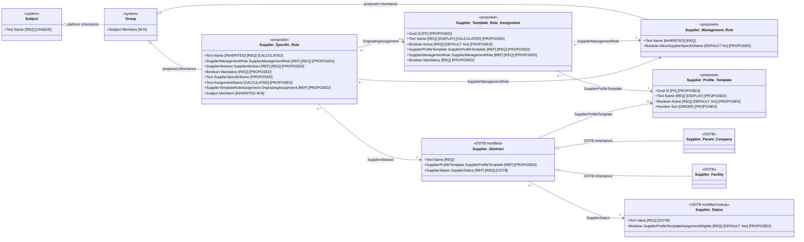

# Supplier Profile Template logical object model

| Property | Value |
|---|---|
| Mode | Target design; proposed configuration layered over the OOTB SRM baseline and Supplier Management Role target model |
| Scope | Supplier Profile Template, Supplier Template Role Assignment, creation-time role generation, assignment-level synchronization, copied role completeness, custom-role exclusion, and supplier-status eligibility |
| Baseline authority | `../../ootb-srm-baseline-model/README.md` and its field and relationship registers |
| Related target model | [Supplier Management Role logical object model](supplier-management-role-logical-model.md) |
| Requirements source | User design direction recorded in the current design conversation; SRM ADR-002, ADR-003, ADR-004, ADR-005, ADR-077, and ADR-079 provide architectural context |
| As of | 2026-09-03 |

## Findings and architectural consequences

Supplier Profile Template is an optional, creation-time configuration choice on Supplier Abstract. It determines which standard Supplier Specific Role records are generated when a Supplier Parent Company or Supplier Facility is first created. It does not determine supplier eligibility, populate role members, create setup tasks, or execute on reactivation.

Each template contains Supplier Template Role Assignment children. Each assignment identifies one standard Supplier Management Role and whether that role is mandatory. Creation materializes every active assignment, including optional assignments, as a Supplier Specific Role related to the newly created Supplier Abstract.

The selected Supplier Profile Template is permanently retained on Supplier Abstract after first save. A null choice is also final: a supplier created without a template cannot apply one later. Template edits do not automatically alter existing suppliers. An administrator may explicitly push one Supplier Template Role Assignment to eligible existing suppliers that reference the same template.

Mandatory status and origin are copied onto Supplier Specific Role so current completeness and provenance do not depend on the mutable template. The push updates the copied Mandatory? value and standard calculated Name while preserving Members.

Custom-name-enabled Supplier Management Roles cannot be included in a template. Custom Supplier Specific Roles are created directly in a supplier context and are outside template generation and synchronization.

## ADR alignment and deliberate deviations

| ADR | Relevant direction | Design response | Alignment |
|---|---|---|---|
| ADR-002 | Supplier becomes active after award; setup completeness is not another approval gate | Template is optional and generated roles may remain empty without blocking Supplier Abstract creation | Aligned |
| ADR-003 | Use standardized supplier/depot roles; not every role is mandatory for every supplier | Template selects applicable library roles and distinguishes mandatory from optional | Aligned |
| ADR-004 | Maintain configurable internal roles without fixed employee fields | Templates create empty role groups and never copy or suggest internal members | Aligned |
| ADR-005 | Reusable setup templates generate role placeholders and allow new roles to be applied to existing suppliers | Creation generates all active assignment placeholders; assignment-level push applies additions or changed parameters to eligible existing suppliers | Aligned for role generation |
| ADR-005 | Generate documents, access activities, training, target dates, and completion work | Those capabilities are explicitly excluded; completeness is calculated directly on Supplier Specific Role with no task record | Partial; ADR scope is broader than this feature |
| ADR-077 | Apply template-driven setup after manual supplier creation | Automatic generation runs after initial Supplier Abstract creation | Aligned |
| ADR-079 | Apply the current template and reconfirm requirements on supplier reactivation | No template application or regeneration occurs on reactivation | Deliberate divergence; ADR-079 should be refined if this target design is adopted |

ADR-006 and ADR-080 may later use the resulting Supplier Specific Roles for profile confirmation, but they do not govern this template model.

## Requirements interpretation

| Requirement ID | Interpreted requirement |
|---|---|
| `SPT-001` | Create Supplier Profile Template as a configuration object with Name, Active?, and Sort. |
| `SPT-002` | Name is Text with a maximum of 255 characters and is the display field. |
| `SPT-003` | Active? is required, defaults to Yes, and controls availability for new Supplier Abstract selection. |
| `SPT-004` | Sort is a Number and the order property for template selection. |
| `SPT-005` | Add an optional M:1 Supplier Profile Template relationship to Supplier Abstract. |
| `SPT-006` | Supplier Profile Template is selectable only during initial Supplier Abstract creation and becomes permanently read only after first save, including when left null. |
| `SPT-007` | Selection is manual, not calculated or suggested, and uses no supplier-attribute applicability rules. |
| `SPT-008` | The same template behavior applies to Supplier Parent Company and Supplier Facility through Supplier Abstract. |
| `SPT-009` | Create Supplier Template Role Assignment with Name, Active?, Supplier Profile Template, Supplier Management Role, and Mandatory?. |
| `SPT-010` | Supplier Template Role Assignment Name is calculated as Supplier Management Role Name, literal ` for `, and Supplier Profile Template Name. |
| `SPT-011` | Supplier Profile Template and Supplier Management Role are required M:1 relationships. |
| `SPT-012` | Mandatory? is a required Yes/No field with no implicit default. |
| `SPT-013` | Active? is required, defaults to Yes, and permits retirement without deletion. |
| `SPT-014` | Supplier Profile Template plus Supplier Management Role is unique across Supplier Template Role Assignment records; a retired record is reactivated rather than duplicated. |
| `SPT-015` | A Supplier Management Role with Allow Supplier-Specific Name? = Yes cannot be selected on Supplier Template Role Assignment. |
| `SPT-016` | Initial creation generates Supplier Specific Roles for all active assignments, whether mandatory or optional. |
| `SPT-017` | Generated supplier and internal roles begin with empty Members and receive no suggested, copied, parent, or default membership. |
| `SPT-018` | A parent-company Supplier Specific Role never satisfies a facility/depot role requirement; generation and resolution use the exact Supplier Abstract. |
| `SPT-019` | Generated Supplier Specific Role copies Mandatory? and retains an optional read-only Originating Supplier Template Role Assignment reference. |
| `SPT-020` | Supplier Specific Role calculates a three-state completeness value directly from copied Mandatory? and eligible Members; no setup task or overall supplier completeness is created. |
| `SPT-021` | Template generation runs only after initial Supplier Abstract creation and never on reactivation or through a later supplier-level apply/retry action. |
| `SPT-022` | Partial creation failure does not roll back or flag Supplier Abstract and does not expose a supplier-level retry; exceptional failures require support. |
| `SPT-023` | Template changes do not automatically propagate to existing suppliers. |
| `SPT-024` | Provide a synchronization action only on Supplier Template Role Assignment. |
| `SPT-025` | Synchronization targets Supplier Abstract records that reference the assignment's template and whose Supplier Status has Supplier Profile Template Assignment Eligible = Yes. |
| `SPT-026` | Add Supplier Profile Template Assignment Eligible to OOTB Supplier Status as a required Yes/No field defaulting to Yes. |
| `SPT-027` | Synchronization creates a missing Supplier Specific Role or updates copied Mandatory?, calculated Name, and origin on an existing match while preserving Members. |
| `SPT-028` | Synchronization is idempotent, skips platform-level failures, and may be rerun over the same scope; no detailed completion report is required. |
| `SPT-029` | Removing or retiring an assignment does not alter existing Supplier Specific Roles. |
| `SPT-030` | No template versioning, effective dates, application-history record, approval workflow, training, access, documentation, target-date, escalation, or completion-task model is included. |
| `SPT-031` | SRM application administrators and system administrators maintain templates and assignments and execute synchronization. |
| `SPT-032` | Ordinary platform Modified By and Date Modified metadata are sufficient audit evidence. |
| `SPT-033` | Inactive referenced templates and retired referenced assignments remain historically reportable; hard-deleted records do not. |

## Target logical object model

All identifiers and fields marked `PROPOSED` are logical design names, not confirmed Intelex internal names or stable metadata identifiers.



## Object inventory

| Logical object | State | Responsibility | Creation and maintenance | Workflow/action behavior |
|---|---|---|---|---|
| Supplier Profile Template | New configuration object | Names and orders one administrator-defined collection of role assignments available during Supplier Abstract creation | SRM application administrators and system administrators | No workflow; Active? controls new selection |
| Supplier Template Role Assignment | New configuration child | Relates one template to one standard role and defines Mandatory? | SRM application administrators and system administrators | Exposes assignment-level synchronization action |
| Supplier Management Role | New object (Refer to Supplier Management Role Logical Model) | Provides the role definition and custom-name eligibility | Existing target governance | Custom-name-enabled roles are excluded from templates |
| Supplier Specific Role | New object (Refer to Supplier Management Role Logical Model) | Materialized role group with copied Mandatory?, origin, custom-name support, Members, and calculated status | Creation automation, assignment push, or direct custom-role maintenance | No lifecycle workflow; completeness is calculated |
| Supplier Abstract | Modified OOTB abstract object | Stores the optional, immutable-after-create template selection inherited by parent and facility records | User selects during creation; system locks after first save | Post-create automation generates roles once |
| Supplier Status | Modified OOTB controlled lookup object | Governs assignment-push eligibility without hard-coded status names | Existing lookup governance | Eligibility field filters push scope |

## Supplier Profile Template fields

| Field | Type | Required | Default/source | Editability | Property behavior | Classification |
|---|---|---:|---|---|---|---|
| Name | Text, maximum 255 characters | Yes | Administrator entered | SRM application administrator or system administrator | Object display field | Required/Proposed |
| Active? | Yes/No | Yes | `Yes` | SRM application administrator or system administrator | Active records are available for new Supplier Abstract selection; inactive records remain visible on existing read-only references | Required/Proposed |
| Sort | Number | No | Blank | SRM application administrator or system administrator | Object order property used by template selection | Required/Proposed |

## Supplier Template Role Assignment fields

| Field | Type | Required | Default/source | Editability | Property behavior | Classification |
|---|---|---:|---|---|---|---|
| Name | Text, maximum 255 characters | Yes | System calculated | Read only | Object display field; formula is Supplier Management Role Name + ` for ` + Supplier Profile Template Name | Required/Proposed |
| Active? | Yes/No | Yes | `Yes` | SRM application administrator or system administrator | Retires assignment from future creation without deleting history | Required/Proposed |
| Supplier Profile Template | M:1 reference to Supplier Profile Template | Yes | Administrator selected | SRM application administrator or system administrator | Related template; inactive template remains referenceable historically | Required/Proposed |
| Supplier Management Role | M:1 reference to Supplier Management Role | Yes | Administrator selected | SRM application administrator or system administrator | Must reject roles where Allow Supplier-Specific Name? is Yes | Required/Proposed |
| Mandatory? | Yes/No | Yes | No implicit default | SRM application administrator or system administrator | Copied to generated or synchronized Supplier Specific Role | Required/Proposed |

### Calculated Name

Logical expression:

```text
SupplierManagementRole.Name + " for " + SupplierProfileTemplate.Name
```

Exact platform syntax is unresolved. Changes to either related Name must recalculate the assignment Name.

### Assignment uniqueness

The pair `(Supplier Profile Template, Supplier Management Role)` is unique across active and retired assignment records. If a retired assignment is needed again, administrators reactivate and modify that record rather than create a duplicate.

## Supplier Abstract modification

| Field | Type | Required | Default/source | Editability | Property behavior | Classification |
|---|---|---:|---|---|---|---|
| Supplier Profile Template | M:1 reference to Supplier Profile Template | No | User may select one active template during initial creation | Editable only before first save; permanently read only afterward | Null is permitted and final; existing inactive reference remains visible; active selections ordered by Sort | Required/Proposed modification |

The field is declared on Supplier Abstract so the same behavior is inherited by Supplier Parent Company and Supplier Facility. No parent-to-child template defaulting or copying occurs.

COMMENT: Supplier Status is a Lookup. Can't really understand the purpose of this additional field. - Gillian

## Supplier Status modification

| Field | Type | Required | Default/source | Editability | Property behavior | Classification |
|---|---|---:|---|---|---|---|
| Supplier Profile Template Assignment Eligible | Yes/No | Yes | `Yes` | Existing Supplier Status administrators | Assignment synchronization includes Supplier Abstract records only when their related status has this value set to Yes | Required/Proposed modification |

This rule replaces hard-coded tests for status names such as Active, Service Parts Only, or Inactive.

## Relationship register

| Source object | Declaring field | Target object | Cardinality | Required | Maintenance | Evidence/classification |
|---|---|---|---|---|---|---|
| Supplier Template Role Assignment | Supplier Profile Template | Supplier Profile Template | Many assignments to one template | Yes | Administrator | Required/Proposed |
| Supplier Template Role Assignment | Supplier Management Role | Supplier Management Role | Many assignments to one library role | Yes | Administrator; custom-name-enabled roles prohibited | Required/Proposed |
| Supplier Abstract | Supplier Profile Template | Supplier Profile Template | Many supplier entities to zero or one template | No | User at initial creation only | Required/Proposed modification |
| Supplier Abstract | Supplier Status | OOTB Supplier Status | Many supplier entities to one status | Yes | Existing SRM behavior | Extracted baseline relationship |
| Supplier Specific Role | Originating Supplier Template Role Assignment | Supplier Template Role Assignment | Many roles to zero or one origin assignment | No | System | Required/Proposed |
| Supplier Specific Role | Supplier Abstract | OOTB Supplier Abstract | Many roles to one exact supplier entity | Yes | Creation automation, synchronization, or direct custom creation | Required/Proposed |
| Supplier Specific Role | Supplier Management Role | Supplier Management Role | Many roles to one library role | Yes | Creation automation, synchronization, or direct custom creation | Required/Proposed |

## Uniqueness and custom-role rules

COMMENT: Not sure what the below uniqueness constraints mean - Gillian

### Standard roles

For a Supplier Management Role where Allow Supplier-Specific Name? is No, the pair `(Supplier Abstract, Supplier Management Role)` must be unique. This makes creation and synchronization deterministic.

### Custom-name-enabled roles

For a Supplier Management Role where Allow Supplier-Specific Name? is Yes:

- it cannot appear on Supplier Template Role Assignment;
- Supplier Specific Roles are created directly from the supplier record;
- more than one Supplier Specific Role may relate to the same Supplier Abstract and Supplier Management Role;
- each instance requires a distinct Supplier-Specific Name within that supplier context; and
- final inherited Name remains subject to the platform's inherited Subject Name uniqueness constraint.

Custom roles have no Originating Supplier Template Role Assignment and are never affected by assignment synchronization.

## Initial creation behavior

### User interaction

1. During creation of Supplier Parent Company or Supplier Facility, the user may select one active Supplier Profile Template ordered by Sort.
2. Selection is optional and is neither calculated nor suggested.
3. When the Supplier Abstract is first saved, the selected value or null becomes permanently read only.
4. The user cannot later apply, replace, or clear a template.

### Post-create generation

If Supplier Profile Template is populated after the first successful save:

1. Read every active Supplier Template Role Assignment related to the selected template.
2. Revalidate that the related Supplier Management Role does not allow supplier-specific naming.
3. For each assignment, create one Supplier Specific Role for the exact new Supplier Abstract.
4. Relate it to the assignment's Supplier Management Role and the exact Supplier Abstract.
5. Copy Mandatory?.
6. Set Originating Supplier Template Role Assignment.
7. Calculate Name.
8. Leave Members empty, regardless of role classification or any parent-company membership.
9. Calculate Assignment Status from Mandatory? and empty eligible membership.

Both mandatory and optional assignments are generated. A parent-company role is not reused for or inherited by a facility, and a facility role is not reused for its parent.

### Generation failures

A partial or complete generation failure does not roll back Supplier Abstract creation, set a failure flag, or expose a supplier-level retry action. Resolution occurs through platform support. The Supplier Profile Template reference remains locked even when generation fails.

## Assignment-level synchronization action

### Availability

The synchronization action exists only on Supplier Template Role Assignment and is available to SRM application administrators and system administrators. It is not available at Supplier Profile Template or Supplier Abstract level.

The action applies only to an active assignment whose related Supplier Management Role has Allow Supplier-Specific Name? = No. Supplier Profile Template Active? controls new supplier selection but does not exclude existing referenced suppliers from synchronization.

### Target population

Select Supplier Abstract records satisfying both conditions:

```text
SupplierAbstract.SupplierProfileTemplate = CurrentAssignment.SupplierProfileTemplate
AND
SupplierAbstract.SupplierStatus.SupplierProfileTemplateAssignmentEligible = Yes
```

No status name is hard coded.

### Per-supplier operation

For each selected Supplier Abstract:

1. Locate the Supplier Specific Role with the exact Supplier Abstract and current assignment's Supplier Management Role.
2. If none exists, create it using the same rules as initial generation.
3. If one exists, update Mandatory?, refresh calculated Name from the current library-role and supplier names, and set or correct Originating Supplier Template Role Assignment.
4. Preserve Members without additions, removals, or replacement.
5. Recalculate Assignment Status.
6. If more than one standard match exists, skip that supplier as a configuration exception rather than selecting one arbitrarily.

The operation is idempotent. Rerunning it processes the same eligible population; already-correct records remain effectively unchanged, while previously skipped platform failures may succeed. No created/updated/unchanged/failed summary is required beyond simple confirmation that processing finished.

### Changes that do not propagate automatically

- Adding an assignment requires its administrator-triggered synchronization to reach existing suppliers.
- Changing Mandatory? requires synchronization to update existing Supplier Specific Roles.
- Renaming a standard Supplier Management Role requires synchronization to refresh related standard Supplier Specific Role Names for suppliers using that assignment.
- Removing, retiring, or deleting an assignment does not remove, retire, or modify existing Supplier Specific Roles.
- Template changes never run automatically on supplier reactivation.

## Permissions and audit

| Scope | Principal | Permission |
|---|---|---|
| Supplier Profile Template | SRM application administrators; system administrators | Create, edit, activate/inactivate, view |
| Supplier Template Role Assignment | SRM application administrators; system administrators | Create, edit, activate/inactivate, delete when deliberately permitted, synchronize, view |
| Supplier Abstract template field | Supplier creator | Select during initial creation only |
| Supplier Abstract template field | All users after first save | Read only subject to record visibility |
| Supplier Status eligibility field | Existing Supplier Status administrators | Edit |
| Synchronization action | SRM application administrators; system administrators | Execute |

No approval workflow or dedicated change-history object is required. Standard platform Modified By and Date Modified metadata are sufficient. Inactive referenced templates and retired referenced assignments remain reportable. Hard deletion removes normal reporting availability and is therefore a deliberate administrative action.

## Change summary

| Change ID | Action | Element | Baseline/current target | Proposed | Requirement | Rationale | Confidence |
|---|---|---|---|---|---|---|---|
| `SPT-C01` | Add | Supplier Profile Template | None | Name, Active?, and Sort configuration object | SPT-001 through SPT-004 | Provides manual reusable role-set selection | High |
| `SPT-C02` | Add | Supplier Template Role Assignment | None | Template child relating one standard role and Mandatory? | SPT-009 through SPT-015 | Defines which standard roles are materialized | High |
| `SPT-C03` | Modify | Supplier Abstract | No profile-template reference | Optional creation-only, permanently read-only M:1 reference | SPT-005 through SPT-008 | Retains the one-time template choice without application-version records | High |
| `SPT-C04` | Modify | Supplier Status | Existing Value field only in extracted package | Add Supplier Profile Template Assignment Eligible default Yes | SPT-025, SPT-026 | Makes push eligibility configurable without status-name logic | High |
| `SPT-C05` | Modify | Supplier Management Role | No custom-name eligibility flag | Add Allow Supplier-Specific Name? default No and prohibit enabled roles in templates | SPT-015 | Separates reusable standard roles from directly created custom roles | High; default is assumed |
| `SPT-C06` | Modify | Supplier Specific Role | Role, supplier, inherited Name and Members | Add Mandatory?, Supplier-Specific Name, Originating Assignment, and Assignment Status | SPT-019, SPT-020 | Supports copied requirement, provenance, custom naming, and direct completeness | High |
| `SPT-C07` | Add automation | Initial Supplier Abstract creation | No role generation | Generate all active standard assignments once after first save | SPT-016 through SPT-022 | Materializes the selected profile without membership copying | High |
| `SPT-C08` | Add action | Supplier Template Role Assignment synchronization | No propagation mechanism | Administrator-triggered status-eligible idempotent create/update | SPT-023 through SPT-029 | Applies discrete changes to existing eligible suppliers without automatic drift | High |
| `SPT-C09` | No change | Supplier reactivation | ADR-079 expected current-template application | No template generation or synchronization | SPT-021, SPT-030 | Avoids clearing or regenerating existing supplier role lists | High; ADR divergence documented |

## Requirement traceability

| Requirement | Affected elements | Design response | Status |
|---|---|---|---|
| SPT-001–SPT-004 | Supplier Profile Template | Object and three fields defined with display, default, and order behavior | Satisfied |
| SPT-005–SPT-008 | Supplier Abstract | Optional manual creation-only reference defined on shared base | Satisfied |
| SPT-009–SPT-015 | Supplier Template Role Assignment; Supplier Management Role | Object, fields, formula, uniqueness, retirement, and custom-role exclusion defined | Satisfied |
| SPT-016–SPT-018 | Initial generation | All active mandatory and optional assignments create exact-entity empty roles | Satisfied |
| SPT-019–SPT-020 | Supplier Specific Role | Copied Mandatory?, origin reference, and direct three-state completeness defined | Satisfied |
| SPT-021–SPT-022 | Creation and reactivation behavior | Initial post-create only; no reactivation, flag, or supplier retry | Satisfied; ADR-079 divergence |
| SPT-023–SPT-029 | Synchronization and non-propagation | Assignment-level eligibility-filtered idempotent action defined | Satisfied |
| SPT-030 | Exclusions | Versioning and broader setup capabilities explicitly excluded | Satisfied for requested scope; ADR-005 partially addressed |
| SPT-031–SPT-033 | Governance and history | Administrator permissions, platform audit, and retention behavior defined | Satisfied |

## Validation findings and unresolved implementation details

1. **ADR-079 conflict:** The target explicitly does not apply the current template on reactivation. ADR-079 currently says that it should. Adopted design should trigger a narrow ADR refinement so future implementers do not reintroduce reactivation behavior.
2. **ADR-005 scope:** The feature implements role placeholders and administrator propagation only. It does not implement training, documents, access setup, target dates, escalation, or completion tasks described by ADR-005.
3. **Optional template is final:** Saving Supplier Abstract with a null template permanently prevents later template application. Confirm the UI clearly communicates this before first save.
4. **Post-save automation timing:** Exact event/configuration used to generate children after initial creation requires platform validation, particularly transaction and error behavior.
5. **No failure telemetry:** Per requirement, generation failures create no supplier flag or retry action. Support diagnostics must rely on platform logs.
6. **Assignment pair uniqueness:** Confirm the platform mechanism used to enforce uniqueness across active and retired Supplier Template Role Assignments.
7. **Custom-role prohibition:** Enforce both filtered selection and save-time validation so a custom-name-enabled role cannot enter a template through import or API.
8. **Allow-name default:** `No` is specified as a conservative proposed default because an explicit default was not recorded. Change it if business owners require another default.
9. **Calculated Name implementation:** Confirm that related-record changes and synchronization can refresh inherited Subject Name without affecting other Group descendants.
10. **Status field deployment:** Existing Supplier Status records need the new field initialized to Yes to match its default intent; verify how the platform applies defaults to existing lookup records.
11. **Eligible member calculation:** Confirm the expression or automation can count only active Members backed by an Employee with a valid user profile and, for supplier roles, the required Supplier Contact association.
12. **Hard deletion:** Deleted templates or assignments will not be available through ordinary historical reporting. Use inactivation for normal retirement.
13. **Push performance:** Test assignment-level processing against representative supplier counts and platform batch limits. Platform retries must remain idempotent.
14. **Concurrent edits:** Synchronization preserves Members, but concurrent administrator membership edits and role updates require platform transaction testing.
15. **No parent fallback:** Exact Supplier Abstract matching is required for creation, completeness, and workflow routing.
16. **Physical metadata:** Final internal names, stable identifiers, relationship/map names, formulas, action configuration, and view behavior remain to be assigned during build.

## Acceptance criteria

1. Administrators can create Supplier Profile Templates with Name, default-active Active?, and Sort ordering.
2. New Supplier Abstract creation offers only active templates ordered by Sort and permits no selection.
3. First save permanently locks the selected template or null value.
4. The same behavior works on Supplier Parent Company and Supplier Facility.
5. Supplier Template Role Assignment requires template, standard role, Mandatory?, and a unique template/role pair.
6. Assignment Name calculates from role and template names and is the display value.
7. Custom-name-enabled roles are rejected from assignments.
8. Initial creation generates every active assignment, including optional roles, for the exact Supplier Abstract.
9. Generated roles copy Mandatory? and origin, calculate Name and Assignment Status, and leave Members empty.
10. Parent membership is never copied to a facility role.
11. Mandatory empty roles show Required - Incomplete; optional empty roles show Optional - Unpopulated; either shows Complete with an eligible member.
12. Removing the last eligible member immediately returns the role to the appropriate unpopulated state.
13. No overall Supplier Abstract completeness value or task record is created.
14. No template action occurs during reactivation.
15. No supplier-level later apply or retry action exists.
16. Assignment synchronization selects only matching-template suppliers whose status eligibility field is Yes.
17. Synchronization creates missing standard roles and updates Mandatory?, Name, origin, and status without changing Members.
18. Synchronization is safely rerunnable and provides only simple completion confirmation.
19. Removing or retiring an assignment does not alter existing Supplier Specific Roles.
20. Inactive referenced templates and retired referenced assignments remain visible for historical reporting.
