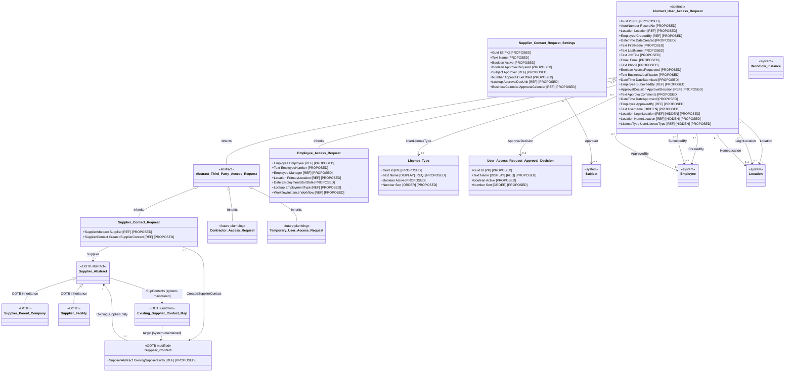

# User Access Request logical object model

| Property | Value |
|---|---|
| Mode | Target design; proposed configuration layered over the OOTB SRM baseline |
| Scope | Two abstract request types, four concrete request types, Supplier Contact Request settings, License Type configuration, and supplier-specific relationships |
| Baseline authority | `ootb-srm-baseline-model/README.md` and its field and relationship registers |
| Requirements source | User design direction recorded in the current design conversation; SRM ADR-003, ADR-006, ADR-007, ADR-076, ADR-078, and ADR-081 provide supporting context |
| API scope | Excluded. No API helper, payload, correlation, retry, or provisioning-result fields are defined here. |
| As of | 2026-09-02 |

## Findings and architectural consequences

The target design introduces four separately governed request lifecycles while centralizing their shared person and access-request data through inheritance. `Abstract User Access Request` is the common base. `Abstract Third-Party Access Request` is an intermediate abstract type for supplier, contractor, and temporary-user requests. `Employee Access Request` inherits directly from the common base.

Neither abstract type is directly creatable and neither owns a workflow. Each concrete request type declares its own workflow relationship and its application-specific context. Fields are declared only on the highest ancestor for which their meaning, validation, and security semantics are consistent.

For Supplier Contact Request, the proposed direct relationship from Supplier Contact to Supplier Abstract becomes the authoritative ownership relationship. The existing OOTB Supplier Abstract-to-Supplier Contact many-to-many relationship remains in place as a system-maintained security projection. It is not the authoritative source of contact ownership.

## Requirements interpretation

| Requirement ID | Interpreted requirement |
|---|---|
| `UAR-001` | Provide four concrete request objects: Supplier Contact Request, Contractor Access Request, Temporary User Access Request, and Employee Access Request. |
| `UAR-002` | Supplier, contractor, and temporary-user requests inherit from Abstract Third-Party Access Request. |
| `UAR-003` | Abstract Third-Party Access Request and Employee Access Request inherit directly from Abstract User Access Request. |
| `UAR-004` | Abstract User Access Request declares the common person and access-request properties but no workflow or application-specific relationship. |
| `UAR-005` | Each implemented concrete request type uses its own workflow configuration rather than inheriting workflow behavior from an abstract ancestor; Contractor Access Request and Temporary User Access Request workflow behavior are deferred with their undefined future use cases. |
| `UAR-006` | Supplier Contact Request identifies one Supplier Abstract and, after authorization, creates one Supplier Contact. |
| `UAR-007` | Supplier Abstract has a proposed one-to-many authoritative relationship to Supplier Contact. |
| `UAR-008` | Establishing the authoritative Supplier Contact relationship automatically maintains the existing OOTB many-to-many security relationship. |
| `UAR-009` | Supplier Contact Request captures whether user access is requested, but API processing is outside this model revision. |
| `UAR-010` | Supplier Contact Request reads the active governed settings once at record creation to determine whether approval is required, the approver, and the approval due-date rule; settings and parameter snapshots are not stored on the request. |
| `UAR-011` | Abstract User Access Request is Location Bound and therefore has the platform-created M:1 Location field. |
| `UAR-012` | Abstract User Access Request uses Created By as an Employee relationship and Date Created as its creation timestamp. |
| `UAR-013` | Abstract User Access Request contains hidden Username, Login Location, Home Location, and User License Type fields. |
| `UAR-014` | User License Type relates to a new License Type object governed by Name, Active?, and Sort properties. |
| `UAR-015` | Phone is optional for every User Access Request subtype. |
| `UAR-016` | Contractor Access Request is retained only as future inheritance plumbing; no contractor-specific fields or application relationships are defined until a requested use case exists. |
| `UAR-017` | Temporary User Access Request is retained only as future inheritance plumbing; no temporary-user-specific fields or application relationships are defined until a requested use case exists. |

## Logical object hierarchy and supplier relationships

All identifiers and fields marked `PROPOSED` are logical design names, not confirmed Intelex internal names or stable metadata identifiers.

## Object inventory

| Object Name | Kind | Parent | Directly declared responsibility | Creatable | Workflow |
|---|---|---|---|---|---|
| Abstract User Access Request | New abstract record object | None | Common person, request, access-intent, audit, and cross-request reporting properties | No | None |
| Abstract Third-Party Access Request | New abstract record object | Abstract User Access Request | Structural classification of non-employee request types | No | None |
| Supplier Contact Request | New concrete record object | Abstract Third-Party Access Request | Supplier context, created-contact reference, and supplier relationship synchronization behavior; approval audit fields are inherited | Yes | Supplier Contact Request workflow |
| Contractor Access Request COMMENT: skipped | New concrete record object | Abstract Third-Party Access Request | Future inheritance plumbing only; no contractor-specific responsibility is defined | Yes | Future workflow, fields, and use cases are undefined and unrequested |
| Temporary User Access Request COMMENT: skipped | New concrete record object | Abstract Third-Party Access Request | Future inheritance plumbing only; no temporary-user-specific responsibility is defined | Yes | Future workflow, fields, and use cases are undefined and unrequested |
| Employee Access Request COMMENT: skipped | New concrete record object | Abstract User Access Request | Employee, manager, location, start date, and employment-type context | Yes | Separate employee workflow; not designed in this revision |
| Supplier Contact Request Settings | New configuration record object | None | Current approval routing and due-date parameters fetched once when a Supplier Contact Request is created | Administrators only | None |
| License Type | New configuration record object | None | Governed user-license choices available to inherited User License Type dropdowns | Administrators only | None |
| User Access Request Approval Decision | New configuration record object | None | Governed approval-decision values inherited by every concrete request | Administrators only | None |
| Supplier Contact | Modified OOTB record object COMMENT: how is it being modified? - Gillian | None | Existing supplier-contact profile plus one authoritative owning Supplier Abstract | Existing behavior plus request-created records | Existing OOTB behavior |

`Abstract Third-Party Access Request` intentionally declares no fields in this revision. No proposed attribute is yet demonstrably common to supplier contacts, contractors, and temporary users without also introducing exceptions. It provides inheritance grouping and a future location for genuinely common third-party properties.

## Field property conventions

- **Required** means the record cannot be stored without the value.
- **Required at Submit** means Draft may be saved without the value, but the Submit action must validate it.
- **System** editability means a workflow or platform operation maintains the value.
- Conditional requirements are enforced by the concrete workflow rather than as unconditional database requiredness.
- Proposed lookup catalogues are logical controlled values; their final internal identifiers remain TBD.

## Abstract User Access Request fields

| Field | Type | Required | Required at Submit | Read Only | Default/source | Editability | Property behavior | Classification |
|---|---|---:|---:|---|---|---|---|---|
| Record No. | Auto Number | Yes | N/A | Yes | System generated | System | Human-readable request identifier | Proposed |
| Location | M:1 reference to Location | Yes | N/A | No | Value defaulting follows platform configuration | Platform/location-bound behavior | Directly declared immediately after Record No.; exact value defaulting and user-editability follow the platform's Location Bound configuration | Field is created automatically when Abstract User Access Request is configured as Location Bound |
| Created By | M:1 reference to Employee | Yes | N/A | No | Current authenticated employee record at creation | System; displayed as Employee dropdown where exposed | Replaces the earlier Requested By-to-Subject proposal; inherited by all descendants | System Generated |
| Date Created | Date/Time | Yes | N/A | No | Current date/time at creation | System | Immutable creation timestamp; replaces the earlier Request Created At name | System Generated |
| First Name | Text (255) | No | Yes | No | User entered | Requester in Draft | Trim leading/trailing whitespace | Required/Proposed |
| Last Name | Text (255) | No | Yes | No | User entered | Requester in Draft | Trim leading/trailing whitespace | Required/Proposed |
| Job Title | Text (255) | No | Yes | No | User entered | Requester in Draft | Common descriptive job/position value | Required/Proposed |
| Email | Email | No | Yes | No | User entered | Requester in Draft | Normalize case and whitespace for duplicate evaluation while retaining display value | Required/Proposed |
| Phone | Text (50) | No | No | No | User entered | Requester in Draft | Optional; text rather than number to preserve country codes and extensions | Proposed |
| Access Requested | Yes/No | Yes | Yes | No | `No` | Requester in Draft; system read-only after Submit | Records intent only; no API behavior is defined in this revision | Required/Proposed |
| Business Justification | Text | No | No | No | Blank | Requester in Draft | Optional common explanation; a subtype workflow may make it conditionally required | Proposed |
| Date Submitted | Date/Time with Time Zone | No | N/A | Yes | Set by Submit action | System | Immutable after first successful submission | Proposed |
| Submitted By | M:1 reference to Employee | No | No | Yes | Set by Submit action | System | Immutable after first successful submission | Proposed |
| Approval Decision | M:1 reference to User Access Request Approval Decision | No | No | No | Blank | Approver | Proposed values: Approved, Rejected, Returned | Proposed |
| Approval Comments | Text | No | No | No | Blank | Approver | Required for Reject and Return; optional for Approve | Proposed |
| Date Approved | Date/Time with Time Zone                               |                No |                N/A | Yes       | Set by Approve action                                        | System                                               | Immutable after Approval                                     | Proposed                                                     |
| Approved By            | M:1 reference to Employee                              |                No |                 No | Yes       | Set by Approve action                                        | System                                               | Immutable after Approval                                     | Proposed |
| Username | Text (100) | No | No | No | Blank | System/administrator | Reserved for the username associated with the access request | Required/Proposed |
| Login Location | M:1 reference to Location | No | No | No | Blank | System/administrator | Distinct from the record's required Location Bound Location | Required/Proposed |
| Home Location | M:1 reference to Location | No | No | No | Blank | System/administrator | Distinct from the record's required Location Bound Location  | Required/Proposed |
| User License Type | M:1 reference to License Type | No | No | No | Blank | System/administrator | Available values should be filtered to active License Type records and ordered by Sort | Required/Proposed |

## License Type fields

| Field | Type | Required | Default/source | Editability | Object/field property behavior | Classification |
|---|---|---:|---|---|---|---|
| Name | Text, maximum 255 characters | Yes | Administrator entered | Administrator | Marked as the License Type object's display field | Required/Proposed |
| Active? | Yes/No | Yes | `Yes` | Administrator | Controls whether the value is available for new User License Type selections; historical references remain valid | Required/Proposed |
| Sort | Number | No | Blank | Administrator | Marked as the License Type object's order property | Required/Proposed |

## User Access Request Approval Decision fields

| Field   | Type                         | Required | Default/source        | Editability   | Object/field property behavior                               | Classification    |
| ------- | ---------------------------- | -------: | --------------------- | ------------- | ------------------------------------------------------------ | ----------------- |
| Name    | Text, maximum 255 characters |      Yes | Administrator entered | Administrator | Marked as the object's display field                         | Required/Proposed |
| Active? | Yes/No                       |      Yes | `Yes`                 | Administrator | Controls whether the value is available; historical references remain valid | Required/Proposed |
| Sort    | Number                       |       No | Blank                 | Administrator | Marked as the object's order property                        | Required/Proposed |

## Abstract Third-Party Access Request fields

No fields are directly declared at this stage. It inherits all Abstract User Access Request fields. Supplier organization, contractor firm, sponsor, site, and access-window fields remain on the applicable concrete descendants because their applicability and required-ness differ.

## Supplier Contact Request fields

| Field | Type | Required | Required at Submit | Default/source | Editability | Property behavior | Classification |
|---|---|---:|---:|---|---|---|---|
| Supplier | Reference to OOTB Supplier Abstract | No | Yes | Selected by requester or prepopulated from launch context | Requester in Draft | May resolve to Supplier Parent Company or Supplier Facility because both inherit Supplier Abstract | Required/Proposed |
| Created Supplier Contact | Reference to OOTB Supplier Contact | No | N/A | Set after successful contact creation | System | Remains blank until processing; prevents duplicate creation during retry | Proposed |

Approval Decision and Approval Comments are inherited from Abstract User Access Request and are therefore not redeclared on Supplier Contact Request.

## Contractor Access Request fields

No fields are directly declared at this stage. Contractor Access Request exists as future inheritance plumbing for additional undefined and currently unrequested use cases. It inherits Abstract User Access Request fields through Abstract Third-Party Access Request. Contractor-specific fields, relationships, and workflow behavior will be added only when a defined use case requires them.

## Temporary User Access Request fields

No fields are directly declared at this stage. Temporary User Access Request exists as future inheritance plumbing for additional undefined and currently unrequested use cases. It inherits Abstract User Access Request fields through Abstract Third-Party Access Request. Temporary-user-specific fields, relationships, and workflow behavior will be added only when a defined use case requires them.

## Employee Access Request fields

The fields required for the current Employee Access Request context are defined below.

| Field | Type | Physical required | Required at Submit | Default/source | Editability | Property behavior | Classification |
|---|---|---:|---:|---|---|---|---|
| Employee | Reference to Employee | No | No | Selected or populated when available | Requester/system | Optional because a new hire may not yet have an Employee record | Proposed |
| Employee Number | Text | No | No | User or system populated when available | Requester/system | Employee identifier used by this request context | Proposed |
| Manager | Reference to Employee | No | Yes | User selected or derived | Requester/system | Approval/ownership context | Proposed |
| Primary Location | Reference to Location | No | Yes | User selected or derived | Requester/system | Internal organizational/site context | Proposed |
| Employment Start Date | Date | No | Yes | User or system populated | Requester/system | New-employee effective-date context | Proposed |
| Employment Type | Controlled lookup | No | Yes | User or system populated | Requester/system | Controlled within the Employee Access Request configuration; no external alignment dependency is asserted | Proposed |
| Workflow | Reference to Workflow Instance | No | N/A | Created when concrete workflow starts | System | Separate employee-specific lifecycle | Proposed |

## Supplier Contact Request Settings fields

| Field | Type | Required | Default/source | Editability | Property behavior | Classification |
|---|---|---:|---|---|---|---|
| Name | Text | Yes | Administrator entered | Administrator | Human-readable configuration name | Proposed |
| Active | Yes/No | Yes | `No` | Administrator | Identifies the settings record available when a Supplier Contact Request is created | Proposed |
| Approval Required | Yes/No | Yes | `No` | Administrator | Governs routing after Submit | Required/Proposed |
| Approver | Reference to System Subject | Conditional | Administrator selected | Administrator | Required when Approval Required is Yes | Required/Proposed |
| Approval Due Offset | Number | Conditional | Administrator entered | Administrator | Non-negative; required when approval is required; COMMENT: unit: days, added as tooltip so user knows | Required/Proposed |
| ~~Approval Due Unit~~ | ~~Controlled lookup~~ | ~~Conditional~~ | ~~`Calendar Days`~~ | ~~Administrator~~ | ~~Proposed values Calendar Days and Business Days~~ | ~~Proposed~~ |
| ~~Approval Calendar~~ | ~~Reference to Business Calendar~~ | ~~Conditional~~ | ~~Blank~~ | ~~Administrator~~ | ~~Required only when the selected unit or policy uses a business calendar; exact target remains unresolved~~ | ~~Proposed/Unresolved target~~ |

Exactly one settings record should be Active when a Supplier Contact Request is created. The workflow fetches its approval parameters once during record creation and does not store a Settings Applied relationship or parameter snapshots on the request. Multiple active records or no active record are configuration exceptions, not implicit permission to bypass approval.

## Supplier relationship register

| Source object | Declaring field | Target object | Cardinality | Required | Maintenance | Evidence/classification |
|---|---|---|---|---|---|---|
| Supplier Contact Request | Supplier | OOTB Supplier Abstract | Many requests to one supplier entity | At Submit | Requester selects; locked after Submit | Required/Proposed |
| Supplier Contact Request | Created Supplier Contact | OOTB Supplier Contact | Many requests to zero or one created contact; one contact should originate from at most one successful creation request | After successful processing | System | Proposed |
| Supplier Contact | Owning Supplier Entity | OOTB Supplier Abstract | Many contacts to one owning supplier entity | Required for request-created contacts; migration may be temporarily incomplete | System during request processing; governed maintenance afterward | Required/Proposed modification |
| OOTB Supplier Abstract | SupContacts through existing junction | OOTB Supplier Contact | Many-to-many | Derived when owning relationship exists | System only under target design | Extracted baseline relationship; proposed maintenance rule |
| Abstract User Access Request | Location | System Location | Many access requests to one Location | Yes; automatically introduced by Location Bound configuration | Platform/location-bound behavior | Required/Proposed |
| Abstract User Access Request | Created By | System Employee | Many access requests to one Employee | Yes | System at record creation | Required/Proposed |
| Abstract User Access Request | Submitted By | System Employee | Many access requests to zero or one submitting Employee | No; populated on Submit | Workflow/system | Required/Proposed |
| Abstract User Access Request | Approval Decision | User Access Request Approval Decision | Many access requests to zero or one decision | No; populated through approval action | Approver/workflow | Required/Proposed |
| Abstract User Access Request | Approved By | System Employee | Many access requests to zero or one approving Employee | No; populated on Approve | Workflow/system | Required/Proposed |
| Abstract User Access Request | Login Location | System Location | Many access requests to zero or one Login Location | No | Hidden; system/administrator | Required/Proposed |
| Abstract User Access Request | Home Location | System Location | Many access requests to zero or one Home Location | No | Hidden; system/administrator | Required/Proposed |
| Abstract User Access Request | User License Type | License Type | Many access requests to zero or one License Type | No | Hidden; system/administrator | Required/Proposed |
| Supplier Contact Request Settings | Approver | System Subject | Many settings records to zero or one approver principal | Required when Approval Required is Yes | Administrator | Required/Proposed |

### Authoritative and derived relationship rule

For every active Supplier Contact with `Owning Supplier Entity = S`, exactly one corresponding OOTB M:N map entry between that contact and `S` must exist. The OOTB map entry is created, corrected, or removed by system automation. Direct ordinary-user maintenance of that map is prohibited.

Changing the owning supplier removes the old derived map entry and creates the new one. If synchronization fails after contact creation, the request enters Exception and retains its Created Supplier Contact reference so Retry does not create a duplicate contact.

## Proposed controlled values

| Catalogue | Proposed values | Notes |
|---|---|---|
| User Access Request Approval Decision | Approved; Rejected; Returned | Governed records selected through the inherited Approval Decision relationship. |
| Approval Due Unit | Calendar Days; Business Days | Business Days requires an approved calendar implementation. |
| Employment Type | Values governed within the Employee Access Request configuration | No additional HR or authentication alignment dependency is asserted by this document. |

## Change summary

| Change ID | Action | Element | Baseline | Proposed | Requirement | Rationale | Confidence |
|---|---|---|---|---|---|---|---|
| `UAR-C01` | Add | Abstract User Access Request | None | Common non-creatable request base | UAR-001, UAR-003, UAR-004 | Centralizes common properties without centralizing workflows | High |
| `UAR-C02` | Add | Abstract Third-Party Access Request | None | Structural non-creatable intermediate base | UAR-002 | Groups third-party request types without forcing incompatible domain relationships | High |
| `UAR-C03` | Add | Four concrete request types | None | Separate request records, with workflow configuration defined only for implemented use cases | UAR-001, UAR-005 | Preserves distinct application contexts without prematurely defining deferred workflows | High |
| `UAR-C04` | Add | Supplier Contact Request Settings | None | Current approval and due-date configuration fetched once at request creation | UAR-010 | Avoids hard-coded approval behavior without storing settings snapshots on requests | High |
| `UAR-C05` | Modify | Supplier Contact | Existing independent M:N supplier association | Add one authoritative Owning Supplier Entity relationship | UAR-006, UAR-007 | Controls which supplier entity owns the contact | High |
| `UAR-C06` | Modify maintenance | Existing Supplier Abstract–Supplier Contact M:N | User-maintainable OOTB relationship | System-maintained projection of owning relationship | UAR-008 | Retains inherited security behavior while preventing relationship drift | High |
| `UAR-C07` | No API change | Access Requested | OOTB Supplier Contact has Allow Access, but no target request model | Store access intent on common request base only | UAR-009 | Keeps this revision independent of API design | High |
| `UAR-C08` | Modify | Abstract User Access Request common fields | Requested By referenced Subject; Request Created At used earlier draft name | Add Location Bound Location; use Created By → Employee and Date Created | UAR-011, UAR-012 | Aligns the model with required platform field behavior and naming | High |
| `UAR-C09` | Add | Hidden user properties | None | Username, Login Location, Home Location, and User License Type | UAR-013 | Supports later user creation without exposing technical fields on request forms | High |
| `UAR-C10` | Add | License Type | None | Name, Active?, and Sort governed configuration object | UAR-014 | Supplies controlled values to User License Type | High |
| `UAR-C11` | Modify | Contractor Access Request | Preliminary contractor-specific fields and unresolved Contractor Firm target | Retain an otherwise empty concrete descendant as future plumbing | UAR-016 | Avoids defining unrequested contractor use cases | High |
| `UAR-C12` | Modify | Phone | Required at Submit in earlier draft | Optional | UAR-015 | Aligns all request types with the revised field requirements | High |
| `UAR-C13` | Modify | Settings consumption | Date-bounded settings plus stored request snapshots | One active settings record read at request creation; no request-side settings storage | UAR-010 | Simplifies configuration and prevents redundant parameter fields | High |
| `UAR-C14` | Modify | Temporary User Access Request | Preliminary temporary-agency, sponsor, site, access-window, and workflow fields | Retain an otherwise empty concrete descendant as future plumbing | UAR-017 | Avoids defining unrequested temporary-user use cases | High |

## Requirement traceability

| Requirement | Affected model elements | Design response | Status |
|---|---|---|---|
| UAR-001 | Four concrete request types | Added as separate descendants | Satisfied |
| UAR-002 | Abstract Third-Party Access Request and three descendants | Direct inheritance edges defined | Satisfied |
| UAR-003 | Abstract User Access Request hierarchy | Direct inheritance edges defined | Satisfied |
| UAR-004 | Abstract User Access Request fields | Common fields declared; no workflow or application relationship | Satisfied |
| UAR-005 | Concrete workflow configurations | Workflow behavior is not inherited from either abstract object; Supplier Contact Request is designed, Employee remains separate, and Contractor and Temporary User are explicitly deferred as future plumbing | Satisfied for current scope |
| UAR-006 | Supplier Contact Request relationships | Required Supplier plus resulting Supplier Contact relationship | Satisfied |
| UAR-007 | Supplier Contact ownership | New many-to-one Owning Supplier Entity relationship | Satisfied |
| UAR-008 | OOTB M:N compatibility | Defined as system-maintained derived projection | Satisfied at design level; implementation mechanism TBD |
| UAR-009 | Access intent without API | Access Requested retained; API fields explicitly excluded | Satisfied |
| UAR-010 | Settings-driven approval | One active settings record is read at record creation; no relationship or parameter snapshots are stored on the request | Satisfied |
| UAR-011 | Location Bound request base | Required M:1 Location declared on Abstract User Access Request | Satisfied |
| UAR-012 | Creator and creation timestamp | Created By → Employee and Date Created declared on common base | Satisfied |
| UAR-013 | Hidden user fields | Four hidden inherited fields declared with types and relationships | Satisfied |
| UAR-014 | License Type object | Configuration object and User License Type relationship defined | Satisfied |
| UAR-015 | Optional Phone | Phone is neither physically required nor required by Submit | Satisfied |
| UAR-016 | Contractor future plumbing | Contractor subtype retained with no directly declared fields or application relationships | Satisfied |
| UAR-017 | Temporary-user future plumbing | Temporary User subtype retained with no directly declared fields or application relationships | Satisfied |

## Validation findings, assumptions, and unresolved items

1. **Multi-facility constraint:** A strict many-to-one owning relationship cannot represent one contact assigned to two selected sibling facilities without parent-wide access. This design intentionally preserves the user's revised one-owner rule. Any additional access-scope mechanism requires a separate decision.
2. **Existing-data migration:** Existing contacts with more than one OOTB supplier association cannot be assigned an owning supplier automatically without a governed selection rule. They require remediation or an approved migration exception.
3. **Draft validation:** Person and context fields are workflow-required at Submit rather than physically required so that incomplete Draft records can be saved.
4. **Third-party future plumbing:** Contractor Access Request and Temporary User Access Request are intentionally retained with no subtype-specific fields, relationships, or defined workflows. Those elements are deferred until an additional use case is explicitly requested.
5. **Phone is optional:** Phone is available on every descendant but is neither physically required nor validated as required at Submit.
6. **Settings consumption:** Settings are not date bound. Exactly one Active settings record is fetched at request creation, and neither the settings record nor its parameters are stored on the request. Missing or multiple Active settings records are configuration errors.
7. **Base-object impact:** Any later change to an Abstract User Access Request field affects all four concrete request types and therefore requires cross-workflow regression testing.
8. **Inheritance implementation:** This is a logical Intelex object model. Final internal names, system fields, identity inheritance, and configurable-view behavior require verification in the target platform.
9. **API deliberately excluded:** `Access Requested` records business intent only. It does not set the OOTB `AllowAccess` field and does not assert that a user account exists.
10. **Location semantics:** The required Location Bound `Location` is distinct from hidden `Login Location` and `Home Location`. Defaulting and security behavior for each must not be conflated.
11. **Created By population:** The design requires an Employee reference. External requesters therefore need the platform representation necessary to populate the Employee dropdown/reference; this should be verified with the supplier-user configuration.
12. **License Type ordering:** Sort is the object order property but is not marked required because no requiredness or default was specified. Duplicate or blank Sort values require an administrative ordering convention.
