# Supplier Surveys technical specification

| Property | Value |
|---|---|
| Mode | Proposed target configuration layered over the preserved OOTB SRM baseline |
| As of | 2026-09-21 |
| Scope | Reusable supplier information campaigns, recurring launches, questionnaires, supplier requests and responses, profile confirmation, review, reminders, reporting, and supplier access |
| Primary requirements | ADR-080, ADR-079, ADR-006 and the agreed solution overview |
| Status | Technical design for review; configuration has not been implemented |
| Baseline | [OOTB logical model](../ootb-srm-baseline-model/README.md), field/relationship/inheritance registers, and the six [OOTB workflows](../ootb-srm-baseline-workflows/) derived from SIA OOTB SRM Export 1.0.0.0 |
| Related target designs | [Supplier Management Role](object_model/supplier-management-role-logical-model.md), [Supplier Profile Template](object_model/supplier-profile-template-logical-model.md), [User Access Request](object_model/user-access-request-logical-model.md), and [Supplier Contact Request workflow](workflow_diagram/supplier-contact-request-workflow.md) |

## 1. Solution overview and evidence boundaries

SIA configures a campaign describing the questions, eligible audience, responsible supplier role, schedule, deadlines, reminders, and optional profile review. Each launch creates an auditable campaign run and one request per eligible supplier entity. Suppliers answer through Intelex. Ordinary questionnaires complete on valid submission; profile corrections follow the configured review policy and update the governed supplier records when accepted.

The first business use case is the twice-yearly shutdown survey. Periodic facility/contact/role confirmation uses the same campaign and request mechanism. The exact shutdown questions and business calendar have not been supplied and are not invented in this specification.

**Extracted** means supported by the existing baseline documentation and registers. **Required** means stated by an ADR or the agreed overview. **Proposed** means a new design choice made here. **Unresolved** means platform behavior or business policy needs verification. Every new object, field, relationship, state, and operation below is Proposed unless explicitly described otherwise. Logical names are not confirmed Intelex internal names, metadata identifiers, database keys, or physical table names.

ADR-079 is accepted. ADR-006 and ADR-080 remain proposed. Agreement on this technical approach does not silently change their repository status. This document supersedes the campaign portion of the earlier [conceptual ERD](../entity-relationship-diagram.md) for detailed survey design; the older ERD remains available as historical design context.

Primary source decisions: [ADR-080 — reusable information campaigns](../adrs/ADR-080-use-reusable-campaigns-for-supplier-information-requests.md), [ADR-079 — lifecycle eligibility](../adrs/ADR-079-govern-supplier-eligibility-through-auditable-lifecycle-statuses.md), and [ADR-006 — profile confirmation](../adrs/ADR-006-allow-supplier-self-service-maintenance-of-external-roles-with-periodic-confirmation.md). Supporting ADRs are identified by requirement in §2 and are available in the [SRM ADR directory](../adrs/).

### Baseline assessment

| Extracted baseline | Target treatment and consequence |
|---|---|
| Supplier Parent Company and Supplier Facility inherit Supplier Abstract and have a separate parent/facility relationship | Reference Supplier Abstract for requests and rules; retain both inheritance and hierarchy |
| Supplier Contact has an Employee reference and OOTB supplier M:N associations | Reuse contact identity and authenticated-user bridge; apply the later ownership target described below |
| Supplier Evaluation captures evaluation description, rating, date, evaluator, and comments | Retain for evaluations; survey answers have a separate lifecycle and question structure |
| Parent Company and Facility workflows perform evaluation submission and deactivation | Survey issuance does not complete, restart, or repurpose those workflows |
| Documentation Requirement has Draft, Assigned, Approval, and a return-for-information action | Reuse the interaction pattern through a separate request workflow; document-specific fields are not applicable |
| Certification Requirement manages audits, renewal, and archive behavior; its exported Closed stage is unreachable | No survey dependency on that workflow or its completion path |
| Six exported workflows contain no campaign/request survey lifecycle | New campaign scheduling, request workflow, notifications, and views are required |
| OOTB supplier status expressions refer to Active, InActive, and Suspended; complete lookup values are not exported | ADR-079 lifecycle rollout is a dependency. Do not infer accepted status semantics from old expressions or change those workflows implicitly |

### Alignment with existing target specifications

1. Use Supplier Management Role as the library and Supplier Specific Role as the operational Group descendant. Members remain inherited from Group. Do not introduce a second role-membership structure.
2. Resolve a standard role using the exact `(Supplier Abstract, Supplier Management Role)` pair. No parent-role fallback is permitted. This is distinct from parent-company access to child-facility records.
3. Initial campaign routing accepts only standard roles with Allow Supplier-Specific Name? = No. Supporting custom roles later requires an explicit disambiguation rule.
4. Supplier Profile Template supplies existing role placeholders. Survey issuance neither applies a new template nor reruns template generation. Its assignment-eligibility flag is not survey eligibility.
5. The User Access Request target defines Supplier Contact.Owning Supplier Entity as authoritative and the OOTB contact M:N as a derived projection. Profile review must respect this ownership. The broader ADR-078 multiple-facility association model is not fully reconciled with this later single-owner target; additional access relationships require a shared security decision, not a survey-specific workaround.
6. New contacts follow Supplier Contact Request. A survey cannot activate accounts, change supplier ownership, or bypass account authorization. Existing self-service maintenance can continue subject to its own permissions; changes encountered during a survey are detected before applying corrections.

## 2. Requirements and design assumptions

| ID | Source | Requirement or design assumption |
|---|---|---|
| SS-01 | ADR-080 | Reuse question sets and campaigns for one-time and recurring information requests |
| SS-02 | ADR-079, ADR-080 | Select suppliers using governed attributes and lifecycle capability rules |
| SS-03 | ADR-003, ADR-080; role target | Resolve authenticated recipients from the exact supplier's standard operational role |
| SS-04 | ADR-080; agreed overview | Preserve the issued audience and create traceable requests, including routing exceptions |
| SS-05 | ADR-080 | Support deadlines, reminders, escalation visibility, and overdue/completion reporting |
| SS-06 | ADR-006, ADR-080 | Show maintained profile data, require affirmative review, and commit accepted corrections |
| SS-07 | ADR-076, ADR-078, ADR-084 | Respect entity scope and applicable record confidentiality across forms, children, reports, and attachments |
| SS-08 | ADR-083 | Expose assigned work through the Intelex workspace within the retained SIA portal arrangement |
| SS-09 | Agreed overview | Default to notify all eligible members and first authorized response; preserve actor identity |
| SS-10 | Proposed | Freeze published question versions and run configuration; preserve immutable submission revisions |
| SS-11 | Proposed | Use explicit run/request uniqueness, retry-safe issuance, and delivery deduplication |
| SS-12 | Proposed | Route missing recipients, concurrency conflicts, and processing failures to owned exception work |
| SS-13 | Proposed | Initially require SIA review for all survey-proposed profile corrections; no-change confirmations complete immediately |
| SS-14 | Proposed | Ordinary survey submission completes without mandatory SIA approval; internal review remains available through reporting |

SS-13 is a conservative initial policy, configurable at campaign level. ADRs leave the exact review boundary open. The initial recipient behavior is fixed to SS-09; all-member response and individual-assignee modes are future extensions requiring additional completion semantics.

## 3. Target logical model

Only direct business inheritance is shown. New survey objects are ordinary record objects; they do not inherit from Supplier Abstract, Supplier Evaluation, or the access-request hierarchy. Platform root identity and audit fields are inherited where available and are not redeclared as physical keys.

```mermaid
classDiagram
direction LR
class Supplier_Abstract
class Supplier_Parent_Company
class Supplier_Facility
class Supplier_Contact
class Employee
class Supplier_Status
class Supplier_Management_Role
class Supplier_Specific_Role
class Group
class Survey_Definition {
  +Text Name
  +Boolean Active
}
class Survey_Version {
  +Integer VersionNumber
  +Choice State
}
class Survey_Question {
  +Text Code
  +Choice AnswerType
  +Boolean Required
}
class Survey_Option
class Survey_Campaign {
  +Choice Purpose
  +Choice ScheduleMode
  +Choice State
}
class Campaign_Audience_Rule
class Survey_Status_Eligibility
class Campaign_Reminder_Rule
class Campaign_Run {
  +DateTime ScheduledOccurrence
  +Choice State
  +Text ConfigurationSnapshot
}
class Campaign_Audience_Entry
class Supplier_Survey_Request {
  +DateTime DueAt
  +Choice State
}
class Survey_Response_Revision
class Survey_Answer
class Survey_Selected_Option
class Profile_Review_Snapshot
class Profile_Change_Proposal
class Profile_Change_Member
class Survey_Event
Supplier_Abstract <|-- Supplier_Parent_Company
Supplier_Abstract <|-- Supplier_Facility
Supplier_Facility "0..*" --> "1" Supplier_Parent_Company : ParentCompany
Group <|-- Supplier_Management_Role : existing target
Group <|-- Supplier_Specific_Role : existing target
Supplier_Specific_Role "0..*" --> "1" Supplier_Abstract : Supplier
Supplier_Specific_Role "0..*" --> "1" Supplier_Management_Role : LibraryRole
Survey_Version "0..*" --> "1" Survey_Definition : Definition
Survey_Question "0..*" --> "1" Survey_Version : Version
Survey_Option "0..*" --> "1" Survey_Question : Question
Survey_Campaign "0..*" --> "0..1" Survey_Version : Questionnaire_required_at_activation
Survey_Campaign "0..*" --> "0..1" Supplier_Management_Role : RecipientRole_required_at_activation
Campaign_Audience_Rule "0..*" --> "1" Survey_Campaign : Campaign
Survey_Status_Eligibility "0..*" --> "1" Supplier_Status : Status
Campaign_Reminder_Rule "0..*" --> "1" Survey_Campaign : Campaign
Campaign_Run "0..*" --> "1" Survey_Campaign : Campaign
Campaign_Run "0..*" --> "1" Survey_Version : IssuedVersion
Campaign_Audience_Entry "0..*" --> "1" Campaign_Run : Run
Campaign_Audience_Entry "0..*" --> "1" Supplier_Abstract : Supplier
Supplier_Survey_Request "0..1" --> "1" Campaign_Audience_Entry : AudienceEntry
Supplier_Survey_Request "0..*" --> "1" Supplier_Abstract : Supplier
Supplier_Survey_Request "0..*" --> "0..1" Supplier_Specific_Role : AssignedRole
Survey_Response_Revision "0..*" --> "1" Supplier_Survey_Request : Request
Survey_Answer "0..*" --> "1" Survey_Response_Revision : Revision
Survey_Answer "0..*" --> "1" Survey_Question : Question
Survey_Selected_Option "0..*" --> "1" Survey_Answer : Answer
Survey_Selected_Option "0..*" --> "1" Survey_Option : Option
Profile_Review_Snapshot "0..*" --> "1" Survey_Response_Revision : Revision
Profile_Change_Proposal "0..*" --> "1" Profile_Review_Snapshot : BaselineSnapshot
Profile_Change_Member "0..*" --> "1" Profile_Change_Proposal : Proposal
Profile_Change_Member "0..*" --> "1" Employee : Member
Survey_Event "0..*" --> "1" Campaign_Run : Run
Survey_Event "0..*" --> "0..1" Supplier_Survey_Request : Request
```



Cardinalities for new elements are proposed logical constraints. The baseline parent/facility multiplicity follows the baseline register's inference. Auxiliary actor, review-role, workflow, and target references are specified below. Survey Selected Option is an explicit junction for answer-option selection. Profile Change Member is an explicit junction for proposed membership additions/removals. Actual Intelex relationship/map identifiers remain build-time metadata.

## 4. Field conventions

All new record objects use platform identity, Created By, Date Created, Modified By, and Date Modified where available. Operational objects have a system-generated Record No. display identifier. Configuration objects use Name, except questions/options, which display Code and label, and rules, which display a calculated description. Do not declare a second Id if the platform provides one.

In the tables, **Y** is required at creation, **C** is conditionally required at the named transition, and **N** permits null. Ref means a logical M:1 relationship unless explicitly described otherwise. A blank default is null, not a guessed business value. Names/codes use Text(255) unless noted; descriptions and snapshots use long text with platform capacity to be validated. Dates with times are stored consistently in UTC and rendered using the campaign timezone. Business durations use calendar days initially; business-day calendars are not assumed.

Configuration is editable while draft. Published content and issued operational snapshots are immutable. Runtime fields are system-maintained except where an authorized action is specified. Platform audit tracks updates; Survey Event captures business actions, state transitions, and notification outcomes. If standard audit is insufficient for an immutable event history, configure the explicit event records described here.

## 5. New configuration objects and fields

### 5.1 Survey Definition

Reusable identity grouping the versions of a questionnaire. No business workflow.

| Field | Type | Required | Default / behavior |
|---|---|---|---|
| Name | Text | Y | Administrator; display name |
| Description | Long text | N | Business purpose |
| Active? | Boolean | Y | Yes; controls new selection, preserves historical references |
| Sort | Integer | N | Dropdown order |

### 5.2 Survey Version

| Field | Type | Required | Default / behavior |
|---|---|---|---|
| Definition | Ref Survey Definition | Y | Parent context |
| Version Number | Positive integer | Y | Next number within Definition; unique pair |
| Name | Calculated text | Y | Definition name plus version |
| State | Choice | Y | Draft; allowed Draft, Published, Retired |
| Instructions | Long text | N | Shown to supplier |
| Published By / Published At | Ref Employee / datetime | C | Set by Publish |

Publishing validates all questions/options and locks their content, types, order, and requiredness. Changes require a new version. Retiring prevents new selection; previously prepared/issued runs retain the published content. Profile-only versions may have zero questions, but campaign publication then requires Profile Review Enabled = Yes.

### 5.3 Survey Question

| Field | Type | Required | Default / behavior |
|---|---|---|---|
| Version | Ref Survey Version | Y | Parent |
| Code | Text | Y | Unique within Version; stable business code may recur in later versions |
| Question Text | Long text | Y | Supplier-facing label |
| Help Text | Long text | N | Optional explanation |
| Display Order | Integer | Y | Unique within Version |
| Answer Type | Choice | Y | Text, Long Text, Number, Date, Yes/No, Single Choice, Multiple Choice |
| Required? | Boolean | Y | Yes, administrator may change before publication |
| Minimum / Maximum | Decimal | N | Number validation only; minimum must not exceed maximum |
| Maximum Text Length | Positive integer | N | Text validation, bounded by platform storage |

Initial scope uses a flat ordered questionnaire. Conditional branching, scored surveys, and repeating answer groups require a later extension if the actual shutdown checklist needs them. Yes/No answers are nullable so unanswered and No remain distinct.

### 5.4 Survey Option

| Field | Type | Required | Default / behavior |
|---|---|---|---|
| Question | Ref Survey Question | Y | Only choice questions |
| Code | Text | Y | Unique within Question |
| Label | Text | Y | Display value |
| Display Order | Integer | Y | Unique within Question |

Options are immutable after publication; historical choices never resolve through a mutable global label list.

### 5.5 Survey Campaign

| Field | Type | Required | Default / behavior |
|---|---|---|---|
| Name / Description | Text / long text | Y / N | Administrator |
| State | Choice | Y | Draft; Draft, Active, Paused, Retired |
| Purpose | Choice | Y | Shutdown, Profile Confirmation, Other Information Request; no implicit default |
| Questionnaire | Ref Survey Version | C | Published version required to activate |
| Target Entity Level | Choice | Y | Parent Company or Facility/Depot; one level per campaign |
| Recipient Role | Ref Supplier Management Role | C | Supplier Users classification; standard role only; required to activate |
| Internal Owner | Ref Employee | C | Active SIA campaign owner required to activate; handles unresolved routing |
| Review Role / Escalation Role | Ref Supplier Management Role each | C | Internal Users, standard roles; required when corresponding feature enabled |
| Schedule Mode | Choice | Y | Manual, Once, Recurring; default Manual |
| First Launch At | Datetime | C | Required for Once/Recurring |
| Recurrence Definition | Validated recurrence value | C | Required for Recurring; logical type mapped to supported scheduler during build |
| Timezone | Text, governed timezone identifier | Y | Explicit administrator selection |
| Response Days | Positive integer | C | Required to activate; no business deadline invented |
| Profile Review Enabled? | Boolean | Y | No |
| Profile Change Policy | Choice | C | Review All when enabled; initial supported policy |
| Visibility Classification | Ref shared classification catalogue | C | Required if survey security matrix mandates; shared metadata unresolved |

Campaign activation validates routing roles, audience configuration, question version, schedule, and notification rules. Future edits affect future runs only. Pausing prevents new scheduled runs, while existing requests continue. Retirement prevents further runs and preserves history.

### 5.6 Campaign Audience Rule

Each row belongs to one campaign. Rules in the same group are ANDed; groups are ORed. Lifecycle eligibility is always an additional mandatory condition. Filters are restricted to governed attributes; arbitrary executable expressions are prohibited.

| Field | Type | Required | Default / behavior |
|---|---|---|---|
| Campaign | Ref Survey Campaign | Y | Parent |
| Group Number / Order | Positive integers | Y | Unique order within campaign/group |
| Attribute | Choice | Y | Supplier, Parent Company, Supplier Category, Supplier Type, Facility Type |
| Operator | Choice | Y | Equals or Not Equals |
| Supplier Value | Ref Supplier Abstract | C | For Supplier attribute |
| Parent Company Value | Ref Supplier Parent Company | C | For Parent Company attribute |
| Category Value | Ref OOTB Supplier Category | C | For Supplier Category |
| Supplier Type Value | Ref OOTB Supplier Type | C | For Supplier Type |
| Facility Type Value | Ref OOTB Facility Type | C | For Facility Type |

Exactly one operand appropriate to Attribute is populated. Invalid attribute/entity-level combinations block activation. No rules means all entities at the selected level, subject to lifecycle eligibility; the administrator must see the resulting preview count before launch. Null source values do not satisfy Equals or Not Equals. Explicit inclusions are still constrained by lifecycle eligibility and never override security.

### 5.7 Survey Status Eligibility

This is the survey slice of ADR-079's capability matrix. If a shared cross-application capability object has already been implemented, map these properties to that object and omit this standalone survey slice. There must be one authority, not two competing matrices.

| Field | Type | Required | Default / behavior |
|---|---|---|---|
| Supplier Status | Ref OOTB Supplier Status | Y | Governed status record |
| Purpose | Choice matching Campaign Purpose | Y | Unique `(Status, Purpose)` pair |
| Allow New Requests? | Boolean | Y | No until deliberately configured |
| Existing Request Policy | Choice | Y | Continue or Withdraw; initially Withdraw unless approved otherwise |

Missing rules deny new requests and are reported as configuration exceptions. Configure Active eligibility by purpose; initially exclude Service Parts Only from Shutdown, evaluate its profile-confirmation eligibility explicitly, and deny Inactive all new operational requests. Inactive existing work must be withdrawn with history retained. Status lookup names are labels, not executable conditions. Audited status transitions themselves remain a shared ADR-079 dependency; survey code may not edit status directly.

### 5.8 Campaign Reminder Rule

| Field | Type | Required | Default / behavior |
|---|---|---|---|
| Campaign | Ref Survey Campaign | Y | Parent |
| Order | Integer | Y | Unique within Campaign |
| Trigger | Choice | Y | Before Due, At Due, After Due |
| Offset Days | Nonnegative integer | Y | 0 for At Due |
| Recipient Mode | Choice | Y | Supplier Role, Internal Escalation Role, Campaign Owner |
| Notification Template | Ref platform notification template | Y | Exact target metadata to verify |
| Active? | Boolean | Y | Yes |

Each rule fires once per request. Multiple rows implement the approved cadence. A new due date creates a new schedule generation; previous notification history is retained. Initial design uses finite rules rather than unbounded daily notifications.

## 6. New operational objects and fields

### 6.1 Campaign Run

A separate run preserves each recurrence. Reusing a previous run would incorrectly combine different survey periods.

| Field | Type | Required | Default / behavior |
|---|---|---|---|
| Campaign | Ref Survey Campaign | Y | Initiation context |
| Occurrence Key | Text | Y | Unique with Campaign; scheduler occurrence or manual operation token |
| Scheduled Occurrence | Datetime | Y | Intended launch time |
| State | Choice | Y | Preparing, Ready, Issuing, Open, Exception, Closed, Cancelled |
| Issued Version | Ref Survey Version | Y | Frozen campaign questionnaire |
| Configuration Snapshot | Structured long text | Y | Canonical snapshot of purpose, audience rules, roles, owner, classification, deadlines, reminders, templates, timezone, and eligibility rules used |
| Snapshot Schema Version | Integer | Y | 1 initially; supports later interpretation |
| Launched At / Closed At | Datetime each | N | Set by successful launch / closure |
| Launched By | Ref Employee | N | Actor; automated initiation identified through event metadata |
| Owner | Ref Employee | Y | Copied from campaign; explicit reassignment is audited |
| Last Error | Long text | N | Internal diagnostic summary |

Snapshot fields are structured configuration data, not executable code. References in the snapshot use stable record identifiers plus readable labels. Run creation must fail if the complete snapshot cannot be stored. Counts are derived from audience entries and requests; do not maintain competing manually editable totals.

### 6.2 Campaign Audience Entry

One entry per candidate supplier per run records selection, exclusion, and eligibility evidence. This makes excluded suppliers visible without assigning supplier work.

| Field | Type | Required | Default / behavior |
|---|---|---|---|
| Run / Supplier | Ref Campaign Run / Supplier Abstract | Y | Unique pair |
| Selection Outcome | Choice | Y | Included, Excluded, Configuration Exception |
| Selection Reason | Long text | Y | Matched rule group or exclusion/configuration reason |
| Attribute Snapshot | Structured long text | Y | Evaluated identity, parent, status, and relevant filter values |
| Evaluated At | Datetime | Y | Selection time |

Candidate population is all supplier records at the campaign's selected entity level. Excluded entries have no request. Included entries have at most one request, even if role resolution fails. Preparation is internal and resumable; a run becomes Ready only when the population and snapshot are complete. Once issuance starts, selection evidence is locked.

### 6.3 Supplier Survey Request

| Field | Type | Required | Default / behavior |
|---|---|---|---|
| Audience Entry | Ref Campaign Audience Entry | Y | Unique: at most one request per entry |
| Supplier | Ref Supplier Abstract | Y | Copied from entry; immutable and must equal entry.Supplier; direct security anchor |
| Assigned Role | Ref Supplier Specific Role | N | Required before issue; exact supplier and frozen recipient library role |
| Review Role / Escalation Role | Ref Supplier Specific Role each | N | Resolve exact entity when required; unresolved routing becomes Exception |
| Workflow | Ref Workflow Instance | N | Platform-managed when workflow starts |
| State | Workflow-backed choice/display | Y | Preparing initially; no independent editable status |
| Issued At / Due At | Datetime each | C | Set on issue; Due At = issue date/time plus frozen Response Days in campaign timezone |
| Last Submitted At / Completed At | Datetime each | N | Set by transitions |
| Schedule Generation | Positive integer | Y | 1; increment on authorized due-date extension |
| Exception Resume State | Choice | N | Preparing, Assigned, Review, or Applying Changes |
| Exception Reason | Long text | N | Internal explanation |
| Closure Reason | Long text | C | Required for cancellation, withdrawal, or closure without response |

Current draft and latest submitted revisions are derived through ordered child revision numbers. There is no separate manually maintained Completed? flag. Overdue is derived for issued, nonterminal requests with Due At earlier than now. Reports distinguish supplier response lateness from SIA review time. Due-date changes require a reason event and notification; the original due date remains in the event history.

### 6.4 Survey Response Revision

| Field | Type | Required | Default / behavior |
|---|---|---|---|
| Request | Ref Supplier Survey Request | Y | Parent |
| Revision Number | Positive integer | Y | Unique within Request |
| State | Choice | Y | Draft, Submitted, Returned, Accepted |
| Submitted By | Ref Employee | C | Authenticated actor at Submit |
| Responding Contact | Ref Supplier Contact | C | Contact corresponding to actor and authorized supplier context |
| Submitted At | Datetime | C | Server timestamp |
| Profile Confirmed? | Nullable Boolean | C | Must be Yes for profile-enabled submission |
| Profile Confirmed At | Datetime | C | Timestamp of affirmative action |
| Declaration | Long text | C | Frozen confirmation wording at submission |
| Reviewed By / Reviewed At | Ref Employee / datetime | N | Internal review actor/time |
| Review Comments | Long text | C | Required on Return; optional acceptance explanation |

One Draft revision per request. Submitted answers and profile snapshots are immutable. Return marks the submitted revision Returned and creates a new Draft copying answers and refreshing profile data. Completed requests are not overwritten; a new follow-up request/run captures later changes.

### 6.5 Survey Answer and Survey Selected Option

| Object / field | Type | Required | Default / behavior |
|---|---|---|---|
| Answer.Revision | Ref Survey Response Revision | Y | Parent |
| Answer.Question | Ref Survey Question | Y | Must belong to Run.Issued Version; unique with Revision |
| Answer.Text Value | Text | N | For Text answer type |
| Answer.Long Text Value | Long text | N | For Long Text |
| Answer.Number Value | Decimal | N | For Number; 0 is a valid answer |
| Answer.Date Value | Date | N | For Date |
| Answer.Boolean Value | Nullable Boolean | N | For Yes/No; No is a valid answer |
| Selected Option.Answer | Ref Survey Answer | Y | Parent |
| Selected Option.Option | Ref Survey Option | Y | Must belong to Answer.Question; unique pair |

Only the value type corresponding to the question may be populated. A required single-choice question has exactly one selection; multiple-choice has at least one; an optional unanswered question may have no value. Structured attachments are deferred until a supplied checklist requires them; native attachments must not become an ungoverned substitute for required answers.

### 6.6 Profile Review Snapshot

One row represents one maintained record shown for review. The snapshot is server-generated; suppliers cannot alter baseline evidence.

| Field | Type | Required | Default / behavior |
|---|---|---|---|
| Revision | Ref Survey Response Revision | Y | Parent |
| Target Kind | Choice | Y | Supplier, Contact, Role |
| Supplier Target | Ref Supplier Abstract | C | Exactly one typed target |
| Contact Target | Ref Supplier Contact | C | Exactly one typed target |
| Role Target | Ref Supplier Specific Role | C | Exactly one typed target |
| Displayed Values | Structured long text | Y | Allowlisted field labels/values and membership identifiers actually shown |
| Baseline Concurrency Token | Text | Y | Row version or stable content fingerprint; mechanism to validate |
| Captured At | Datetime | Y | Snapshot generation time |

Initial scope shows the exact target supplier, its owned contacts, and its external operational roles. A facility survey does not expose unrelated parent or sibling contact details. Parent roll-up survey content needs an explicitly approved scope rule before expansion. Internal role membership is not supplier-editable through profile confirmation.

The form retrieves current values on review. If they changed since the draft snapshot, refresh before confirmation. At submission recheck tokens; stale data blocks submission with an instruction to review the refreshed profile. Preserve submitted snapshots permanently even after master records change.

### 6.7 Profile Change Proposal and Profile Change Member

| Object / field | Type | Required | Default / behavior |
|---|---|---|---|
| Proposal.Baseline Snapshot | Ref Profile Review Snapshot | Y | Target and baseline values derive from this row |
| Proposal.Change Type | Choice | Y | Update Allowed Field, Change Role Members, Request New Contact |
| Proposal.Field Key | Governed choice | C | Required for Update Allowed Field; no arbitrary property-path execution |
| Proposal.Proposed Text | Long text | C | Field correction; cast and validate against the allowed target field |
| Proposal.State | Choice | Y | Proposed, Approved, Rejected, Applying, Applied, Conflict, Failed |
| Proposal.Decision By / Decision At | Ref Employee / datetime | N | Review audit |
| Proposal.Decision Reason | Long text | C | Required on rejection/conflict resolution |
| Proposal.Applied At | Datetime | N | Set only after confirmed master update |
| Proposal.Application Key | Text | Y | Stable unique operation token for retry |
| Proposal.Error | Long text | N | Internal diagnostic |
| Proposal.Supplier Contact Request | Ref Supplier Contact Request | C | For Request New Contact; retain approved contact-creation linkage |
| Change Member.Proposal | Ref Profile Change Proposal | Y | Change Role Members proposals only |
| Change Member.Member | Ref Employee | Y | Existing eligible user |
| Change Member.Operation | Choice | Y | Add or Remove; unique Proposal/Member pair |

Initial allowlist: supplier phone/address information and contact phone/position. Contact email, ownership, supplier identifiers, lifecycle status, access rights, account flags, and library-role configuration require their governed maintenance processes. Final field mappings and allowed address components must be confirmed against target metadata. Role changes apply explicit additions/removals after revalidation, never replace the whole group from a stale list.

New-contact requests are initiated through the existing Supplier Contact Request workflow and linked here. The survey cannot claim that a contact or account exists merely because access was requested. Such a proposal remains pending until the linked request succeeds; its cancellation/rejection returns the survey for correction or explicit disposition. Automated initiation and completion callbacks require target-platform validation.

### 6.8 Survey Event

| Field | Type | Required | Default / behavior |
|---|---|---|---|
| Run | Ref Campaign Run | Y | Context |
| Request | Ref Supplier Survey Request | N | Required for request-level events; must belong to same run |
| Event Type | Choice | Y | Launch, Issue, Submit, Return, Accept, Apply, Retry, Extend Due, Withdraw, Cancel, Close No Response, Notify, Exception, Close Run |
| Occurred At | Datetime | Y | Server time |
| Actor | Ref Employee | N | Required for human actions; blank for scheduler/service events |
| Origin | Choice | Y | User, Scheduler, Automation |
| Correlation Key | Text | Y | Stable action/delivery token |
| Recipient | Ref Employee | N | One row per notification recipient |
| Notification Rule Key | Text | N | Frozen run rule identifier |
| Scheduled At / Sent At | Datetime | N | Delivery lifecycle |
| Outcome | Choice | Y | Pending, Succeeded, Failed, Suppressed |
| Details | Structured long text | N | Prior/new states or due dates, reason, recipient eligibility evidence, provider result |

Notification uniqueness is `(Request, Rule Key, Schedule Generation, Recipient)`; assignment/submission notifications use their business event token instead of a reminder rule. Business events are append-only. Delivery outcome updates are restricted to the dispatcher with platform audit enabled. Transport acceptance is not proof the supplier read the email.

## 7. Existing-object changes and relationship register

No new supplier master scalar fields are needed for surveys. Add reverse related-record navigation from Supplier Abstract to requests and audience entries, and from Supplier Contact to submitted revisions where useful. These are inverse views of child references, not duplicate stored links. Supplier Parent Company and Supplier Facility inherit the common navigation; test both descendants.

Existing role/contact/template modifications described by other target specifications are dependencies, not additional changes made by this document. The survey status capability slice relates to the existing Supplier Status lookup; it does not add a universal Survey Eligible flag because different campaign purposes can have different rules.

| Source / declaring field | Target | Cardinality and requiredness | Evidence |
|---|---|---|---|
| Version.Definition; Question.Version; Option.Question | Respective configuration parent | Each child → exactly 1 parent; parent → 0..* children | Proposed |
| Campaign.Questionnaire | Survey Version | 0..1 in Draft; exactly 1 at activation | Proposed |
| Campaign.Recipient Role, Review Role, Escalation Role | Supplier Management Role | Each 0..1 in Draft; conditional requiredness in §5.5 | Proposed; consumes existing target |
| Campaign.Internal Owner; Run.Owner | Employee | Campaign conditional at activation; Run exactly 1 | Proposed |
| Audience Rule.Campaign; Reminder Rule.Campaign | Campaign | Each → exactly 1 | Proposed |
| Audience Rule typed operand references | Supplier Abstract, Parent Company, Category, Supplier Type, Facility Type | Each 0..1; exactly one appropriate operand | Proposed; existing target types |
| Eligibility.Supplier Status | Supplier Status | Exactly 1; unique with Purpose | Proposed |
| Reminder Rule.Notification Template | Platform template | Exactly 1 | Proposed; physical type unresolved |
| Run.Campaign; Run.Issued Version | Campaign; Survey Version | Each exactly 1 | Proposed |
| Audience Entry.Run; Audience Entry.Supplier | Run; Supplier Abstract | Each exactly 1; unique pair | Proposed |
| Request.Audience Entry | Audience Entry | Exactly 1; inverse 0..1 | Proposed |
| Request.Supplier | Supplier Abstract | Exactly 1; integrity match with entry | Proposed |
| Request.Assigned Role, Review Role, Escalation Role | Supplier Specific Role | Each 0..1; stage-conditional | Proposed; existing target |
| Request.Workflow | Workflow Instance | 0..1; platform maintained | Proposed |
| Revision.Request; Answer.Revision; Answer.Question | Respective parent / Question | Each exactly 1 | Proposed |
| Selected Option.Answer; Selected Option.Option | Answer; Option | Each exactly 1; junction unique pair | Proposed |
| Snapshot.Revision | Response Revision | Exactly 1 | Proposed |
| Snapshot.Supplier/Contact/Role Target | Respective typed target | Each 0..1; exactly one per snapshot | Proposed |
| Proposal.Baseline Snapshot | Profile Review Snapshot | Exactly 1 | Proposed |
| Proposal.Supplier Contact Request | Existing target Supplier Contact Request | 0..1, conditional | Proposed |
| Change Member.Proposal; Change Member.Member | Proposal; Employee | Each exactly 1; junction unique pair | Proposed |
| Event.Run; Event.Request; Event.Recipient | Run; Request; Employee | Exactly 1 / 0..1 / 0..1 | Proposed |
| Submitted/Reviewed/Published/Decision/Actor fields | Employee | 0..1 until associated human action; then required | Proposed |
| Revision.Responding Contact | Supplier Contact | 0..1 in draft; 1 for supplier submission | Proposed |
| Campaign.Visibility Classification | Shared classification | 0..1; conditional by security matrix | Proposed; physical shared model unresolved |

## 8. Scheduling, selection, and issuance

1. Validate active campaign and published questionnaire. Create or retrieve the run using its unique occurrence key. A scheduler retry returns the same run.
2. Copy effective configuration into the run and evaluate the candidate population. Store an audience entry for each candidate. Complete interrupted preparation idempotently before marking Ready.
3. Present included, excluded, and exception counts. An authorized launch begins issuance. Scheduled launches execute the same preflight without a human preview approval step; invalid configuration enters Exception.
4. For every Included entry, create or retrieve its unique request. Recheck current lifecycle eligibility. If status changed, retain the original selection evidence and withdraw the request with a reason before issue where required.
5. Resolve the exact supplier operational role and eligible active members. No role, duplicate role, or no eligible authenticated member leaves the request in Exception under Run.Owner. Other suppliers can still be issued.
6. Start the request workflow, set issue/deadline timestamps, and enqueue one issue notification per eligible member. A request is not considered issued until the workflow assignment and security context are valid. Retry resumes partial processing without duplicate requests.
7. Set the run Open after issuance has processed its population. Outstanding request exceptions remain visible. A run-level failure concerns processing itself and uses run Exception.

Membership is live for authorization, while recipient events preserve who was notified. A replaced member may act only after current membership, account activity, supplier scope, and classification checks pass. If the platform snapshots individuals instead of assigning the group dynamically, controlled reassignment automation is required and must be verified before release.

Status transitions trigger eligibility reevaluation on open requests. Continue is permitted only by the applicable capability rule. Withdraw stops further supplier actions/reminders while retaining responses and audit history. Reactivation does not resurrect a withdrawn request; a new campaign run may issue new work. No survey action regenerates profile templates.

## 9. Request workflow

All stages/actions below are Proposed. Due-date evaluation and native Group recipient behavior require platform verification. The diagram uses native Mermaid `swimlane-beta`, requiring a compatible renderer (11.16.0 or later).

```mermaid
swimlane-beta LR
  accTitle: Supplier survey request workflow
  accDescr: Requests are prepared and assigned, suppliers submit answers, profile corrections are reviewed and applied, and exceptions retain owned recovery paths.
  subgraph system[Intelex automation]
    preparing[Preparing]
    route{Routing valid?}
    type{Corrections proposed?}
    applying[Applying Changes]
    applied{All accepted changes applied?}
    completed([Completed])
    withdrawn([Withdrawn])
    cancelled([Cancelled])
    noresponse([Closed No Response])
  end
  subgraph supplier[Supplier role members]
    assigned[Assigned]
  end
  subgraph sia[SIA authorized owners and reviewers]
    review[Review]
    exception[Exception]
  end
  preparing --> route
  route -->|Valid: issue| assigned
  route -->|Missing or invalid route| exception
  assigned -->|Submit valid answers and affirmation| type
  type -->|No| completed
  type -->|Yes: resolve internal review role| review
  review -->|Return with reason| assigned
  review -->|Approve corrections| applying
  applying --> applied
  applied -->|Yes| completed
  applied -->|Conflict or failure| exception
  exception -->|Retry initial routing| preparing
  exception -->|Restore supplier assignment| assigned
  exception -->|Restore reviewer assignment| review
  exception -->|Retry accepted changes| applying
  assigned -->|Authorized close after deadline| noresponse
  preparing -->|Cancel with reason| cancelled
  assigned -->|Cancel with reason| cancelled
  review -->|Cancel with reason| cancelled
  exception -->|Cancel after partial-change reconciliation| cancelled
  assigned -->|Eligibility withdrawn| withdrawn
  review -->|Eligibility withdrawn| withdrawn
  preparing -->|Eligibility withdrawn| withdrawn
```

### Stage details

| Stage | Owner | Due-date logic | Entry and exits |
|---|---|---|---|
| Preparing | Run.Owner; automation performs issue | None | Initial; issue → Assigned, failure → Exception, cancel → Cancelled, ineligible → Withdrawn |
| Assigned | Assigned Role, current eligible Members | Request.Due At | Issue or return; valid submit → Completed or Review; routing failure → Exception; cancel, withdraw, or authorized no-response closure |
| Review | Review Role, current eligible internal Members | No review SLA assumed; report elapsed review time | Submitted corrections; return → Assigned, approve → Applying Changes, route failure → Exception, cancel/withdraw |
| Applying Changes | Run.Owner accountable; automation executes | None | Approved revision; successful apply → Completed, failure → Exception |
| Exception | Run.Owner | No exception SLA assumed; report age | Retains intended resume state; Retry → Preparing/Assigned/Review/Applying Changes; cancel/withdraw after reconciliation |
| Completed | Terminal | None | Valid ordinary/no-change response or successfully applied corrections |
| Cancelled | Terminal | None | Authorized cancellation with reason |
| Withdrawn | Terminal | None | Supplier no longer eligible under capability rule |
| Closed No Response | Terminal | None | Explicit owner decision after deadline; not a completed response |

Applying Changes is a short controlled processing phase. Cancellation/withdrawal during processing is queued until the operation reaches a safe boundary, then reconciles applied changes and enters Exception or Withdrawn. The diagram omits these administrative cross-cutting edges for readability; this table and the action contract govern them.

### Ordered actions and validation

| Stage / order | Action and actor | Ordered behavior | Outcome / notification |
|---|---|---|---|
| Preparing / 1 | Issue — automation | Validate run/eligibility → resolve group → secure record → set timestamps → assign workflow → enqueue notifications | Assigned; N1. Failure preserves record in Exception |
| Assigned / 1 | Save Draft — eligible supplier member | Check current authorization and editable revision → validate supplied types → save draft | Remains Assigned; no completion notification |
| Assigned / 2 | Submit — eligible supplier member | Lock submission → validate required typed answers, exact question version, current role/scope, profile tokens and affirmation → record actor/time → freeze revision → resolve review route if changes → transition | Completed with N3 if no corrections; Review with N2 otherwise; missing review route → Exception with submitted revision intact |
| Review / 1 | Approve — eligible internal reviewer | Validate proposals and unchanged master tokens → capture decision/actor → mark approved → transition and invoke application | Applying Changes; application failure → Exception |
| Review / 2 | Return — eligible internal reviewer | Require reason → freeze return decision → create new draft/rebaseline profile → preserve due date unless explicitly extended → transition | Assigned; N4 |
| Applying Changes / 1 | Apply — automation | Check current eligibility and tokens → apply approved allowlisted operations using application keys → verify writes → mark proposals Applied → complete revision/request | Completed; N3; partial failure → Exception/N6 |
| Exception / 1 | Retry — Run.Owner/support | Require defect correction → revalidate eligibility/authorization → resume recorded processing state; reuse prior operation keys | Intended stage; no duplicate masters, responses, or notifications |
| Assigned / 3 | Extend Due — Run.Owner | Require reason and later date → record previous date → set new date/increment generation → rebuild unsent reminder schedule | Assigned; N5 |
| Assigned / 4 | Close No Response — Run.Owner | Require overdue request with no submitted revision and reason → stop reminders → terminal transition | Closed No Response; N7 |
| Nonterminal / 90 | Cancel — authorized internal owner | Require reason; reconcile any applied profile operations first → stop pending delivery → terminal transition | Cancelled; N7 where already issued |
| Nonterminal / 91 | Withdraw — status automation/authorized owner | Verify capability rule → reconcile processing → retain evidence → stop actions/reminders | Withdrawn; N7 where already issued |

Submission validation failure keeps the editable draft and displays the question-specific error or changed-profile instruction. Validation precedes completion. Concurrent submissions are serialized; only one submitted revision succeeds, and the second user sees that the request has already been submitted.

For the initial Review All policy, a reviewer returns the revision if any proposed correction is unacceptable; this avoids ambiguous partial acceptance. Already applied changes after a technical failure are retained and identified; retry applies only remaining accepted operations. Conflict resolution requires renewed review or a new supplier revision, never an unconditional overwrite.

## 10. Notifications, permissions, and reporting

### Notification contract

Template names below are proposed logical names. Each requires a configured platform template and confirmed recipient expressions; an existing similarly named OOTB template is not proof of a trigger.

| ID | Trigger | Proposed template | Recipients / condition |
|---|---|---|---|
| N1 | Successful issue | Supplier information request assigned | All current eligible Assigned Role members; authenticated link |
| N2 | Submission with corrections enters Review | Supplier profile corrections require review | All eligible Review Role members; first authorized review acts |
| N3 | Request completes | Supplier information request completed | Submitting individual if still authorized; completion remains visible in supplier workspace |
| N4 | Review returns request | Supplier information request needs correction | Current eligible Assigned Role members |
| N5 | Deadline extension | Supplier information request due date changed | Current eligible Assigned Role members |
| N6 | Processing/routing exception | Supplier information request exception | Run.Owner; approved escalation role when resolvable |
| N7 | Cancellation, withdrawal, no-response closure | Supplier information request closed | Current eligible supplier members when previously issued; internal owner |
| N8 | Frozen reminder rule becomes due | Rule-selected reminder/escalation template | Current eligible assigned or escalation role members, or Run.Owner |

N8 supplier reminders apply only while awaiting supplier response; stop on submission, withdrawal, cancellation, or terminal closure. Internal review aging is visible on dashboards; no review SLA notification is invented. Revalidate scope before each email and omit sensitive answer/profile content. If no recipient resolves, log failure and notify Run.Owner; never select an arbitrary person. Retry delivery with the same correlation key; test provider deduplication boundaries because exact-once external email cannot be presumed.

### Permission exceptions and security standard

Comparison standard: ADR-078 entity scope, ADR-084 applicable classification, and existing target role eligibility. OOTB stage ACL numeric enums and empty permission rows are insufficient evidence of runtime grants. New permissions must be explicitly configured and tested.

| Scope | Principal | Proposed permission beyond basic authorized read |
|---|---|---|
| Definition/version/questions/options/campaign/rules | SRM campaign administrators | Draft editing, publication, activation, pause, retirement, launch |
| Run/audience entries/global counts | Authorized internal owners | Manage assigned campaigns; supplier users cannot browse other suppliers or audience entries |
| Request and draft response | Current eligible Assigned Role members within entity/classification scope | Edit answers and propose allowed corrections only while Assigned |
| Submitted revisions/snapshots/events | Authorized readers of associated request | Read only; internal diagnostic fields hidden externally |
| Review and proposal decisions | Current eligible Review Role members | Approve or return; no authority to expand supplier access |
| Application of changes | Controlled automation identity | Narrow allowlisted master updates after approved decision |
| Exception and administrative closure | Run.Owner and scoped support administrators | Retry, reconcile, cancel, extend, close no response; all actions audited |

Child records enforce the parent request's supplier/classification boundary, including direct URLs, exports, search, and attachments if later enabled. Parent campaign/run access is not granted just because a supplier can read one request. A technical Location value, if required by the platform, must not become the supplier isolation boundary. Actual Location Bound settings remain platform verification items.

The initial shared classification implementation is not defined by the inspected OOTB model. Restricted campaigns may launch only after their classification permissions are configured; ordinary campaigns use the approved ordinary-survey security policy. Configuration snapshots and candidate lists are internal-only.

### Operational views and calculations

- Campaign run dashboard: candidate, excluded, selected, issued, routing exception, awaiting supplier, submitted awaiting review, completed, overdue, withdrawn, cancelled, and closed-no-response counts, each linking to its filtered records.
- Supplier workspace: authorized open requests and due dates; completed-response history. The upstream SIA portal retains its Intelex navigation link.
- SIA supplier record: related requests, profile confirmations, and outstanding role/contact issues.
- Shutdown analysis: answers by question code/version and facility/company; no combining differently worded versions without an approved mapping.
- Completion rate: Completed divided by Included requests, with Cancelled/Withdrawn exclusions explicitly reported and a gross Included count retained. Closed No Response and routing exceptions never count as Completed.
- Response timeliness: first successful submission versus original due date, plus revised-date reporting. Internal review age is measured separately.

Closing a run requires all Included entries to have terminal requests and no unresolved issuance failure. Closed No Response is an explicit disposition; merely passing a deadline does not auto-complete or auto-close requests. A run can close with non-response or cancellation outcomes, which remain visible in the summary.

## 11. Change summary and traceability

| Change | Action | Baseline / earlier target | Proposed result | Requirements |
|---|---|---|---|---|
| SS-C01 | Add | No exported survey definition structure | Definition, immutable versions, questions/options | SS-01, SS-10 |
| SS-C02 | Add | No exported campaign scheduling structure | Campaign, typed audience filters, reminders, purpose/status eligibility | SS-01, SS-02, SS-05 |
| SS-C03 | Add | Earlier conceptual campaign had no distinct recurrence run | Campaign Run and Audience Entry preserve each occurrence and candidate decision | SS-04, SS-10, SS-11 |
| SS-C04 | Add | No exported survey request workflow | Supplier Survey Request, response revisions, typed answers and selected-option junction | SS-03, SS-04, SS-09 |
| SS-C05 | Add | Conceptual profile change proposals only | Typed profile snapshots, change proposals, membership junction, governed contact-request linkage | SS-06, SS-12, SS-13 |
| SS-C06 | Add | Existing platform audit/notification infrastructure | Business/delivery events, deduplication rules, workflow and notification configuration | SS-05, SS-11, SS-12 |
| SS-C07 | Modify views | Supplier Abstract shared by company/facility | Related survey navigation and workspace lists, inherited by both supplier descendants | SS-07, SS-08 |
| SS-C08 | Reuse | Existing target Supplier Specific Role and Members | Exact-entity group routing, live authorization and actor audit | SS-03, SS-09 |
| SS-C09 | Preserve | OOTB evaluation/document/certification workflows | Independent survey lifecycle; shared lifecycle migration handled separately | SS-01, SS-02 |

| Requirement | Design response | Design status |
|---|---|---|
| SS-01 | Definition/version → campaign → independent run → request | Satisfied at logical design level |
| SS-02 | Purpose/status eligibility plus frozen selection; status-change reevaluation | Partially satisfied; shared audited status-transition implementation and final rules required |
| SS-03 | Exact entity + standard library role; eligible authenticated membership validation | Satisfied at logical level; Group runtime validation required |
| SS-04 | Immutable audience entries and unique supplier request per run | Satisfied at logical level |
| SS-05 | Due dates, finite reminder rules, events, escalation and drilldown reporting | Requires business cadence/template configuration |
| SS-06 | Current displayed profile, affirmative action, immutable baseline, approved writeback | Partially satisfied; allowlist, contact workflow integration, and ownership/security reconciliation required |
| SS-07 | Child permission propagation and current entity/classification checks | Requires target security implementation/testing |
| SS-08 | Task views and request history inside Intelex workspace | Satisfied at design level |
| SS-09 | Notify all eligible members, first authorized response, immutable actor identity | Satisfied at design level |
| SS-10 | Published version locking, run snapshots, immutable submission revisions | Satisfied at design level |
| SS-11 | Occurrence/request/answer uniqueness and operation keys | Requires transactional/concurrency verification |
| SS-12 | Owned exceptions and explicit resume states | Satisfied at design level |
| SS-13, SS-14 | Review all corrections; ordinary/no-change submissions complete | Proposed policy awaiting business review |

## 12. Deployment, migration, and validation

### Implementation sequence

1. Verify the target platform's Group inheritance/assignment behavior, audit metadata, record security, scheduler, notification templates, child creation, uniqueness, and transaction semantics. The inspected export targets platform 6.6.25.1; it does not prove available runtime capabilities in the deployment environment.
2. Establish shared dependencies: governed supplier hierarchy/status transitions, role groups and eligible membership, contact ownership/security, and classification rules where needed.
3. Configure questionnaire/version publishing and campaign/rule management. Load the approved shutdown questionnaire, audience, schedule, role, and reminder policy.
4. Implement run preparation, idempotent issuance, request workflow, answer validation, and reporting. Pilot with representative parent/facility suppliers and missing-recipient cases.
5. Implement profile snapshots, allowlisted changes, approval/writeback, concurrency checking, and linked contact requests. Add profile confirmation campaigns after writeback verification.
6. Transition future survey occurrences from the existing Forms/email process. Import historical survey data only with a separate mapping that preserves original dates, question wording, source identifiers, and provenance; no automatic history migration is assumed.

Pause campaign scheduling to roll back issuance. Preserve issued requests and published versions. Disabling the new feature must not remove existing supplier/profile records or cancel unrelated OOTB workflows. Configuration changes to Supplier Abstract views affect both concrete descendants; regression-test both and existing requirements/contact navigation.

### Validation findings and unresolved choices

| Finding | Result / required resolution |
|---|---|
| Baseline source | Existing extracted documentation/registers used; no new live-environment extraction or runtime verification claimed |
| Relationship integrity | Every proposed reference target is named; platform template/classification metadata remains unresolved; typed target exclusivity requires validation |
| Inheritance | No new survey inheritance edges; retain Group siblings and Supplier Abstract descendants; no proposed cycle |
| Requiredness | Draft records permit incomplete answers and routes; issue/submit/publish enforce conditional requirements without preventing exception capture |
| Question scope | Actual shutdown checklist may require repeating shutdown periods or conditional questions; add explicit structures only if supplied requirements establish them |
| Role ambiguity | Standard roles only initially; custom-name-enabled roles rejected for campaign routing |
| Contact model conflict | Later single-owner target does not fully implement ADR-078 arbitrary multi-facility associations; resolve centrally before enabling affected users, never broaden survey permissions implicitly |
| Reactivation conflict | Profile Template target explicitly diverges from ADR-079 automatic template reapplication; survey design follows the later target and does not regenerate templates |
| Lifecycle migration | OOTB Suspended/InActive evaluation expressions need coordinated shared lifecycle work; survey eligibility cannot safely infer their mapping |
| Workflow completeness | Initial, completion, return, exception recovery, withdrawal, cancellation, and no-response outcomes defined; admin paths during writeback require transactional implementation |
| Notifications | Trigger/recipient contracts defined; actual template references, delivery implementation, and business cadence outstanding |
| Profile writeback | Atomicity or compensating reconciliation needed; partial success cannot be reported as completed; linked contact creation callbacks require verification |
| Concurrent edits | Verify publish locking, one-draft/one-submit constraints, unique run/request creation, baseline tokens, and event deduplication under races |
| Storage/performance | Validate structured snapshot capacity, candidate population size, batch limits, rule evaluation, report indexes, and security-filtered queries |
| Retention | Retention period remains governed by SIA policy; prohibit ordinary deletion of referenced versions, submitted evidence, and applied decisions |
| ADR status | ADR-006/080 still Proposed; final campaign ownership, calendar, role taxonomy, and profile-review policy remain business configuration choices |

### Acceptance scenarios

| Scenario | Expected result |
|---|---|
| Publish version, then edit questionnaire | Published version stays immutable; new version required; prior responses unchanged |
| Run same scheduled occurrence twice | One run and one request per Included supplier; retries resume work |
| Selection rule changes after launch | Historical audience and run settings remain unchanged |
| Service Parts Only supplier in shutdown campaign | Excluded under configured capability rule, with reason; no supplier assignment |
| Missing or ambiguous supplier role | Request retained in owned Exception; other requests continue; no parent-role fallback |
| Role includes notification-only contact | Contact receives no authenticated work assignment |
| Two eligible members submit together | One accepted submission; actor retained; second receives already-submitted feedback |
| Role membership changes after issue | Removed user loses action access; eligible replacement can act; original notification history remains |
| Required Boolean is No / Number is 0 | Both are valid supplied values |
| Answer references different version's question/option | Save/submit blocked; no cross-version contamination |
| Ordinary survey submits | Completes without mandatory internal approval; response becomes immutable |
| Profile reviewed without changes | Current displayed records and affirmative confirmation retained; request completes |
| Profile changes during draft or approval | Conflict detected; refreshed review required; no stale overwrite |
| Reviewer returns corrections | Prior submission preserved; new editable revision created with refreshed baseline |
| Profile update partially fails | Request enters Exception; applied operations identified; retry does not repeat them |
| Survey proposes new contact | Existing contact-request approval and creation process governs result; survey cannot provision an account |
| Supplier becomes Inactive while request open | Request withdrawn under capability rule; actions/reminders stop; evidence retained |
| Deadline passes without response | Overdue remains visible; no false completion; explicit no-response closure required |
| Due date extended | Old/new dates and reason retained; pending reminder generation replaced without duplicate historical sends |
| Facility user opens another supplier's answer URL/export | Access denied, including child records and profile snapshots |
| User has parent access but no facility role | May read only as permitted by security; cannot substitute parent role for facility assignment |
| Run closes with non-response | Terminal outcome retained and excluded from completion numerator |
| Survey feature disabled | Existing SRM supplier, evaluation, document, certification, and role records remain intact |

These are build acceptance criteria, not claims of executed tests. Final internal names, stable IDs, formulas, workflow operations, permissions, and physical constraint mechanisms will be assigned and validated during implementation.
